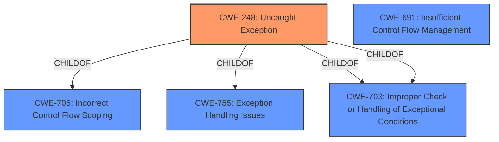

# Raw Analyzer Response for CVE-2022-25917

# Summary
| CWE ID  | CWE Name           | Confidence | CWE Abstraction Level | CWE Vulnerability Mapping Label | CWE-Vulnerability Mapping Notes |
| :------- | :----------------- | :--------- | :-------------------- | :------------------------------ | :---------------------------- |
| CWE-248  | Uncaught Exception | 0.9        | Base                  | Primary                         | Allowed                       |
| CWE-691  | Insufficient Control Flow Management | 0.5       | Pillar                  | Secondary                         | Discouraged                       |

## Evidence and Confidence

*   **Confidence Score:** 0.9
*   **Evidence Strength:** HIGH

## Relationship Analysis
The primary relationship influencing the decision is the direct match of the vulnerability description to CWE-248, Uncaught Exception. While other CWEs such as CWE-691 (Insufficient Control Flow Management) were considered, they are higher-level and less specific than CWE-248, which directly addresses the **rootcause** of the vulnerability.

## Vulnerability Chain
The vulnerability chain is relatively simple: an **uncaught exception** (CWE-248) leads to a denial of service.

## Summary of Analysis
The analysis is strongly based on the provided evidence, specifically the vulnerability description and the CVE reference summary, which clearly state that the **rootcause** is an **uncaught exception**. This aligns perfectly with the description of CWE-248.

The relationship graph highlights that CWE-248 is a child of several other CWEs related to control flow and exception handling. However, selecting any of these parent CWEs would be less specific and would not accurately capture the precise nature of the vulnerability.

The selection of CWE-248 is at the optimal level of specificity because it directly addresses the **rootcause** of the vulnerability (the **uncaught exception**) and is a Base level CWE.

Relevant CWE Information:

# Enhanced Context (25 CWEs)
The following CWEs were identified as potentially relevant to this vulnerability:

## CWE-691: Insufficient Control Flow Management
**Abstraction Level**: Pillar
**Similarity Score**: 0.75
**Source**: dense

**Description**:
The code does not sufficiently manage its control flow during execution, creating conditions in which the control flow can be modified in unexpected ways.

**Mapping Guidance**:
- Usage: Discouraged
- Rationale: This CWE entry is extremely high-level, a Pillar. However, classification research is limited for weaknesses of this type, so there can be gaps or organizational difficulties within CWE that force use of this weakness, even at such a high level of abstraction.

## CWE-248: Uncaught Exception
**Abstraction:** Base

### Description
An exception is thrown from a function, but it is not caught.

# Detailed Analysis

## CWE-248: Uncaught Exception
*   **Explanation:** The vulnerability description states that an **uncaught exception** in the firmware may allow a privileged user to cause a denial of service. This directly matches the definition of CWE-248, which describes a scenario where an exception is thrown but not caught.
*   **Security Implications:** If an exception is not caught, it can lead to unexpected program termination, data corruption, or, as in this case, a denial of service.
*   **Relationship:** CWE-248 is a Base level CWE.
*   **Mapping Guidance:** The MITRE mapping guidance allows for the use of CWE-248.
*   **Confidence:** 0.9

## CWE-691: Insufficient Control Flow Management
*   **Explanation:** While an **uncaught exception** can be seen as a form of **insufficient control flow management**, CWE-691 is a higher-level, more abstract classification. The description "The code does not sufficiently manage its control flow during execution, creating conditions in which the control flow can be modified in unexpected ways" is too general in this case. The vulnerability description points to a specific type of control flow issue: an **uncaught exception**.
*   **Security Implications:** **Insufficient control flow management** can lead to a variety of security vulnerabilities.
*   **Relationship:** CWE-691 is a Pillar level CWE.
*   **Mapping Guidance:** The MITRE mapping guidance discourages the use of CWE-691 due to its high level of abstraction.
*   **Confidence:** 0.5

## Other CWEs Considered and Rejected

*   **CWE-453 (Insecure Default Variable Initialization):** This CWE is not applicable because the vulnerability is due to an **uncaught exception**, not an insecure default variable.
*   **CWE-119 (Improper Restriction of Operations within the Bounds of a Memory Buffer):** This CWE relates to memory buffer issues, which is not the case in this vulnerability.
*   **CWE-693 (Protection Mechanism Failure):** This CWE is too general. The **uncaught exception** is a specific issue and doesn't necessarily indicate a failure of a broader protection mechanism.
*   **CWE-1193 (Power-On of Untrusted Execution Core Before Enabling Fabric Access Control):** This CWE is specific to hardware and firmware initialization issues, which doesn't match the **uncaught exception** vulnerability.
*   **CWE-617 (Reachable Assertion):** While an **uncaught exception** might lead to a program termination similar to a reachable assertion, the **rootcause** is the **uncaught exception**, not the assertion itself.
*   **CWE-284 (Improper Access Control):** Access control is not the primary issue. The **uncaught exception** allows a privileged user to trigger a DoS, but the underlying problem isn't related to access control mechanisms.
*   **CWE-287 (Improper Authentication):** Similar to CWE-284, authentication is not the core issue in this vulnerability.
*   **CWE-277 (Insecure Inherited Permissions):** This CWE is irrelevant to the **uncaught exception** vulnerability.