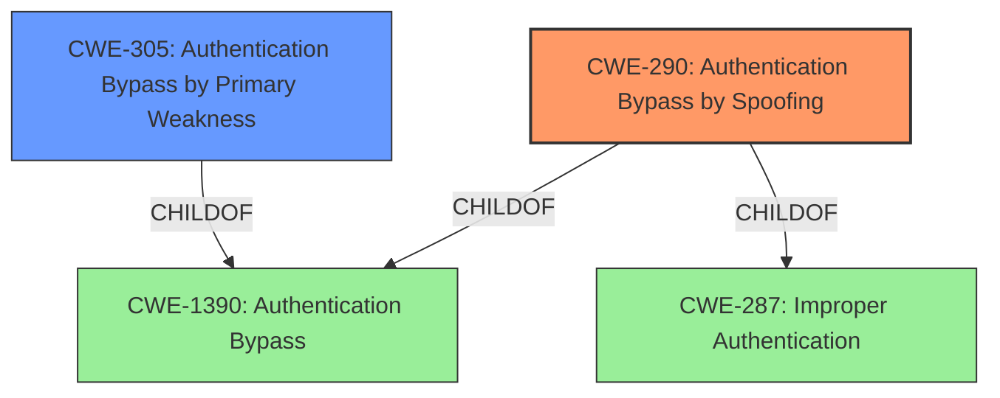

# Raw Analyzer Response for CVE-2022-25989

# Summary
| CWE ID | CWE Name | Confidence | CWE Abstraction Level | CWE Vulnerability Mapping Label | CWE-Vulnerability Mapping Notes |
|---|---|---|---|---|---|
| CWE-290 | Authentication Bypass by Spoofing | 0.9 | Base | Allowed | Primary CWE |
| CWE-305 | Authentication Bypass by Primary Weakness | 0.7 | Base | Allowed | Secondary CWE |

## Evidence and Confidence

*   **Confidence Score:** 0.8
*   **Evidence Strength:** HIGH

## Relationship Analysis
The primary relationship influencing the CWE selection is that of parent and child. CWE-290 [Authentication Bypass by Spoofing] is a base CWE, and while it could be argued that CWE-305 [Authentication Bypass by Primary Weakness] is also applicable, the spoofing aspect of the DHCP poisoning attack makes CWE-290 a more specific and accurate fit. CWE-290 is a child of both CWE-1390 and CWE-287, which broadens the context but doesn't change the core weakness.

## Vulnerability Chain
The vulnerability chain starts with the **improper authentication** in the `getpeermac()` function, leading to the **authentication bypass**. The **reliance on the client's IP address without proper validation** allows an attacker to perform **DHCP poisoning**, ultimately resulting in unauthorized access to the Eufy Homebase 2's internal network services.

## Summary of Analysis
The initial analysis correctly identified the **authentication bypass** as the core issue. The retriever results and the CVE Reference Links Content Summary provide ample evidence to support this. The final selection of CWE-290 [Authentication Bypass by Spoofing] is based on the evidence of **DHCP poisoning** which allows the attacker to spoof the IP address and MAC address.

> **Vulnerability Description:** An **authentication bypass** vulnerability exists in the libxm_av.so getpeermac() functionality of Anker Eufy Homebase 2 2.1.8.5h. A specially-crafted DHCP packet can lead to **authentication bypass**. An attacker can DHCP poison to trigger this vulnerability.

> **CVE Reference Links Content Summary:** The `getpeermac()` function in `libxm_av.so` uses the client's IP address to query the ARP table for the corresponding MAC address... an attacker can bypass the authentication mechanism... The attacker must perform DHCP poisoning to assign a desired IP address to the Homebase's `eth0` interface.

The selection is further supported by the mapping guidance for CWE-290, which states that it is at the Base level of abstraction and is Allowed for use.

CWE-305 [Authentication Bypass by Primary Weakness] was considered as a secondary CWE because the underlying weakness in the `getpeermac()` function is the primary cause of the **authentication bypass**. The function **does not properly validate if the client's IP address and corresponding MAC address are actually associated with an authorized device**. This primary weakness allows the **spoofing attack**.

Relevant CWE Information:

# Enhanced Context (25 CWEs)

## CWE-74: Improper Neutralization of Special Elements in Output Used by a Downstream Component ('Injection')
**Abstraction Level**: Class
**Similarity Score**: 0.77
**Source**: dense

**Description**:
The product constructs all or part of a command, data structure, or record using externally-influenced input from an upstream component, but it does not neutralize or incorrectly neutralizes special elements that could modify how it is parsed or interpreted when it is sent to a downstream component.

**Mapping Guidance**:
- Usage: Discouraged
- Rationale: CWE-74 is high-level and often misused when lower-level weaknesses are more appropriate.

*Rationale for not selecting:* This CWE is too generic and doesn't accurately reflect the specifics of the **authentication bypass** vulnerability. It is also discouraged.

## CWE-1289: Improper Validation of Unsafe Equivalence in Input
**Abstraction Level**: Base
**Similarity Score**: 0.76
**Source**: dense

**Description**:
The product receives an input value that is used as a resource identifier or other type of reference, but it does not validate or incorrectly validates that the input is equivalent to a potentially-unsafe value.

**Mapping Guidance**:
- Usage: Allowed
- Rationale: This CWE entry is at the Base level of abstraction, which is a preferred level of abstraction for mapping to the root causes of vulnerabilities.

*Rationale for not selecting:* While there is **improper validation**, it is more specifically related to spoofing, which is better captured by CWE-290 [Authentication Bypass by Spoofing].

## CWE-807: Reliance on Untrusted Inputs in a Security Decision
**Abstraction Level**: Base
**Similarity Score**: 0.75
**Source**: dense

**Description**:
The product uses a protection mechanism that relies on the existence or values of an input, but the input can be modified by an untrusted actor in a way that bypasses the protection mechanism.

**Mapping Guidance**:
- Usage: Allowed
- Rationale: This CWE entry is at the Base level of abstraction, which is a preferred level of abstraction for mapping to the root causes of vulnerabilities.

*Rationale for not selecting:* This could be a factor, but again, the **spoofing** aspect is more directly related to CWE-290 [Authentication Bypass by Spoofing].

## CWE-303: Incorrect Implementation of Authentication Algorithm
**Abstraction Level**: Base
**Similarity Score**: 0.75
**Source**: dense

**Description**:
The requirements for the product dictate the use of an established authentication algorithm, but the implementation of the algorithm is incorrect.

**Mapping Guidance**:
- Usage: Allowed
- Rationale: This CWE entry is at the Base level of abstraction, which is a preferred level of abstraction for mapping to the root causes of vulnerabilities.

*Rationale for not selecting:* The issue isn't so much an incorrect implementation of an algorithm as it is a missing or inadequate validation of the client's IP and MAC address.

## CWE-294: Authentication Bypass by Capture-replay
**Abstraction Level**: Base
**Similarity Score**: 0.75
**Source**: dense

**Description**:
A capture-replay flaw exists when the design of the product makes it possible for a malicious user to sniff network traffic and bypass authentication by replaying it to the server in question to the same effect as the original message (or with minor changes).

**Mapping Guidance**:
- Usage: Allowed
- Rationale: This CWE entry is at the Base level of abstraction, which is a preferred level of abstraction for mapping to the root causes of vulnerabilities.

*Rationale for not selecting:* This is not a capture-replay vulnerability.

## CWE-1391: Use of Weak Credentials
**Abstraction Level**: Class
**Similarity Score**: 0.75
**Source**: dense

**Description**:
The product uses weak credentials (such as a default key or hard-coded password) that can be calculated, derived, reused, or guessed by an attacker.

**Mapping Guidance**:
- Usage: Allowed-with-Review
- Rationale: This CWE entry is a Class and might have Base-level children that would be more appropriate

*Rationale for not selecting:* This is not a vulnerability related to weak credentials.

## CWE-288: Authentication Bypass Using an Alternate Path or Channel
**Abstraction Level**: Base
**Similarity Score**: 0.75
**Source**: dense

**Description**:
The product requires authentication, but the product has an alternate path or channel that does not require authentication.

**Mapping Guidance**:
- Usage: Allowed
- Rationale: This CWE entry is at the Base level of abstraction, which is a preferred level of abstraction for mapping to the root causes of vulnerabilities.

*Rationale for not selecting:* This is not an alternate path or channel bypass.

## CWE-131: Incorrect Calculation of Buffer Size
**Abstraction Level**: Base
**Similarity Score**: 0.74
**Source**: dense

**Description**:
The product does not correctly calculate the size to be used when allocating a buffer, which could lead to a buffer overflow.

**Mapping Guidance**:
- Usage: Allowed
- Rationale: This CWE entry is at the Base level of abstraction, which is a preferred level of abstraction for mapping to