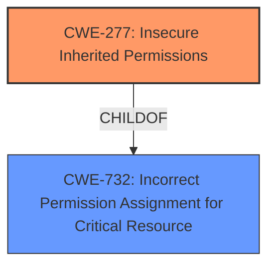

# Analysis Report for CVE-2022-25992

# Vulnerability Analysis Report: CVE-2022-25992

## Description


## Analysis (with Relationship Data)

# Summary
| CWE ID | CWE Name | Confidence | CWE Abstraction Level | CWE Vulnerability Mapping Label | CWE-Vulnerability Mapping Notes |
|---|---|---|---|---|---|
| CWE-277 | Insecure Inherited Permissions | 1.0 | Variant | Allowed | Primary CWE |
| CWE-732 | Incorrect Permission Assignment for Critical Resource | 0.7 | Class | Allowed-with-Review | Secondary Candidate |

## Evidence and Confidence

*   **Confidence Score:** 0.9
*   **Evidence Strength:** HIGH

## Relationship Analysis
The primary CWE, CWE-277 (Insecure Inherited Permissions), is a variant of CWE-732 (Incorrect Permission Assignment for Critical Resource). This parent-child relationship indicates that CWE-277 is a more specific case of CWE-732. The vulnerability description directly mentions "insecure inherited permissions," making CWE-277 a direct and accurate fit.



## Vulnerability Chain
The chain of events for this vulnerability is:
1.  **Root Cause:** **Insecure inherited permissions** (CWE-277)
2.  **Impact:** Escalation of privilege

## Summary of Analysis
The initial assessment identified CWE-277 (Insecure Inherited Permissions) as the primary candidate due to the direct mention of "insecure inherited permissions" in both the vulnerability description and the CVE Reference Links Content Summary. The retriever results also listed CWE-277 as the top combined result.

The evidence from the vulnerability description is clear: "**Insecure inherited permissions** in the Intel(R) oneAPI Toolkits oneapi-cli before version 0.2.0 may allow an authenticated user to potentially enable **escalation of privilege** via local access." The CVE Reference Links Content Summary reinforces this with "Root cause: **Insecure inherited permissions**" and "Weaknesses: **Insecure inherited permissions** in the Intel(R) oneAPI Toolkits oneapi-cli."

CWE-277 is a Variant of CWE-732. While CWE-732 (Incorrect Permission Assignment for Critical Resource) could be considered a broader classification, CWE-277 specifically addresses the inheritance aspect, making it a more accurate and specific representation of the vulnerability. Therefore, CWE-277 is the optimal choice.

Other CWEs were considered but deemed less relevant:

*   CWE-284 (Improper Access Control): This is a very high-level (Pillar) CWE and doesn't provide enough specificity. The issue is not just general access control but the specific case of inherited permissions.
*   CWE-732 (Incorrect Permission Assignment for Critical Resource): While related as a parent, CWE-277 is a more precise description of the vulnerability.

# Relevant CWE Information:

## Enhanced Context (25 CWEs)

## CWE-277: Insecure Inherited Permissions
**Abstraction:** Variant
**Status:** Draft

### Description
A product defines a set of insecure permissions that are inherited by objects that are created by the program.

### Extended Description
Not provided

### Alternative Terms
None

### Relationships
ChildOf -> CWE-732

### Mapping Guidance
**Usage:** Allowed
**Rationale:** This CWE entry is at the Variant level of abstraction, which is a preferred level of abstraction for mapping to the root causes of vulnerabilities.
**Comments:** Carefully read both the name and description to ensure that this mapping is an appropriate fit. Do not try to 'force' a mapping to a lower-level Base/Variant simply to comply with this preferred level of abstraction.
**Reasons:**
- Acceptable-Use

### Observed Examples
- **CVE-2005-1841:** User's umask is used when creating temp files.
- **CVE-2002-1786:** Insecure umask for core dumps [is the umask preserved or assigned?].

## CWE-732: Incorrect Permission Assignment for Critical Resource
**Abstraction:** Class
**Status:** Draft

### Description
The product specifies permissions for a security-critical resource in a way that allows that resource to be read or modified by unintended actors.

### Extended Description
When a resource is given a permission setting that provides access to a wider range of actors than required, it could lead to the exposure of sensitive information, or the modification of that resource by unintended parties. This is especially dangerous when the resource is related to program configuration, execution, or sensitive user data. For example, consider a misconfigured storage account for the cloud that can be read or written by a public or anonymous user.

### Alternative Terms
None

### Relationships
ChildOf -> CWE-285
ChildOf -> CWE-668

### Mapping Guidance
**Usage:** Allowed-with-Review
**Rationale:** While the name itself indicates an assignment of permissions for resources, this is often misused for vulnerabilities in which "permissions" are not checked, which is an "authorization" weakness (CWE-285 or descendants) within CWE's model [REF-1287].
**Comments:** Closely analyze the specific mistake that is allowing the resource to be exposed, and perform a CWE mapping for that mistake.
**Reasons:**
- Frequent Misuse

### Observed Examples
- **CVE-2022-29527:** Go application for cloud management creates a world-writable sudoers file that allows local attackers to inject sudo rules and escalate privileges to root by winning a race condition.
- **CVE-2009-3482:** Anti-virus product sets insecure "Everyone: Full Control" permissions for files under the "Program Files" folder, allowing attackers to replace executables with Trojan horses.
- **CVE-2009-3897:** Product creates directories with 0777 permissions at installation, allowing users to gain privileges and access a socket used for authentication.


## CWE Relationship Analysis

Current CWEs represent these abstraction levels: .


### Vulnerability Chain Analysis

**Chain starting from CWE-277:**
- 277 (Insecure Inherited Permissions) - ROOT


**Chain starting from CWE-668:**
- 668 (Exposure of Resource to Wrong Sphere) - ROOT


### CWE Relationship Diagram

```mermaid
graph TD
    classDef primary fill:#f96,stroke:#333,stroke-width:2px
    classDef secondary fill:#69f,stroke:#333
    classDef tertiary fill:#9e9,stroke:#333
```


*Report generated on 2025-03-30 18:12:18*
