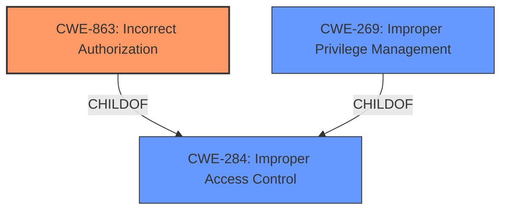

# Analysis for CVE-2022-26017

# Summary
| CWE ID | CWE Name | Confidence | CWE Abstraction Level | CWE Vulnerability Mapping Label | CWE-Vulnerability Mapping Notes |
|---|---|---|---|---|---|
| CWE-863 | Incorrect Authorization | 0.9 | Class | Allowed-with-Review | Primary CWE |
| CWE-269 | Improper Privilege Management | 0.6 | Class | Discouraged | Secondary CWE |
| CWE-284 | Improper Access Control | 0.5 | Pillar | Discouraged | Secondary CWE |

## Evidence and Confidence

*   **Confidence Score:** 0.9
*   **Evidence Strength:** HIGH

## Relationship Analysis
The primary CWE is CWE-863 (Incorrect Authorization), which is a child of CWE-284 (Improper Access Control). CWE-269 (Improper Privilege Management) is also a child of CWE-284. Given that the description explicitly mentions "improper access control" leading to "escalation of privilege," both CWE-863 and CWE-269 are relevant, but CWE-863 is more specific because it addresses the authorization mechanism directly. The abstraction levels guided the selection towards CWE-863, which is a Class-level CWE, providing a balance between specificity and broad applicability.

## Vulnerability Chain
The vulnerability chain starts with **improper access control** (CWE-284) leading to **incorrect authorization** (CWE-863) and **improper privilege management** (CWE-269), which ultimately results in **escalation of privilege**.
  - **Root Cause:** Improper Access Control (CWE-284)
  - **Weakness:** Incorrect Authorization (CWE-863), Improper Privilege Management (CWE-269)
  - **Impact:** Escalation of Privilege

## Summary of Analysis
The initial analysis identified **improper access control** as the root cause, with escalation of privilege as the impact. The key phrase "improper access control" from the "Vulnerability Description Key Phrases" section and "Root cause of vulnerability: Improper access control in the Intel Driver & Support Assistant (DSA) software" from the "CVE Reference Links Content Summary" section support this.

The Retriever Results suggested several CWEs, including CWE-691, CWE-693, CWE-284, CWE-277, CWE-119, CWE-269, CWE-1257, CWE-287, CWE-20, and CWE-1288.

CWE-284 (Improper Access Control) is too high-level. The mapping guidance discourages its use, suggesting more specific descendants like CWE-863 (Incorrect Authorization) or CWE-732 (Incorrect Permission Assignment for Critical Resource).

CWE-269 (Improper Privilege Management) is also a Class-level CWE and is related to the impact (escalation of privilege). However, it's more about the management of privileges rather than the specific authorization check.

CWE-863 (Incorrect Authorization) is the most appropriate because it directly addresses the **incorrect** authorization check, which is a more specific manifestation of the **improper access control** described in the vulnerability. The vulnerability description indicates the software performs an authorization check, but it is done incorrectly, allowing an authenticated user to escalate privileges.

CWE-284 is considered but not used as the primary CWE because it is a high-level pillar. The mapping guidance suggests using its descendants, and CWE-863 and CWE-269 are better choices.

CWE-269 is considered because the end result is privilege escalation, but the root cause is more directly related to the authorization process.

CWE-863 is at the optimal level of specificity, representing the root cause of the vulnerability more accurately than its parent CWE-284. The decision is strongly supported by the vulnerability description and the guidance provided for CWE-284.