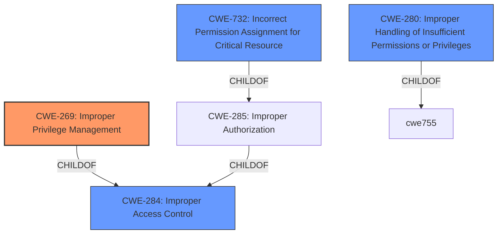

# Analysis for CVE-2022-26019

# Summary
| CWE ID | CWE Name | Confidence | CWE Abstraction Level | CWE Vulnerability Mapping Label | CWE-Vulnerability Mapping Notes |
|---|---|---|---|---|---|
| CWE-269 | Improper Privilege Management | 0.8 | Class | Primary CWE | Discouraged |
| CWE-284 | Improper Access Control | 0.6 | Pillar | Secondary Candidate | Discouraged |
| CWE-732 | Incorrect Permission Assignment for Critical Resource | 0.6 | Class | Secondary Candidate | Allowed-with-Review |
| CWE-280 | Improper Handling of Insufficient Permissions or Privileges | 0.5 | Base | Secondary Candidate | Allowed |
| CWE-184 | Incomplete List of Disallowed Inputs | 0.4 | Base | Secondary Candidate | Allowed |

## Evidence and Confidence

*   **Confidence Score:** 0.7
*   **Evidence Strength:** MEDIUM

## Relationship Analysis
The primary relationship that influenced the selection of CWE-269 was its parent-child relationship with CWE-284 (Improper Access Control). While the description mentions **improper access control**, the more specific weakness of **improper privilege management** better captures the essence of the vulnerability. The other CWEs considered, such as CWE-732 and CWE-280, represent related aspects of access control and privilege handling but are less directly applicable to the core issue of assigning, modifying, tracking, or checking privileges, even though CWE-280 is at the Base level. CWE-732 is a child of CWE-285, which is itself a child of CWE-284, representing a hierarchical relationship that led to considering the broader access control context.

## Vulnerability Chain
The vulnerability chain starts with the **improper access control**/**improper privilege management** that allows a remote attacker with the privilege to change NTP GPS settings. This leads to the ability to rewrite existing files on the file system, ultimately resulting in arbitrary command execution.

Improper Access Control/Privilege Management -> File Overwrite -> Arbitrary Command Execution

## Summary of Analysis
The initial assessment identified **improper access control** as a key phrase. The retriever results also highlighted CWE-284 (Improper Access Control) and CWE-269 (Improper Privilege Management) as potential candidates.

The final decision leans towards CWE-269 (Improper Privilege Management) because the vulnerability involves an attacker with specific privileges (to change NTP GPS settings) being able to exploit a flaw in how those privileges are managed to perform unauthorized actions (rewriting files and executing commands). While CWE-284 is a broader category, CWE-269 more precisely captures the weakness in the assignment, modification, tracking, or checking of privileges.

The decision to choose CWE-269 is also influenced by the MITRE mapping guidance for CWE-284, which discourages its use due to its high-level nature and recommends considering more specific descendants. Although CWE-269 is also a Class, it is more specific than the Pillar CWE-284.

The evidence supporting this decision comes from the "Vulnerability Description" which states "Improper access control vulnerability in pfSense CE and pfSense Plus... allows a remote attacker with the privilege to change NTP GPS settings to rewrite existing files on the file system, which may result in arbitrary command execution." This highlights the role of existing privileges in enabling the attack.

While CWE-280 (Improper Handling of Insufficient Permissions or Privileges) was considered, it is less applicable because the attacker *does* have some privileges; the issue is that these privileges are not being managed correctly, allowing for their misuse. CWE-732 (Incorrect Permission Assignment for Critical Resource) is also a possibility, but the core issue is more about the management of privileges than the incorrect assignment of permissions to a specific resource. CWE-184 (Incomplete List of Disallowed Inputs) was considered because of the lack of input validation on the gpsport parameter, but that's a secondary weakness. The primary issue is the **improper access control** that allows the attacker to even attempt to write to arbitrary files.

Therefore, the selected CWE is at the optimal level of specificity, given the available information.