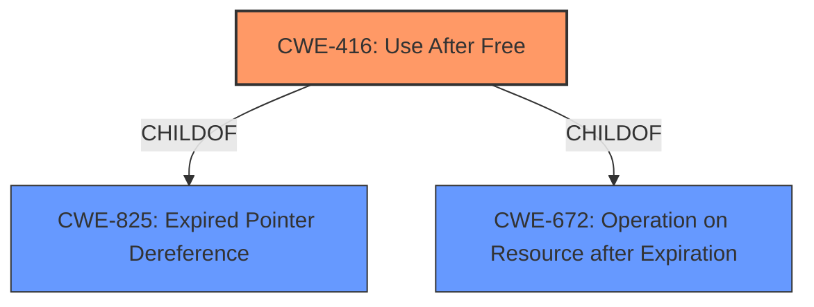

# Analysis for CVE-2022-2603

# Summary
| CWE ID | CWE Name | Confidence | CWE Abstraction Level | CWE Vulnerability Mapping Label | CWE-Vulnerability Mapping Notes |
|---|---|---|---|---|---|
| CWE-416 | Use After Free | 1.0 | Variant | Primary | Allowed |

## Evidence and Confidence

*   **Confidence Score:** 1.0
*   **Evidence Strength:** HIGH

## Relationship Analysis
The primary identified CWE is **CWE-416 (Use After Free)**, which is a Variant level CWE. It has a child relationship to **CWE-825 (Expired Pointer Dereference)** and **CWE-672 (Operation on Resource after Expiration)**, but remains the most accurate and specific classification based on the vulnerability description. There are also chain relationships from **CWE-120 (Buffer Copy without Checking Size)** and **CWE-123 (Write-what-where Condition)** that can precede **CWE-416**, but these are not relevant in the description.

## Vulnerability Chain
The vulnerability chain consists of a **use after free** condition in the Omnibox component of Google Chrome. The initial flaw is the **improper memory management** leading to the **use after free** (CWE-416). The impact of this is potential heap corruption, exploitable by a remote attacker via a crafted HTML page.

## Summary of Analysis
The primary weakness identified is **CWE-416 (Use After Free)**. This is supported by:

*   The vulnerability description which explicitly states: "**weakness:** **use after free**"
*   The CVE Reference Links Content Summary which mentions: "**Root cause of vulnerability:** Use-after-free in the Omnibox component of Chromium." and "**Weaknesses/vulnerabilities present:** Use-after-free: This occurs when a program attempts to access memory that has already been freed."
*   The "CWE for similar CVE Descriptions" which lists **CWE-416** as the primary match.

The retriever results also list **CWE-416** as the second highest match.

The relationships of **CWE-416** to other CWEs were considered, but none were more appropriate or added additional context given the provided information. The analysis is based on the provided evidence, which is quite strong and directly supports the classification of **CWE-416** as the primary weakness.

CWEs considered but not used:

*   CWE-366, CWE-356, CWE-843, CWE-415, CWE-1022, CWE-123, CWE-362, CWE-122, CWE-665: Although these CWEs had some level of similarity based on the retriever results, they did not align as closely with the explicit vulnerability description of a **use after free** condition.