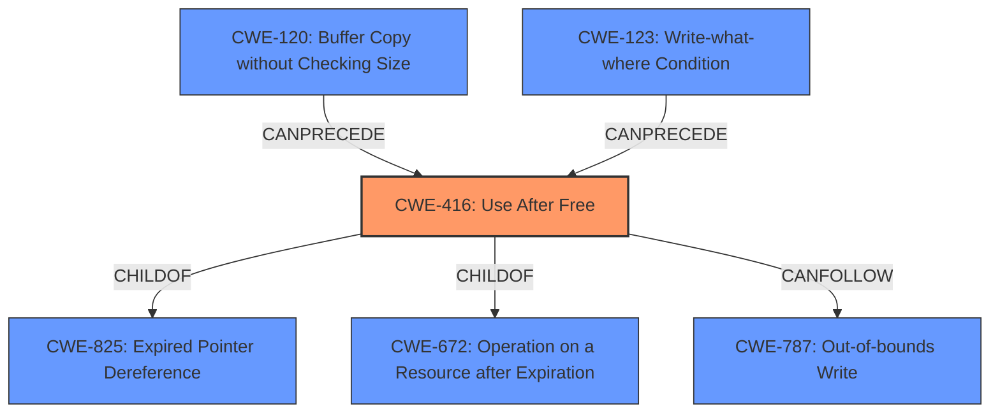

# Enhanced Analysis for CVE-2022-2604

# Summary
| CWE ID | CWE Name | Confidence | CWE Abstraction Level | CWE Vulnerability Mapping Label | CWE-Vulnerability Mapping Notes |
|---|---|---|---|---|---|
| CWE-416 | Use After Free | 1.0 | Variant | Primary | Allowed |
| CWE-787 | Out-of-bounds Write | 0.5 | Base | Secondary | Allowed |

## Evidence and Confidence

*   **Confidence Score:** 0.8
*   **Evidence Strength:** HIGH

## Relationship Analysis
The primary CWE, CWE-416, is a Variant of CWE-825 (Expired Pointer Dereference) and CWE-672 (Operation on a Resource after Expiration). It can be preceded by CWE-120 (Buffer Copy without Checking Size of Input) or CWE-123 (Write-what-where Condition). CWE-787 (Out-of-bounds Write) is a potential impact that can follow a use-after-free. The analysis focuses on identifying the root cause first and then considering potential impacts or related weaknesses.



## Vulnerability Chain
The vulnerability chain starts with the **use after free** condition (CWE-416). This leads to **heap corruption**. Although the description indicates **heap corruption**, it is not explicit about the nature of the corruption, which could manifest as an out-of-bounds write (CWE-787).

## Summary of Analysis
The primary focus is on the **use after free** vulnerability as the root cause. The description clearly states this condition in the "Vulnerability Description Key Phrases" section and the "CVE Reference Links Content Summary" section. The "**heap corruption**" is a consequence of the **use after free**, and potentially an **out-of-bounds write**.

The selection of CWE-416 is based on the explicit mention of "use after free" in the vulnerability description. The supporting evidence is:

*   "**rootcause:** **use after free**" from the "Vulnerability Description Key Phrases"
*   "**Weaknesses/vulnerabilities present:** \- Use-after-free: This occurs when a program attempts to access memory after it has been freed, potentially leading to crashes or arbitrary code execution." from the "CVE Reference Links Content Summary"

CWE-787 (Out-of-bounds Write) is considered as a secondary candidate because the vulnerability could potentially allow an attacker to write data outside the intended memory region, leading to **heap corruption**.

The abstraction levels are chosen to be as specific as possible. CWE-416 is a Variant, which is a preferred level of abstraction. CWE-787 is a Base, which is also a preferred level of abstraction.

CWE-366, CWE-226, CWE-404, CWE-667, CWE-665, CWE-662, CWE-909, CWE-664, CWE-1419, CWE-457, CWE-451, CWE-362, CWE-415, CWE-364, CWE-367, CWE-123, CWE-120, CWE-825, CWE-476, CWE-170, and CWE-1341 were considered but not chosen because they did not directly match the root cause of the vulnerability as described. Some of these, such as CWE-362 (Race Condition), might be indirectly related, but the provided information does not offer sufficient evidence to support their inclusion.

Relevant CWE Information:

# Enhanced Context (25 CWEs)
The following CWEs were identified as potentially relevant to this vulnerability:

## CWE-366: Race Condition within a Thread
**Abstraction Level**: Base
**Similarity Score**: 0.76
**Source**: dense

**Description**:
If two threads of execution use a resource simultaneously, there exists the possibility that resources may be used while invalid, in turn making the state of execution undefined.

**Mapping Guidance**:
- Usage: Allowed
- Rationale: This CWE entry is at the Base level of abstraction, which is a preferred level of abstraction for mapping to the root causes of vulnerabilities.

## CWE-226: Sensitive Information in Resource Not Removed Before Reuse
**Abstraction Level**: Base
**Similarity Score**: 0.76
**Source**: dense

**Description**:
The product releases a resource such as memory or a file so that it can be made available for reuse, but it does not clear or "zeroize" the information contained in the resource before the product performs a critical state transition or makes the resource available for reuse by other entities.

**Mapping Guidance**:
- Usage: Allowed
- Rationale: This CWE entry is at the Base level of abstraction, which is a preferred level of abstraction for mapping to the root causes of vulnerabilities.

## CWE-404: Improper Resource Shutdown or Release
**Abstraction Level**: Class
**Similarity Score**: 0.76
**Source**: dense

**Description**:
The product does not release or incorrectly releases a resource before it is made available for re-use.

**Mapping Guidance**:
- Usage: Allowed-with-Review
- Rationale: This CWE entry is a Class and might have Base-level children that would be more appropriate

## CWE-667: Improper Locking
**Abstraction Level**: Class
**Similarity Score**: 0.76
**Source**: dense

**Description**:
The product does not properly acquire or release a lock on a resource, leading to unexpected resource state changes and behaviors.

**Mapping Guidance**:
- Usage: Allowed-with-Review
- Rationale: This CWE entry is a Class and might have Base-level children that would be more appropriate

## CWE-665: Improper Initialization
**Abstraction Level**: Class
**Similarity Score**: 0.76
**Source**: dense

**Description**:
The product does not initialize or incorrectly initializes a resource, which might leave the resource in an unexpected state when it is accessed or used.

**Mapping Guidance**:
- Usage: Discouraged
- Rationale: This CWE entry is a level-1 Class (i.e., a child of a Pillar). It might have lower-level children that would be more appropriate

## CWE-662: Improper Synchronization
**Abstraction Level**: Class
**Similarity Score**: 0.76
**Source**: dense

**Description**:
The product utilizes multiple threads or processes to allow temporary access to a shared resource that can only be exclusive to one process at a time, but it does not properly synchronize these actions, which might cause simultaneous accesses of this resource by multiple threads or processes.

**Mapping Guidance**:
- Usage: Discouraged
- Rationale: This CWE entry is a level-1 Class (i.e., a child of a Pillar). It might have lower-level children that would be more appropriate

## CWE-909: Missing Initialization of Resource
**Abstraction Level**: Class
**Similarity Score**: 0.74
**Source**: dense

**Description**:
The product does not initialize a critical resource.

**Mapping Guidance**:
- Usage: Allowed-with-Review
- Rationale: This CWE entry is a Class and might have Base-level children that would be more appropriate

## CWE-664: Improper Control of a Resource Through its Lifetime
**Abstraction Level**: Pillar
**Similarity Score**: 0.74
**Source**: dense

**Description**:
The product does not maintain or incorrectly maintains control over a resource throughout its lifetime of creation, use, and release.

**Mapping Guidance**:
- Usage: Discouraged
- Rationale: This CWE entry is high-level when lower-level children are available.

## CWE-1419: Incorrect Initialization of Resource
**Abstraction Level**: Class
**Similarity Score**: 0.73
**Source**: dense

**Description**:
The product attempts to initialize a resource but does not correctly do so, which might


## CWE Relationship Analysis

Current CWEs represent these abstraction levels: .


### Vulnerability Chain Analysis

**Chain starting from CWE-366:**
- 366 (Race Condition within a Thread) - ROOT


**Chain starting from CWE-123:**
- 123 (Write-what-where Condition) - ROOT


### CWE Relationship Diagram

```mermaid
graph TD
    classDef primary fill:#f96,stroke:#333,stroke-width:2px
    classDef secondary fill:#69f,stroke:#333
    classDef tertiary fill:#9e9,stroke:#333
```