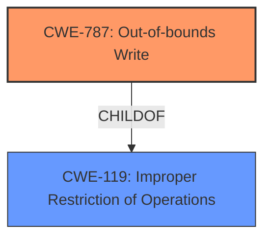

# Analysis for CVE-2022-26045

# Summary
| CWE ID | CWE Name | Confidence | CWE Abstraction Level | CWE Vulnerability Mapping Label | CWE-Vulnerability Mapping Notes |
|---|---|---|---|---|---|
| CWE-787 | Out-of-bounds Write | 0.8 | Base | Allowed | Primary CWE |
| CWE-119 | Improper Restriction of Operations within the Bounds of a Memory Buffer | 0.6 | Class | Discouraged | Secondary Candidate |

## Evidence and Confidence

*   **Confidence Score:** 0.8
*   **Evidence Strength:** HIGH

## Relationship Analysis
The primary CWE selected is CWE-787, which is a base-level CWE and a child of CWE-119. This indicates a hierarchical relationship where CWE-787 is a more specific type of buffer issue compared to the more general CWE-119.

## Vulnerability Chain
The vulnerability chain starts with **improper buffer restrictions** (CWE-787), leading to potential **escalation of privilege**.

## Summary of Analysis
The initial analysis identified **improper buffer restrictions** as the root cause, leading to a potential **escalation of privilege** due to physical access. The "CVE Reference Links Content Summary" confirms this, stating, "Improper buffer restrictions in the Intel® XMM™ 7560 Modem software" and "The software has insufficient buffer size limitations, potentially allowing for buffer overflows or other memory corruption issues."

The primary CWE match from similar CVE descriptions was CWE-NVD-noinfo, which is not useful. However, the provided information points towards memory corruption due to the buffer restriction issue. Considering the retriever results, CWE-119 (Improper Restriction of Operations within the Bounds of a Memory Buffer) was initially considered. However, CWE-119 is a Class-level CWE and is discouraged by MITRE when more specific CWEs are available. Given that the specific issue is related to writing outside the bounds of the buffer, CWE-787 (Out-of-bounds Write) is a more precise match.

The "Vulnerability Description Key Phrases" identifies the **rootcause** as **improper buffer restrictions**. This directly relates to CWE-787. The vulnerability requires a privileged user and physical access, indicating that the **improper buffer restrictions** allow for exploitation under these conditions.

The final decision to select CWE-787 is based on the evidence of **improper buffer restrictions** leading to potential memory corruption, as confirmed by both the vulnerability description and the CVE reference summary. CWE-787 is at the optimal level of specificity (Base) and aligns with MITRE's mapping guidance.

**CWEs Considered but Not Used:**

*   **CWE-119:** While initially considered due to the term "buffer restrictions," CWE-119 is too general. The provided information specifies a potential write operation outside the buffer's bounds, making CWE-787 a better fit.
*   **CWE-459:** Incomplete Cleanup - This CWE doesn't fit the vulnerability description as the issue is related to buffer handling and not resource cleanup.
*   **CWE-691:** Insufficient Control Flow Management and **CWE-693:** Protection Mechanism Failure - These are Pillar-level CWEs and are too abstract for the provided vulnerability description.
*   **CWE-277:** Insecure Inherited Permissions - This CWE is related to file permissions and is not relevant to the buffer restriction issue.
*   **CWE-1256:** Improper Restriction of Software Interfaces to Hardware Features - This is not a software interface issue.
*   **CWE-1260:** Improper Handling of Overlap Between Protected Memory Ranges - While related to memory, the description does not imply overlapping ranges, but more directly an out-of-bounds write.