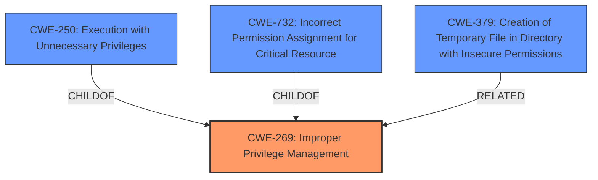

# Analysis Report for CVE-2022-26057

# Vulnerability Analysis Report: CVE-2022-26057

## Description


## Analysis (with Relationship Data)

# Summary
| CWE ID | CWE Name | Confidence | CWE Abstraction Level | CWE Vulnerability Mapping Label | CWE-Vulnerability Mapping Notes |
|---|---|---|---|---|---|
| CWE-269 | Improper Privilege Management | 0.8 | Class | Primary | Discouraged |
| CWE-250 | Execution with Unnecessary Privileges | 0.7 | Base | Secondary | Allowed |
| CWE-732 | Incorrect Permission Assignment for Critical Resource | 0.6 | Class | Secondary | Allowed-with-Review |
| CWE-379 | Creation of Temporary File in Directory with Insecure Permissions | 0.5 | Base | Secondary | Allowed |

## Evidence and Confidence

*   **Confidence Score:** 0.7
*   **Evidence Strength:** MEDIUM

## Relationship Analysis
The primary classification is CWE-269, a Class-level CWE, which is discouraged but justifiable given the high-level nature of the description. CWE-250 (Execution with Unnecessary Privileges) is a child of CWE-269 and represents a more specific scenario where operations are performed with higher privileges than necessary, which is a Base level of abstraction. CWE-732 (Incorrect Permission Assignment for Critical Resource) is related as the incorrect assignment of privileges enables unintended access. CWE-379 is related to the creation of temporary files with insecure permission.



## Vulnerability Chain
The vulnerability chain involves:
1.  A low-privileged attacker can trigger a repair operation within the Mint WorkBench installer.
2.  This leads to the creation of a file with arbitrary content.
3.  The file is created anywhere on the file system.
4.  The file is created as SYSTEM, which is the root cause of the improper privilege management.

The root cause is the **improper privilege management** leading to the impact of arbitrary file creation with SYSTEM privileges.

## Summary of Analysis
The initial assessment focused on the ability of a low-privileged attacker to create a file anywhere on the file system as SYSTEM. The key aspect of the vulnerability lies in the **improper privilege management** during the file creation process.

The evidence provided by the vulnerability description is: "Vulnerabilities in the Mint WorkBench allow a low privileged attacker to create and write to a file anywhere on the file system as SYSTEM with arbitrary content as long as the file does not already exist."

The graph relationships helped in understanding how **improper privilege management** (CWE-269) can lead to **execution with unnecessary privileges** (CWE-250). The fact that the file is created as SYSTEM highlights this aspect. The file creation may also be occurring in a directory with insecure permissions (CWE-379). The incorrect assignment of permissions (CWE-732) for the file also contributes to the overall vulnerability.

The selected CWEs are at an appropriate level of specificity. While CWE-269 is a Class, it captures the essence of the vulnerability. CWE-250 and CWE-732 provide more specific details about how the **improper privilege management** manifests in this case.

Relevant CWE Information:

# Enhanced Context (25 CWEs)
The following CWEs were identified as potentially relevant to this vulnerability:

## CWE-59: Improper Link Resolution Before File Access ('Link Following')
**Abstraction Level**: Base
**Similarity Score**: 0.79
**Source**: dense

**Description**:
The product attempts to access a file based on the filename, but it does not properly prevent that filename from identifying a link or shortcut that resolves to an unintended resource.

**Mapping Guidance**:
- Usage: Allowed
- Rationale: This CWE entry is at the Base level of abstraction, which is a preferred level of abstraction for mapping to the root causes of vulnerabilities.

## CWE-269: Improper Privilege Management
**CWE-269 (Improper Privilege Management)** is selected as the primary CWE because the root cause of the vulnerability involves the incorrect handling of privileges, allowing a low-privileged attacker to perform actions as SYSTEM. The vulnerability allows a low-privileged attacker to create and write to a file anywhere on the file system as SYSTEM, indicating that the application is not properly managing privileges. While it is a discouraged Class, in this case it is appropriate. Confidence: 0.8

## CWE-250: Execution with Unnecessary Privileges
**CWE-250 (Execution with Unnecessary Privileges)** is a child of CWE-269. The Mint WorkBench installer is running the repair operation with SYSTEM privileges, which are unnecessary for the task. This unnecessary elevation of privileges creates a security vulnerability. This vulnerability matches the description of CWE-250, where the product performs an operation at a privilege level higher than required. Confidence: 0.7

## CWE-732: Incorrect Permission Assignment for Critical Resource
**CWE-732 (Incorrect Permission Assignment for Critical Resource)** is considered because the file is being created with SYSTEM privileges, suggesting an incorrect assignment of permissions for a critical resource. The installer file is creating the file with elevated privileges. Confidence: 0.6

## CWE-379: Creation of Temporary File in Directory with Insecure Permissions
**CWE-379 (Creation of Temporary File in Directory with Insecure Permissions)** may be present, as the attacker can create the file anywhere on the file system, which might include directories with insecure permissions. However, without further information, it's difficult to confirm if the vulnerability involves temporary files or directories with insecure permissions. Confidence: 0.5

## Other CWEs Considered But Not Used
- **CWE-59, CWE-23, CWE-41, CWE-73, CWE-1386, CWE-367, CWE-61, CWE-363, CWE-22, CWE-183, CWE-915, CWE-386, CWE-434, CWE-668, CWE-667, CWE-404, CWE-1289, CWE-552, CWE-502**: These CWEs were considered but ultimately deemed less relevant because they focus on file access issues like path traversal, symlink following, or deserialization issues, which are not the primary concern in this vulnerability description. The main issue here is the **improper privilege management** during the file creation process, rather than how files are accessed or handled after creation.


## CWE Relationship Analysis

Current CWEs represent these abstraction levels: .


### Vulnerability Chain Analysis

**Chain starting from CWE-41:**
- 41 (Improper Resolution of Path Equivalence) - ROOT


**Chain starting from CWE-668:**
- 668 (Exposure of Resource to Wrong Sphere) - ROOT


### CWE Relationship Diagram

```mermaid
graph TD
    classDef primary fill:#f96,stroke:#333,stroke-width:2px
    classDef secondary fill:#69f,stroke:#333
    classDef tertiary fill:#9e9,stroke:#333
```


*Report generated on 2025-03-30 11:23:32*
