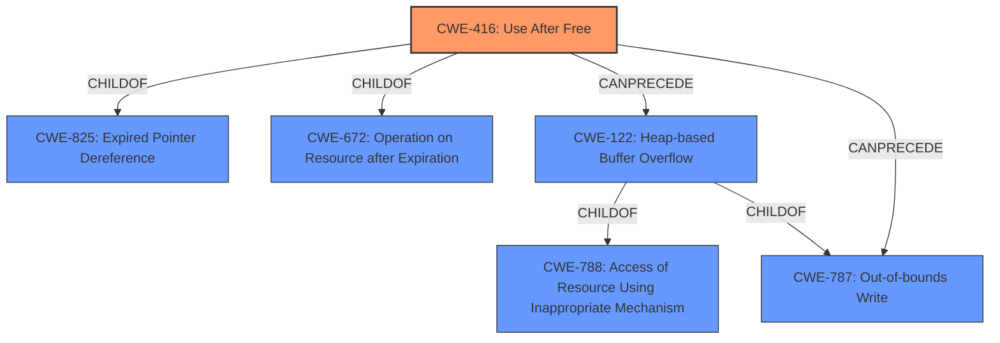

# Analysis for CVE-2022-2606

# Summary
| CWE ID | CWE Name | Confidence | CWE Abstraction Level | CWE Vulnerability Mapping Label | CWE-Vulnerability Mapping Notes |
|---|---|---|---|---|---|
| CWE-416 | Use After Free | 1.0 | Variant | Allowed | Primary CWE |
| CWE-787 | Out-of-bounds Write | 0.6 | Base | Allowed | Secondary CWE |
| CWE-122 | Heap-based Buffer Overflow | 0.5 | Variant | Allowed | Secondary CWE |

## Evidence and Confidence

*   **Confidence Score:** 0.8
*   **Evidence Strength:** HIGH

## Relationship Analysis
The primary weakness is **CWE-416 (Use After Free)**, which can **CANPRECEDE** **CWE-122 (Heap-based Buffer Overflow)** or **CWE-787 (Out-of-bounds Write)** if the freed memory is reallocated and then improperly accessed. **CWE-416** is a **Variant** of **CWE-825 (Expired Pointer Dereference)** and **CWE-672 (Operation on Resource after Expiration)**. **CWE-122** is a **Variant** of **CWE-788 (Access of Resource Using Inappropriate Mechanism)** and **CWE-787 (Out-of-bounds Write)**.

## Vulnerability Chain
The vulnerability chain starts with a **Use-After-Free (CWE-416)** condition. This **Use-After-Free** can lead to **heap corruption**, potentially resulting in an **Out-of-bounds Write (CWE-787)** or **Heap-based Buffer Overflow (CWE-122)** if the freed memory is reallocated and improperly written to. The attacker exploits this by crafting an HTML page and convincing a user to enable a specific Enterprise policy, leading to potential arbitrary code execution.

## Summary of Analysis
The primary **root cause** of this vulnerability is a **Use-After-Free (CWE-416)** condition in the Managed devices API in Google Chrome. The vulnerability description explicitly states "**Use after free** in Managed devices API...allowed a remote attacker...to potentially exploit **heap corruption** via a crafted HTML page." The CVE Reference Links Content Summary confirms this: "root_cause: Use after free in Managed devices API" and "weaknesses: [ "Use-after-free" ]".

The **Use-After-Free** can lead to **heap corruption**, which can manifest as an **Out-of-bounds Write (CWE-787)** or **Heap-based Buffer Overflow (CWE-122)**. While the description mentions "heap corruption," it does not specify the exact nature of the corruption, making **CWE-787** and **CWE-122** potential secondary weaknesses depending on how the memory is corrupted.

The selection of **CWE-416** as the primary CWE is based on its direct identification as the root cause in both the vulnerability description and the CVE reference. It is a **Variant** level CWE, providing a specific description of the weakness.

**CWE-787 (Out-of-bounds Write)** is considered because **Use-After-Free** can lead to writing to memory outside the allocated bounds if the memory is reallocated.

**CWE-122 (Heap-based Buffer Overflow)** is considered as a possibility because the **Use-After-Free** can lead to writing beyond the allocated buffer in the heap.

Other CWEs Considered and Rejected:

*   **CWE-366 (Race Condition within a Thread)**, **CWE-362 (Concurrent Execution using Shared Resource with Improper Synchronization ('Race Condition'))**, **CWE-364 (Signal Handler Race Condition)**: While race conditions can sometimes lead to use-after-free vulnerabilities, there is no direct mention or indication of a race condition in this specific vulnerability description.
*   **CWE-451 (User Interface (UI) Misrepresentation of Critical Information)**, **CWE-356 (Product UI does not Warn User of Unsafe Actions)**: These CWEs relate to UI issues, and while the attack involves a crafted HTML page, the core weakness is not related to UI misrepresentation.
*   **CWE-665 (Improper Initialization)**: There is no mention of improper initialization in the vulnerability description.
*   **CWE-415 (Double Free)**: There is no mention of a double free condition in the vulnerability description.

The final selection of **CWE-416** as the primary CWE, with **CWE-787** and **CWE-122** as potential secondary weaknesses, is based on the available evidence and the relationships between the CWEs. **CWE-416** directly represents the root cause, while **CWE-787** and **CWE-122** are potential consequences of the **Use-After-Free** condition.