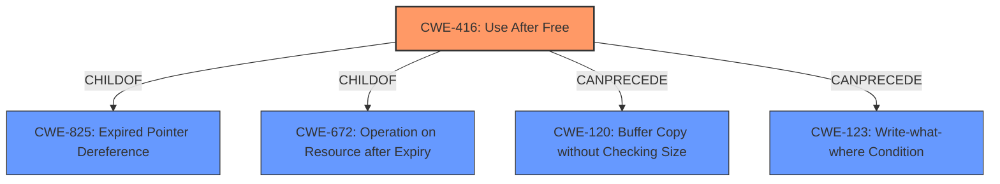

# Raw Analyzer Response for CVE-2022-2609

# Summary
| CWE ID | CWE Name | Confidence | CWE Abstraction Level | CWE Vulnerability Mapping Label | CWE-Vulnerability Mapping Notes |
|---|---|---|---|---|---|
| CWE-416 | Use After Free | 1.0 | Variant | Allowed | Primary CWE |

## Evidence and Confidence

*   **Confidence Score:** 1.0
*   **Evidence Strength:** HIGH

## Relationship Analysis
The primary relationship influencing the selection of CWE-416 is its Variant abstraction level, which is preferred. The child-parent relationships of CWE-416 with CWE-825 and CWE-672 were considered, but CWE-416 was deemed a more direct match. The `CanPrecede` relationships to CWE-120 and CWE-123 were noted as potential downstream consequences but not primary weaknesses in this case.

## Vulnerability Chain
The vulnerability chain starts with a **Use after free** condition, leading to potential **heap corruption**. The attacker exploits this through specific UI interactions in the Nearby Share feature of Google Chrome on Chrome OS.
  - **Root Cause:** CWE-416 (**Use after free**)
  - **Weakness:** Heap corruption

## Summary of Analysis
The analysis is based on the provided vulnerability description, key phrases, and CVE reference content summary. The core issue is a **Use after free** vulnerability in the Nearby Share feature of Google Chrome on Chrome OS.

The vulnerability description explicitly states "**Use after free**" as the root cause, which aligns directly with CWE-416. The CVE reference links content summary also confirms "**Use after free**" as the root cause. The description also mentions "**heap corruption**" as the weakness.

The choice of CWE-416 is further supported by its Variant abstraction level, which is a preferred level for mapping root causes. The retriever results also list CWE-416 as a highly relevant candidate.

I considered other CWEs like CWE-366 (Race Condition within a Thread), CWE-404 (Improper Resource Shutdown or Release), and CWE-122 (Heap-based Buffer Overflow). However, CWE-416 is the most accurate and specific representation of the vulnerability based on the provided evidence.

Relevant CWE Information:
- CWE-366: Race Condition within a Thread - This was considered because race conditions can lead to use-after-free vulnerabilities, but the description doesn't mention a race condition.
- CWE-404: Improper Resource Shutdown or Release - This was considered because it relates to resource management, but the vulnerability is more specific to using memory after it has been freed, not just a general failure to release a resource.
- CWE-122: Heap-based Buffer Overflow - While the description mentions "heap corruption," the root cause is the use-after-free, not a buffer overflow. Therefore, CWE-122 is not the primary weakness.

CWE-416 is at the optimal level of specificity because it directly addresses the **Use after free** condition described in the vulnerability.