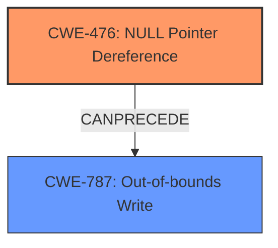

# Enhanced Analysis for CVE-2022-26093

# Summary
| CWE ID | CWE Name | Confidence | CWE Abstraction Level | CWE Vulnerability Mapping Label | CWE-Vulnerability Mapping Notes |
|---|---|---|---|---|---|
| CWE-476 | NULL Pointer Dereference | 1.0 | Base | Allowed | Primary CWE |
| CWE-787 | Out-of-bounds Write | 0.7 | Base | Allowed | Secondary CWE |

## Evidence and Confidence

*   **Confidence Score:** 0.85
*   **Evidence Strength:** HIGH

## Relationship Analysis
The primary relationship is that **CWE-476 (NULL Pointer Dereference)** can lead to **CWE-787 (Out-of-bounds Write)**. The **NULL Pointer Dereference** is the root cause that allows an attacker to perform an **Out-of-bounds Write**, resulting in memory corruption and potential code execution. Both CWEs are at the Base level of abstraction, which is preferred.



## Vulnerability Chain
The vulnerability chain starts with a **NULL Pointer Dereference** (**CWE-476**), which then leads to an **Out-of-bounds Write** (**CWE-787**). The **NULL Pointer Dereference** is the root cause and the **Out-of-bounds Write** is the impact of the vulnerability.

## Summary of Analysis
The initial analysis identified **CWE-476 (NULL Pointer Dereference)** as the primary weakness, supported by the vulnerability description stating "**Null pointer dereference** vulnerability" and the CVE reference links content summary confirming "**Null pointer dereference vulnerability** in some parser functions of libsimba library.". This is further supported by "**weaknesses**: [ "Null pointer dereference" ]".

The vulnerability description also mentions "allows out of bounds write by remote attacker," suggesting a potential impact or consequence of the **NULL Pointer Dereference**. Therefore, **CWE-787 (Out-of-bounds Write)** was considered as a secondary CWE, as the **NULL Pointer Dereference** leads to an **Out-of-bounds Write**.

The graph relationships influenced the final selection by illustrating that **CWE-476** can precede **CWE-787**.

The selected CWEs are at the optimal level of specificity, as they accurately describe the root cause and the immediate impact of the vulnerability, based on the available evidence.

Relevant CWE Information:

# Enhanced Context (25 CWEs)
The following CWEs were identified as potentially relevant to this vulnerability:

## CWE-476: NULL Pointer Dereference
**Abstraction Level**: Base
**Similarity Score**: 0.78
**Source**: dense

**Description**:
The product dereferences a pointer that it expects to be valid but is NULL.

**Mapping Guidance**:
- Usage: Allowed
- Rationale: This CWE entry is at the Base level of abstraction, which is a preferred level of abstraction for mapping to the root causes of vulnerabilities.

## CWE-787: Out-of-bounds Write
**Abstraction Level**: base
**Similarity Score**: 4.33
**Source**: graph

**Description**:
CWE-787: Out-of-bounds Write

**Mapping Guidance**:
- Usage: Allowed
- Rationale: This CWE entry is at the Base level of abstraction, which is a preferred level of abstraction for mapping to the root causes of vulnerabilities.

**Relationships**:
- CANFOLLOW -> CWE-825
- CANFOLLOW -> CWE-824
- CANFOLLOW -> CWE-823
- CANFOLLOW -> CWE-822
- PARENTOF -> CWE-124

## CWE-824: Access of Uninitialized Pointer
**Abstraction Level**: Base
**Similarity Score**: 0.79
**Source**: dense

**Description**:
The product accesses or uses a pointer that has not been initialized.

**Mapping Guidance**:
- Usage: Allowed
- Rationale: This CWE entry is at the Base level of abstraction, which is a preferred level of abstraction for mapping to the root causes of vulnerabilities.

## CWE-457: Use of Uninitialized Variable
**Abstraction Level**: Variant
**Similarity Score**: 0.78
**Source**: dense

**Description**:
The code uses a variable that has not been initialized, leading to unpredictable or unintended results.

**Mapping Guidance**:
- Usage: Allowed
- Rationale: This CWE entry is at the Variant level of abstraction, which is a preferred level of abstraction for mapping to the root causes of vulnerabilities.

## CWE-908: Use of Uninitialized Resource
**Abstraction Level**: Base
**Similarity Score**: 0.79
**Source**: sparse

**Description**:
The product uses or accesses a resource that has not been initialized.

**Mapping Guidance**:
- Usage: Allowed
- Rationale: This CWE entry is at the Base level of abstraction, which is a preferred level of abstraction for mapping to the root causes of vulnerabilities.

## CWE-822: Untrusted Pointer Dereference
**Abstraction Level**: Base
**Similarity Score**: 0.79
**Source**: dense

**Description**:
The product obtains a value from an untrusted source, converts this value to a pointer, and dereferences the resulting pointer.

**Mapping Guidance**:
- Usage: Allowed
- Rationale: This CWE entry is at the Base level of abstraction, which is a preferred level of abstraction for mapping to the root causes of vulnerabilities.

## CWE-120: Buffer Copy without Checking Size of Input ('Classic Buffer Overflow')
**Abstraction Level**: base
**Similarity Score**: 4.33
**Source**: graph

**Description**:
CWE-120: Buffer Copy without Checking Size of Input ('Classic Buffer Overflow')

**Mapping Guidance**:
- Usage: Allowed-with-Review
- Rationale: There are some indications that this CWE ID might be misused and selected simply because it mentions "buffer overflow" - an increasingly vague term. This CWE entry is only appropriate for "Buffer Copy" operations (not buffer reads), in which where there is no "Checking [the] Size of Input", and (by implication of the copy) writing past the end of the buffer.

### CWE Justifications:

*   **CWE-476: NULL Pointer Dereference**
    *   The vulnerability description explicitly states "**Null pointer dereference** vulnerability".
    *   The CVE reference links content summary confirms this: "**Null pointer dereference vulnerability** in some parser functions of libsimba library."
    *   The retriever results and similar CVE descriptions also strongly suggest this CWE.
    *   This CWE is at the Base level of abstraction.
    *   Confidence: 1.0
*   **CWE-787: Out-of-bounds Write**
    *   The vulnerability description indicates that the **NULL Pointer Dereference** "allows out of bounds write by remote attacker".
    *   The CVE reference links content summary shows that the impact is "**Allows out of bounds write by remote attackers**".
    *   This CWE is a consequence of the **NULL Pointer Dereference**, where the code attempts to write data to a memory location outside the intended buffer.
    *   This CWE is at the Base level of abstraction.
    *   Confidence: 0.7

### CWEs Considered but Not Used:

*   **CWE-824: Access of Uninitialized Pointer**, **CWE-457: Use of Uninitialized Variable**, **CWE-908: Use of Uninitialized Resource**, and **CWE-822: Untrusted Pointer Dereference:** These CWEs were considered because they relate to pointer issues, but the description specifically identifies a **NULL Pointer Dereference**, making **CWE-476** a more precise fit.

*   **CWE-120: Buffer Copy without Checking Size of Input ('Classic Buffer Overflow')**: Although the vulnerability leads to an out-of-bounds write (potentially causing a buffer overflow), there is no evidence to suggest that this involves copying a buffer without checking its size. Therefore, **CWE-787** is a more accurate fit.


## CWE Relationship Analysis

Current CWEs represent these abstraction levels: .


### Vulnerability Chain Analysis

**Chain starting from CWE-825:**
- 825 (Expired Pointer Dereference) - ROOT


**Chain starting from CWE-476:**
- 476 (NULL Pointer Dereference) - ROOT


### CWE Relationship Diagram

```mermaid
graph TD
    classDef primary fill:#f96,stroke:#333,stroke-width:2px
    classDef secondary fill:#69f,stroke:#333
    classDef tertiary fill:#9e9,stroke:#333
```