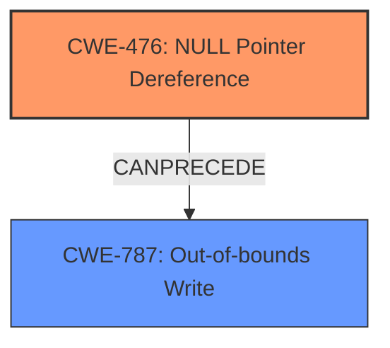

# Raw Analyzer Response for CVE-2022-26094

# Summary
| CWE ID | CWE Name | Confidence | CWE Abstraction Level | CWE Vulnerability Mapping Label | CWE-Vulnerability Mapping Notes |
|---|---|---|---|---|---|
| CWE-476 | NULL Pointer Dereference | 1.0 | Base | Allowed | Primary CWE |
| CWE-787 | Out-of-bounds Write | 0.7 | Base | Allowed | Secondary Candidate CWE |

## Evidence and Confidence

*   **Confidence Score:** 0.85
*   **Evidence Strength:** HIGH

## Relationship Analysis
The primary weakness is a **NULL pointer dereference** (CWE-476), which can lead to an **out-of-bounds write** (CWE-787). CWE-476 is a base-level CWE, providing a specific description of the root cause. CWE-787, also a base-level CWE, describes the resulting **out-of-bounds write**. The relationship between them is that the NULL pointer dereference can precede the out-of-bounds write.

## Vulnerability Chain
The vulnerability chain starts with a **NULL pointer dereference** (CWE-476) and leads to an **out-of-bounds write** (CWE-787).
  - **Root Cause:** **NULL pointer dereference** (CWE-476) in the `parser_auxC` function.
  - **Weakness:** **out-of-bounds write** (CWE-787) caused by the **NULL pointer dereference**.
  - **Impact:** Remote attacker can potentially cause a denial of service or other unexpected behavior.

## Summary of Analysis
The initial assessment identifies **NULL pointer dereference** (CWE-476) as the primary root cause and **out-of-bounds write** (CWE-787) as the resulting weakness, aligning with the vulnerability description and CVE reference details. The provided evidence indicates that a **NULL pointer dereference** occurs within the `libsimba` library's parser functions, leading to an **out-of-bounds write**.

The retriever results and similar CVE descriptions support this assessment, with CWE-476 being the primary match. The relationship analysis confirms that a **NULL pointer dereference** can lead to an **out-of-bounds write**, solidifying the classification.

The final decision emphasizes the root cause and resulting weakness, selecting CWE-476 and CWE-787 as the most appropriate CWEs. These choices are at the base level of abstraction, providing specific details about the vulnerability.

Evidence:
- Vulnerability Description Key Phrases: "**rootcause:** **Null pointer dereference**", "**weakness:** **out of bounds write**"
- CVE Reference Links Content Summary: "Root Cause: A null pointer dereference exists in multiple parser functions within the `libsimba` library.", "Impact: This null pointer dereference can lead to an out-of-bounds write, potentially causing a denial of service or other unexpected behavior."

Other CWEs Considered:

*   CWE-824 (Access of Uninitialized Pointer): While related to pointer issues, the vulnerability description specifically mentions a NULL pointer dereference, making CWE-476 a more precise fit.
*   CWE-125 (Out-of-bounds Read) and CWE-126 (Buffer Over-read): While related to memory access issues, the primary weakness is an out-of-bounds write, not a read.
*   CWE-908 (Use of Uninitialized Resource): Similar to CWE-824, this is a broader category. Since we know it's a pointer that's NULL, CWE-476 is more specific.

Relevant CWE Information:

# Enhanced Context (25 CWEs)
The following CWEs were identified as potentially relevant to this vulnerability:

## CWE-824: Access of Uninitialized Pointer
**Abstraction Level**: Base
**Similarity Score**: 0.78
**Source**: dense

**Description**:
The product accesses or uses a pointer that has not been initialized.

**Mapping Guidance**:
- Usage: Allowed
- Rationale: This CWE entry is at the Base level of abstraction, which is a preferred level of abstraction for mapping to the root causes of vulnerabilities.

## CWE-823: Use of Out-of-range Pointer Offset
**Abstraction Level**: Base
**Similarity Score**: 0.78
**Source**: dense

**Description**:
The product performs pointer arithmetic on a valid pointer, but it uses an offset that can point outside of the intended range of valid memory locations for the resulting pointer.

**Mapping Guidance**:
- Usage: Allowed
- Rationale: This CWE entry is at the Base level of abstraction, which is a preferred level of abstraction for mapping to the root causes of vulnerabilities.

## CWE-125: Out-of-bounds Read
**Abstraction Level**: Base
**Similarity Score**: 0.78
**Source**: dense

**Description**:
The product reads data past the end, or before the beginning, of the intended buffer.

**Mapping Guidance**:
- Usage: Allowed
- Rationale: This CWE entry is at the Base level of abstraction, which is a preferred level of abstraction for mapping to the root causes of vulnerabilities.

## CWE-131: Incorrect Calculation of Buffer Size
**Abstraction Level**: Base
**Similarity Score**: 0.78
**Source**: dense

**Description**:
The product does not correctly calculate the size to be used when allocating a buffer, which could lead to a buffer overflow.

**Mapping Guidance**:
- Usage: Allowed
- Rationale: This CWE entry is at the Base level of abstraction, which is a preferred level of abstraction for mapping to the root causes of vulnerabilities.

## CWE-476: NULL Pointer Dereference
**Abstraction Level**: Base
**Similarity Score**: 0.77
**Source**: dense

**Description**:
The product dereferences a pointer that it expects to be valid but is NULL.

**Mapping Guidance**:
- Usage: Allowed
- Rationale: This CWE entry is at the Base level of abstraction, which is a preferred level of abstraction for mapping to the root causes of vulnerabilities.

## CWE-822: Untrusted Pointer Dereference
**Abstraction Level**: Base
**Similarity Score**: 0.77
**Source**: dense

**Description**:
The product obtains a value from an untrusted source, converts this value to a pointer, and dereferences the resulting pointer.

**Mapping Guidance**:
- Usage: Allowed
- Rationale: This CWE entry is at the Base level of abstraction, which is a preferred level of abstraction for mapping to the root causes of vulnerabilities.

## CWE-252: Unchecked Return Value
**Abstraction Level**: Base
**Similarity Score**: 0.77
**Source**: dense

**Description**:
The product does not check the return value from a method or function, which can prevent it from detecting unexpected states and conditions.

**Mapping Guidance**:
- Usage: Allowed
- Rationale: This CWE entry is at the Base level of abstraction, which is a preferred level of abstraction for mapping to the root causes of vulnerabilities.

## CWE-805: Buffer Access with Incorrect Length Value
**Abstraction Level**: Base
**Similarity Score**: 0.77
**Source**: dense

**Description**:
The product uses a sequential operation to read or write a buffer, but it uses an incorrect length value that causes it to access memory that is outside of the bounds of the buffer.

**Mapping Guidance**:
- Usage: Allowed
- Rationale: This CWE entry is at the Base level of abstraction, which is a preferred level of abstraction for mapping to the root causes of vulnerabilities.

## CWE-126: Buffer Over-read
**Abstraction Level**: Variant
**Similarity Score**: 0.77
**Source**: dense

**Description**:
The product reads from a buffer using buffer access mechanisms such as indexes or pointers that reference memory locations after the targeted buffer.

**Mapping Guidance**:
- Usage: Allowed
- Rationale: This CWE entry is at the Variant level of abstraction, which is a preferred level of abstraction for mapping to the root causes of vulnerabilities.

## CWE-191: Integer Underflow (Wrap or Wraparound)
**Abstraction Level**: Base
**Similarity Score**: 0.77
**Source**: dense

**Description**:
The product subtracts one value from another, such that the result is less than the minimum allowable integer value, which produces a value that is not equal to the correct result.

**Mapping Guidance**:
- Usage: Allowed
- Rationale: This CWE entry is at the Base level of abstraction, which is a preferred level of abstraction for mapping to the root causes of vulnerabilities.

## CWE-252: Unchecked Return Value
**Abstraction Level**: Base
**Similarity Score**: 606