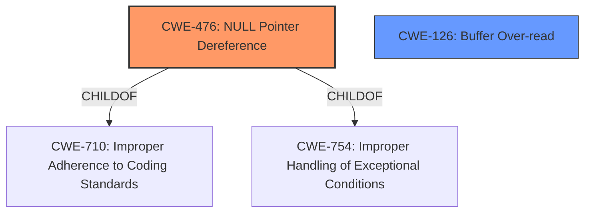

# Analysis for CVE-2022-26099

# Summary
| CWE ID | CWE Name | Confidence | CWE Abstraction Level | CWE Vulnerability Mapping Label | CWE-Vulnerability Mapping Notes |
|---|---|---|---|---|---|
| CWE-476 | NULL Pointer Dereference | 1.0 | Base | Allowed | Primary CWE |
| CWE-126 | Buffer Over-read | 0.7 | Variant | Allowed | Secondary Candidate |

## Evidence and Confidence

*   **Confidence Score:** 0.9
*   **Evidence Strength:** HIGH

## Relationship Analysis
The primary CWE is CWE-476, which is a Base level CWE. The vulnerability description explicitly mentions a **null pointer dereference**. CWE-476 is a child of CWE-710 (Improper Adherence to Coding Standards) and CWE-754 (Improper Handling of Exceptional Conditions). CWE-126 (Buffer Over-read) is considered a secondary candidate because the impact of the **null pointer dereference** leads to an out-of-bounds read.

## Vulnerability Chain
The vulnerability chain starts with a **null pointer dereference** (CWE-476), which leads to an out-of-bounds read (CWE-126).

## Summary of Analysis
The initial analysis focused on the **null pointer dereference** as the root cause, which directly maps to CWE-476. The retriever results also listed CWE-476 as the top candidate. The evidence from the vulnerability description and the CVE Reference Links Content Summary strongly support this mapping. The relationship analysis confirms that CWE-476 is a Base level CWE, and the vulnerability description aligns well with its characteristics.
The possibility of an out-of-bounds read was also considered, leading to CWE-126 as a secondary candidate. This is because the **null pointer dereference** can cause a read operation to access memory outside the intended buffer.

The selected CWEs are at the optimal level of specificity because they accurately represent the root cause (**null pointer dereference**) and the potential impact (out-of-bounds read) of the vulnerability.

Relevant CWE Information:

# Enhanced Context (25 CWEs)

## CWE-476: NULL Pointer Dereference
**Abstraction:** Base
**Similarity Score**: 0.78
**Source**: dense

**Description**:
The product dereferences a pointer that it expects to be valid but is NULL.

**Mapping Guidance**:
- Usage: Allowed
- Rationale: This CWE entry is at the Base level of abstraction, which is a preferred level of abstraction for mapping to the root causes of vulnerabilities.

## CWE-126: Buffer Over-read
**Abstraction:** Variant
**Similarity Score**: 3.25
**Source**: graph

**Description**:
CWE-126: Buffer Over-read

**Mapping Guidance**:
- Usage: Allowed
- Rationale: This CWE entry is at the Variant level of abstraction, which is a preferred level of abstraction for mapping to the root causes of vulnerabilities.

**Relationships**:
- CANFOLLOW -> CWE-170
- CHILDOF -> CWE-788
- CHILDOF -> CWE-125
- PARENTOF -> CWE-126
- CANPRECEDE -> CWE-126

---

**CWE-476**: **NULL Pointer Dereference** is the primary CWE because the vulnerability description explicitly states: "**Null pointer dereference** vulnerability in parser_infe function". The CVE Reference Links Content Summary also confirms this: "root_cause": "Null pointer dereference vulnerability in `parser_infe` function of `libsimba` library.", "weaknesses": ["Null pointer dereference"]. The security implication is that the program attempts to use a memory address that does not point to a valid object, leading to a crash or unexpected behavior.

**CWE-126**: **Buffer Over-read** is a secondary CWE because the vulnerability description also mentions: "allows out of bounds read by remote attackers." This suggests that the **null pointer dereference** can cause a read operation to access memory outside the intended buffer. The security implication is that sensitive information can be exposed.

**CWE-252**: **Unchecked Return Value**, **CWE-824**: **Access of Uninitialized Pointer**, **CWE-456**: **Missing Initialization of a Variable** were considered but not selected as primary CWEs because the vulnerability description specifically identifies a **null pointer dereference** as the root cause. While these CWEs could potentially be related to the vulnerability, there is no direct evidence to support their selection as the primary issue.