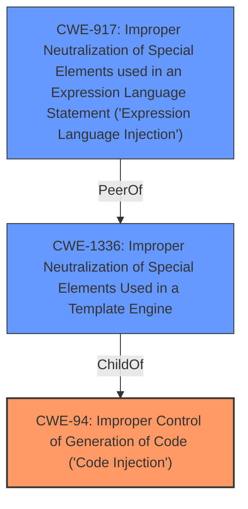

# Enhanced Analysis for CVE-2022-26111

# Summary
| CWE ID | CWE Name | Confidence | CWE Abstraction Level | CWE Vulnerability Mapping Label | CWE-Vulnerability Mapping Notes |
|---|---|---|---|---|---|
| CWE-94 | Improper Control of Generation of Code ('Code Injection') | 0.9 | Base | Allowed-with-Review | Primary CWE |
| CWE-1336 | Improper Neutralization of Special Elements Used in a Template Engine | 0.7 | Base | Allowed | Secondary Candidate |
| CWE-917 | Improper Neutralization of Special Elements used in an Expression Language Statement ('Expression Language Injection') | 0.6 | Base | Allowed | Secondary Candidate |

## Evidence and Confidence

*   **Confidence Score:** 0.8
*   **Evidence Strength:** MEDIUM

## Relationship Analysis
The primary CWE is CWE-94, which represents code injection. CWE-1336 (Template Engine Injection) is a child of CWE-94, representing a specific type of code injection that uses template engines. CWE-917 (Expression Language Injection) is related, as expression languages are often used within templating languages. I have chosen CWE-94 as primary because the description indicates "arbitrary commands" and "Remote Code Execution" which are best represented by general Code Injection.


## Vulnerability Chain
The chain starts with the **weakness** of **Remote Code Execution** via BeanShell expressions. The vulnerability vector is the creation or editing of custom searches, which leads to the execution of arbitrary commands.
  - Root Cause: **Improper Control of Generation of Code ('Code Injection')** (CWE-94)
  - Impact: Execution of arbitrary commands on the target server.

## Summary of Analysis
The initial assessment identified **Remote Code Execution** as the key **weakness**. The selection of CWE-94 is based on the ability to execute arbitrary commands, which matches the description of code injection. The description "The BeanShell components of IRISNext through 9.8.28 allow execution of arbitrary commands on the target server by creating a custom search (or editing an existing/predefined search) of the documents. The search components permit adding BeanShell expressions that result in **Remote Code Execution** in the context of the IRISNext application user, running on the web server." provides sufficient evidence. The graph relationships and retriever results support the selection of CWE-94, CWE-1336 and CWE-917.

Relevant CWE Information:

# Enhanced Context (25 CWEs)

## CWE-917: Improper Neutralization of Special Elements used in an Expression Language Statement ('Expression Language Injection')
**Abstraction Level**: Base
**Similarity Score**: 0.81
**Source**: dense

**Description**:
The product constructs all or part of an expression language (EL) statement in a framework such as a Java Server Page (JSP) using externally-influenced input from an upstream component, but it does not neutralize or incorrectly neutralizes special elements that could modify the intended EL statement before it is executed.

**Mapping Guidance**:
- Usage: Allowed
- Rationale: This CWE entry is at the Base level of abstraction, which is a preferred level of abstraction for mapping to the root causes of vulnerabilities.

**Why Not Used as Primary:** While the vulnerability uses BeanShell expressions, the overall impact is arbitrary command execution, which is more general than just expression language injection. CWE-917 is considered a secondary candidate because BeanShell is an expression language and the vulnerability allows for the injection of expressions.

## CWE-94: Improper Control of Generation of Code ('Code Injection')
**Abstraction Level**: base
**Similarity Score**: 4.33
**Source**: graph

**Description**:
CWE-94: Improper Control of Generation of Code ('Code Injection')

**Mapping Guidance**:
- Usage: Allowed-with-Review
- Rationale: This entry is frequently misused for vulnerabilities with a technical impact of "code execution," which does not by itself indicate a root cause weakness, since dozens of weaknesses can enable code execution.

**Relationships**:
- CANFOLLOW -> CWE-98
- PARENTOF -> CWE-96
- PARENTOF -> CWE-95
- PARENTOF -> CWE-1336
- CHILDOF -> CWE-913

**Why Used as Primary:** The vulnerability description clearly states that arbitrary commands can be executed, which aligns directly with the description of CWE-94. Even though the usage is "Allowed-with-Review", the rationale acknowledges that code execution is the technical impact, and this vulnerability's root cause directly leads to code execution via the insertion of commands.

## CWE-1336: Improper Neutralization of Special Elements Used in a Template Engine
**Abstraction Level**: Base
**Similarity Score**: 0.75
**Source**: dense

**Description**:
The product uses a template engine to insert or process externally-influenced input, but it does not neutralize or incorrectly neutralizes special elements or syntax that can be interpreted as template expressions or other code directives when processed by the engine.

**Mapping Guidance**:
- Usage: Allowed
- Rationale: This CWE entry is at the Base level of abstraction, which is a preferred level of abstraction for mapping to the root causes of vulnerabilities.

**Why Not Used as Primary:** The vulnerability uses BeanShell expressions within the search components, which might be considered a form of templating. However, the core issue is the execution of arbitrary commands, not specifically the improper neutralization of template elements.

## CWE-427: Uncontrolled Search Path Element
**Abstraction Level**: Base
**Similarity Score**: 8328.18
**Source**: sparse

**Description**:
The product uses a fixed or controlled search path to find resources, but one or more locations in that path can be under the control of unintended actors.

**Mapping Guidance**:
- Usage: Allowed
- Rationale: This CWE entry is at the Base level of abstraction, which is a preferred level of abstraction for mapping to the root causes of vulnerabilities.

**Why Not Used:** This CWE relates to the search path used to find resources, and it does not match the vulnerability description. The provided information indicates arbitrary command execution through BeanShell expressions and not through manipulation of the search path.


## CWE Relationship Analysis

Current CWEs represent these abstraction levels: .


### Vulnerability Chain Analysis

**Chain starting from CWE-98:**
- 98 (Improper Control of Filename for Include/Require Statement in PHP Program ('PHP Remote File Inclusion')) - ROOT


**Chain starting from CWE-913:**
- 913 (Improper Control of Dynamically-Managed Code Resources) - ROOT


### CWE Relationship Diagram

```mermaid
graph TD
    classDef primary fill:#f96,stroke:#333,stroke-width:2px
    classDef secondary fill:#69f,stroke:#333
    classDef tertiary fill:#9e9,stroke:#333
```