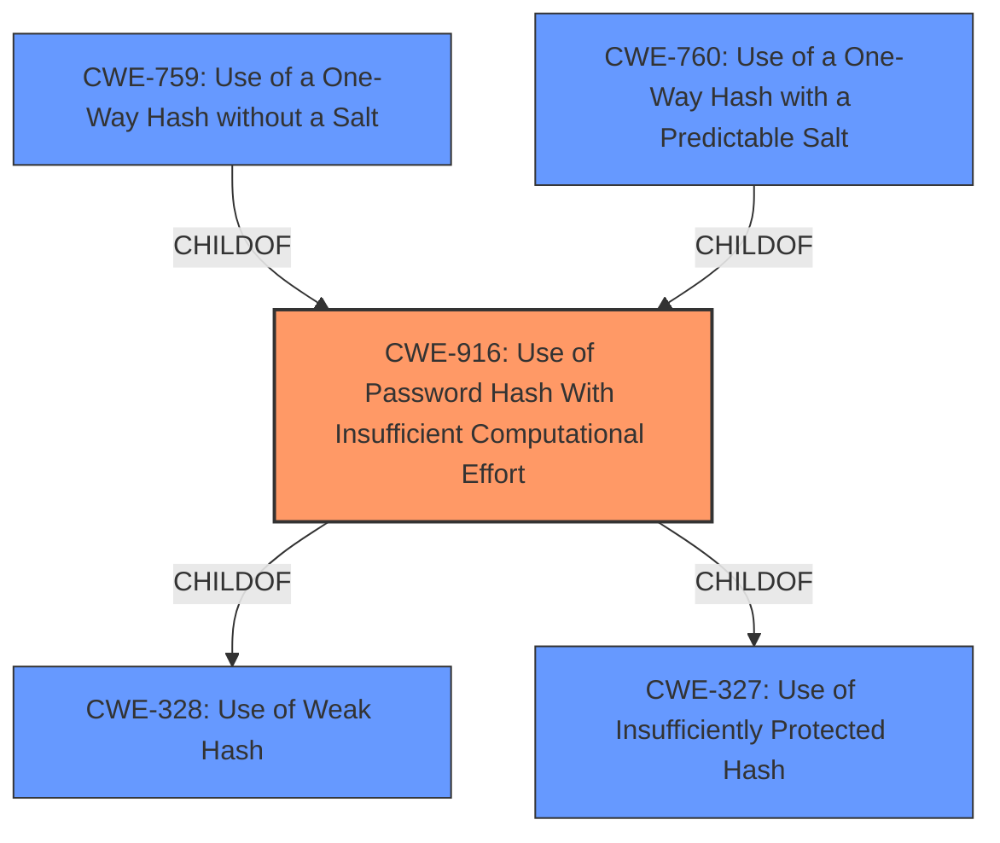

# Raw Analyzer Response for CVE-2022-26115

# Summary
| CWE ID | CWE Name | Confidence | CWE Abstraction Level | CWE Vulnerability Mapping Label | CWE-Vulnerability Mapping Notes |
|---|---|---|---|---|---|
| CWE-916 | Use of Password Hash With Insufficient Computational Effort | 1.0 | Base | Allowed | Primary CWE |

## Evidence and Confidence

*   **Confidence Score:** 1.0
*   **Evidence Strength:** HIGH

## Relationship Analysis
The analysis centers on CWE-916, which is a Base level CWE. The vulnerability description explicitly mentions "**password hash with insufficient computational effort**" aligning directly with the definition of CWE-916. Other CWEs considered, such as CWE-759 and CWE-760, are children of CWE-916, providing more specific scenarios, but the description lacks details to support those more specific cases.

## Vulnerability Chain
The vulnerability chain starts with the **use of a password hash with insufficient computational effort** [CWE-916], leading to a compromised password database and the attacker's ability to recover passwords, ultimately resulting in unauthorized access.

## Summary of Analysis
The initial analysis strongly suggests CWE-916 as the primary weakness, given the explicit mention of "**password hash with insufficient computational effort**" in both the vulnerability description and the CVE reference summary. The retriever results also list CWE-916 as the top candidate.

The analysis is based heavily on the provided evidence, specifically:

*   Vulnerability Description: "A use of **password hash with insufficient computational effort** vulnerability [**CWE-916**] in FortiSandbox before 4.2.0 may allow an attacker with access to the password database to efficiently mount bulk guessing attacks to recover the passwords."
*   CVE Reference Links Content Summary: "The vulnerability stems from the use of a password hash with insufficient computational effort in FortiSandbox. This makes it easier to crack passwords if the password database is compromised."

The graph relationships confirm that CWE-916 is a base-level weakness, and the description aligns perfectly with its definition. Therefore, selecting CWE-916 is at the optimal level of specificity.

**CWEs Considered But Not Used:**

*   **CWE-759 and CWE-760:** These are variants of CWE-916 related to the use of one-way hashes without a salt or with a predictable salt, respectively. While possible, the provided information does not specify whether a salt was used or not, making CWE-916 a more appropriate and general classification.
*   **CWE-328:** This CWE relates to the use of a weak hash algorithm. Although related, the description focuses more on the computational effort rather than the specific hash algorithm being weak.
*   **CWE-311:** Missing Encryption of Sensitive Data was considered, but the description explicitly mentions hashing, not a lack of encryption.
*   **CWE-836:** Use of Password Hash Instead of Password for Authentication was considered but is not applicable because the issue is not about using a hash *instead* of a password, but rather the hash itself being weak.