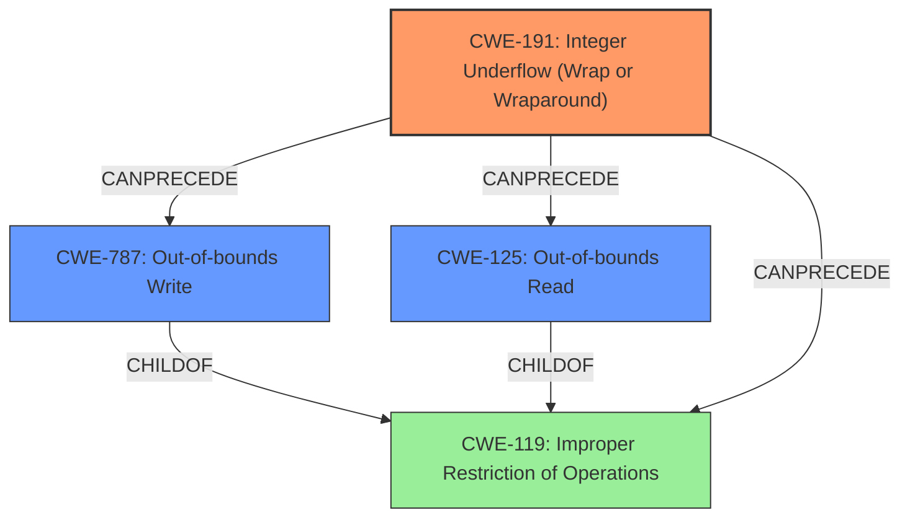

# Enhanced Analysis for CVE-2022-26125

# Summary
| CWE ID | CWE Name | Confidence | CWE Abstraction Level | CWE Vulnerability Mapping Label | CWE-Vulnerability Mapping Notes |
|---|---|---|---|---|---|
| CWE-191 | Integer Underflow (Wrap or Wraparound) | 0.9 | Base | Allowed | Primary CWE |
| CWE-787 | Out-of-bounds Write | 0.8 | Base | Allowed | Secondary Candidate |
| CWE-125 | Out-of-bounds Read | 0.7 | Base | Allowed | Secondary Candidate |

## Evidence and Confidence

*   **Confidence Score:** 0.9
*   **Evidence Strength:** HIGH

## Relationship Analysis
The primary weakness is an Integer Underflow (CWE-191) that leads to an Out-of-bounds Write (CWE-787) or Read (CWE-125). CWE-191 can precede CWE-119 (Improper Restriction of Operations within the Bounds of a Memory Buffer), which is a parent of both CWE-787 and CWE-125. Selecting CWE-191 as the root cause and CWE-787/CWE-125 as consequences provides a more accurate and granular representation of the vulnerability than just using CWE-119.



## Vulnerability Chain
The vulnerability chain starts with an **integer underflow** (CWE-191) in the calculation of buffer lengths, leading to either an **out-of-bounds write** (CWE-787) or an **out-of-bounds read** (CWE-125), and ultimately resulting in a **buffer overflow**.

## Summary of Analysis
Initially, the vulnerability was described as a **buffer overflow**. However, the detailed analysis of CVE-2022-26125 reveals a more complex scenario. The key evidence lies in the "CVE Reference Links Content Summary":

*   "**Integer Overflow:** The subtraction `subtlv_len = subtlv_len - length - 2` using `uint8_t` variables can wrap around, leading to an incorrect `subtlv_len` value and potential buffer over-read/write."

This statement indicates that the root cause is an integer wraparound issue (specifically an underflow since it involves subtraction and results in a value smaller than the minimum), which then leads to the **buffer overflow**. The use of `uint8_t` variables makes the subtraction operation susceptible to wrapping around if the result is negative. This evidence strongly supports classifying the root cause as CWE-191.

The subsequent effects, such as the potential **buffer over-read/write**, are more accurately represented by CWE-125 and CWE-787, respectively. These are consequences of the initial integer underflow.

The Retriever Results also support these classifications. CWE-191 and CWE-787 are both listed, though CWE-119 has the highest score. However, CWE-119 is discouraged when more specific CWEs are available.

Therefore, the final classification focuses on CWE-191 as the primary root cause, and CWE-787 and CWE-125 as contributing factors to the overall vulnerability. These choices are at the Base and Variant levels of abstraction, providing a more granular and accurate representation of the vulnerability than a broader Class-level CWE like CWE-119.


## CWE Relationship Analysis

Current CWEs represent these abstraction levels: .


### Vulnerability Chain Analysis

**Chain starting from CWE-787:**
- 787 (Out-of-bounds Write) - ROOT


**Chain starting from CWE-119:**
- 119 (Improper Restriction of Operations within the Bounds of a Memory Buffer) - ROOT


### CWE Relationship Diagram

```mermaid
graph TD
    classDef primary fill:#f96,stroke:#333,stroke-width:2px
    classDef secondary fill:#69f,stroke:#333
    classDef tertiary fill:#9e9,stroke:#333
```