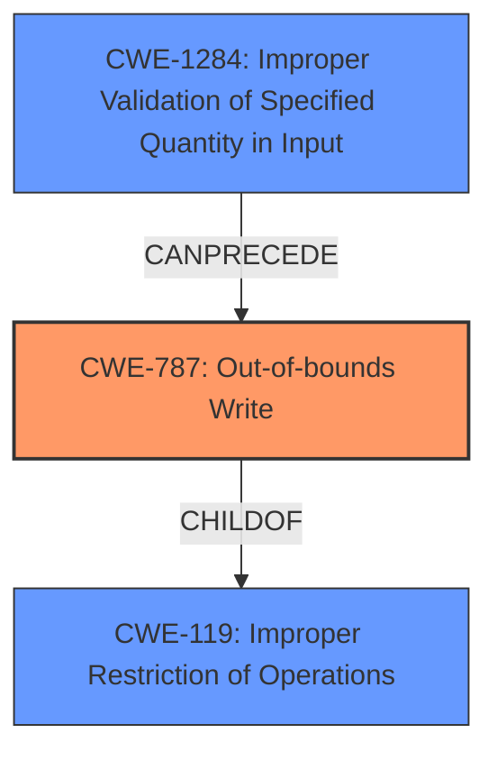

# Enhanced Analysis for CVE-2022-26127

# Summary
| CWE ID  | CWE Name  | Confidence | CWE Abstraction Level | CWE Vulnerability Mapping Label | CWE-Vulnerability Mapping Notes |
| ----------- | ----------- | ----------- | ----------- | ----------- | ----------- |
| CWE-787 | Out-of-bounds Write | 0.75 | Base | Allowed | Primary CWE |
| CWE-1284 | Improper Validation of Specified Quantity in Input | 0.6 | Base | Allowed | Secondary Candidate |
| CWE-119 | Improper Restriction of Operations within the Bounds of a Memory Buffer | 0.5 | Class | Discouraged | Secondary Candidate |

## Evidence and Confidence

*   **Confidence Score:** 0.7
*   **Evidence Strength:** HIGH

## Relationship Analysis
The primary CWE is CWE-787 **Out-of-bounds Write** which is a specific type of buffer overflow. This is related to CWE-119 **Improper Restriction of Operations within the Bounds of a Memory Buffer** through a parent-child relationship, where CWE-787 is a more specific case of CWE-119. The vulnerability also involves **Improper Validation of Specified Quantity in Input** CWE-1284. The attacker provides a `bodylen` that exceeds the actual available `packetlen` minus the header size. This leads to an out-of-bounds write (CWE-787) when the code attempts to read beyond the packet buffer.



## Vulnerability Chain
1.  **Root Cause:** **Missing Input Validation** (The code lacks the validation to ensure the packet size is sufficient for the announced body length)
2.  **Weakness:** **Improper Validation of Specified Quantity in Input** (CWE-1284): The `bodylen` is not validated against the `packetlen`.
3.  **Resulting Weakness:** **Out-of-bounds Write** (CWE-787): Because the length isn't validated, the code attempts to read beyond the bounds of the packet buffer.
4.  **Impact:** Heap **buffer overflow**, potentially leading to Remote Code Execution or Denial of Service.

## Summary of Analysis
Initially, the primary CWE match was CWE-1284 **Improper Validation of Specified Quantity in Input**. However, after analyzing the CVE description, it became evident that the **missing check on the input packet length** directly leads to a **buffer overflow** due to an out-of-bounds write. Thus, CWE-787 **Out-of-bounds Write** is a more accurate primary classification since it describes the direct consequence of the missing input validation.

The vulnerability description states: "A **buffer overflow** vulnerability exists in FRRouting through 8.1.0 due to missing a check on the input packet length in the babel_packet_examin function in babeld/message.c." Also, the CVE Reference Links Content Summary states: "**Buffer Overflow:** When `packetlen` is less than `bodylen + 4`, the code attempts to read beyond the bounds of the packet buffer, leading to a heap buffer overflow."

CWE-1284 is still relevant as the root cause, but CWE-787 represents the direct vulnerability. CWE-119 is too general and discouraged.

Therefore, the final selection is:

*   **Primary:** CWE-787 **Out-of-bounds Write** because it is the direct result of the vulnerability.
*   **Secondary:** CWE-1284 **Improper Validation of Specified Quantity in Input** because it is the root cause.
*   **Considered but not used:** CWE-119 **Improper Restriction of Operations within the Bounds of a Memory Buffer** because it is too general.


## CWE Relationship Analysis

Current CWEs represent these abstraction levels: .


### Vulnerability Chain Analysis

**Chain starting from CWE-1284:**
- 1284 (Improper Validation of Specified Quantity in Input) - ROOT


**Chain starting from CWE-787:**
- 787 (Out-of-bounds Write) - ROOT


### CWE Relationship Diagram

```mermaid
graph TD
    classDef primary fill:#f96,stroke:#333,stroke-width:2px
    classDef secondary fill:#69f,stroke:#333
    classDef tertiary fill:#9e9,stroke:#333
```