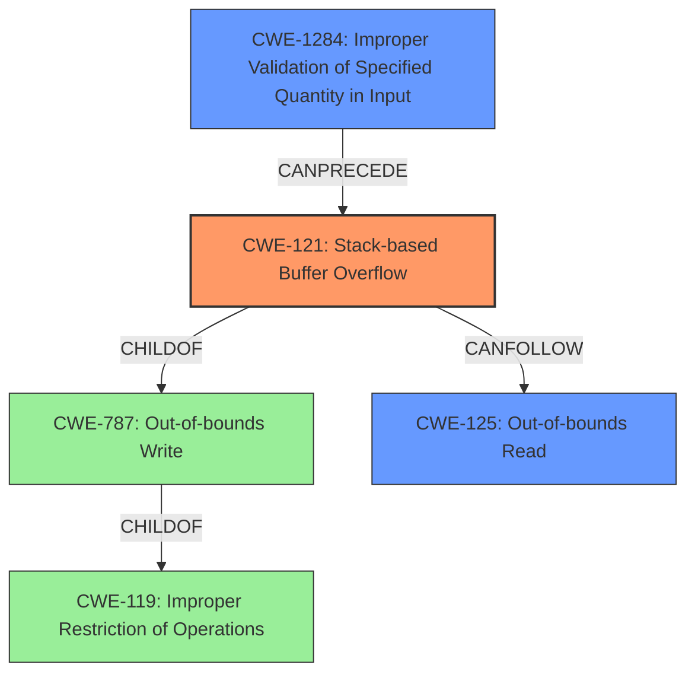

# Raw Analyzer Response for CVE-2022-26129

# Summary
| CWE ID    | CWE Name                                                              | Confidence | CWE Abstraction Level | CWE Vulnerability Mapping Label | CWE-Vulnerability Mapping Notes |
| --------- | --------------------------------------------------------------------- | ---------- | ----------------------- | ------------------------------- | ------------------------------- |
| CWE-121   | Stack-based Buffer Overflow                                             | 0.9        | Variant               | Primary                         | Allowed                       |
| CWE-1284  | Improper Validation of Specified Quantity in Input                     | 0.7        | Base                  | Secondary                       | Allowed                       |
| CWE-125   | Out-of-bounds Read                                                        | 0.6        | Base                  | Secondary                       | Allowed                       |

## Evidence and Confidence

*   **Confidence Score:** 0.8
*   **Evidence Strength:** HIGH

## Relationship Analysis
The primary CWE is CWE-121, a variant of CWE-787 (Out-of-bounds Write) and CWE-119 (Improper Restriction of Operations within the Bounds of a Memory Buffer). CWE-1284, representing the **improper validation of the sub-TLV length**, can precede the buffer overflow. CWE-125, the out-of-bounds read, is a consequence of the **incorrect length check**, and is also related to CWE-119. The abstraction levels influenced the selection, favoring the more specific Variant (CWE-121) and Base (CWE-1284, CWE-125) levels.

## Vulnerability Chain
The vulnerability chain starts with **improper validation of the sub-TLV length** (CWE-1284), leading to a **stack-based buffer overflow** (CWE-121), and resulting in an **out-of-bounds read** (CWE-125).

## Summary of Analysis
The initial assessment identified a **stack-based buffer overflow** due to **incorrect length checks**. The evidence supports this assessment, as the vulnerability description explicitly mentions "wrong checks on the subtlv length" leading to a "stack-based buffer overflow" in FRRouting. The CVE Reference Links Content Summary confirms the **incorrect loop condition checks** leading to an **out-of-bounds read**.

The graph relationships highlight how the **improper input validation** can lead to a **buffer overflow**, and subsequently, to an **out-of-bounds read**. The selected CWEs are at the optimal level of specificity, with CWE-121 accurately representing the type of buffer overflow and CWE-1284 capturing the **root cause of the input validation issue**.

*   **CWE-121: Stack-based Buffer Overflow:** This is the primary CWE because the vulnerability description explicitly mentions a "stack-based buffer overflow." The description aligns perfectly with the definition of CWE-121, which is a buffer overflow that occurs when the buffer being overwritten is allocated on the stack.
    *   *Evidence:* "Buffer overflow vulnerabilities exist in FRRouting through 8.1.0 due to **wrong checks on the subtlv length** in the functions, parse_hello_subtlv, parse_ihu_subtlv, and parse_update_subtlv in babeld/message.c." and "**weakness:** **stack-based buffer overflow**"
*   **CWE-1284: Improper Validation of Specified Quantity in Input:** This CWE is selected as a secondary CWE because the **root cause** of the vulnerability is due to **incorrect checks on the subtlv length**. The code does not properly validate the size or length of the sub-TLV, which leads to the buffer overflow.
    *   *Evidence:* "The vulnerability stems from incorrect checks on the sub-TLV length within the `parse_hello_subtlv`, `parse_ihu_subtlv`, and `parse_update_subtlv` functions in `babeld/message.c`."
*   **CWE-125: Out-of-bounds Read:** This CWE is a secondary effect of the **incorrect length checks**, where the code attempts to read data beyond the allocated buffer. The "CVE Reference Links Content Summary" section mentions "Out-of-Bounds Read: Due to the incorrect checks, the code can attempt to read beyond the allocated buffer when accessing `a[i + 1]` to retrieve the length and when processing the sub-TLV data."

CWE-119 (Improper Restriction of Operations within the Bounds of a Memory Buffer) was considered but not selected as the primary CWE because it is a class-level CWE and more specific CWEs (CWE-121) are available.

Relevant CWE Information:

# Enhanced Context (25 CWEs)
The following CWEs were identified as potentially relevant to this vulnerability:

## CWE-191: Integer Underflow (Wrap or Wraparound)
**Abstraction Level**: Base
**Similarity Score**: 0.78
**Source**: dense

**Description**:
The product subtracts one value from another, such that the result is less than the minimum allowable integer value, which produces a value that is not equal to the correct result.

**Mapping Guidance**:
- Usage: Allowed
- Rationale: This CWE entry is at the Base level of abstraction, which is a preferred level of abstraction for mapping to the root causes of vulnerabilities.

## CWE-131: Incorrect Calculation of Buffer Size
**Abstraction Level**: Base
**Similarity Score**: 0.78
**Source**: dense

**Description**:
The product does not correctly calculate the size to be used when allocating a buffer, which could lead to a buffer overflow.

**Mapping Guidance**:
- Usage: Allowed
- Rationale: This CWE entry is at the Base level of abstraction, which is a preferred level of abstraction for mapping to the root causes of vulnerabilities.

## CWE-805: Buffer Access with Incorrect Length Value
**Abstraction Level**: Base
**Similarity Score**: 0.78
**Source**: dense

**Description**:
The product uses a sequential operation to read or write a buffer, but it uses an incorrect length value that causes it to access memory that is outside of the bounds of the buffer.

**Mapping Guidance**:
- Usage: Allowed
- Rationale: This CWE entry is at the Base level of abstraction, which is a preferred level of abstraction for mapping to the root causes of vulnerabilities.

## CWE-124: Buffer Underwrite ('Buffer Underflow')
**Abstraction Level**: Base
**Similarity Score**: 0.77
**Source**: dense

**Description**:
The product writes to a buffer using an index or pointer that references a memory location prior to the beginning of the buffer.

**Mapping Guidance**:
- Usage: Allowed
- Rationale: This CWE entry is at the Base level of abstraction, which is a preferred level of abstraction for mapping to the root causes of vulnerabilities.

## CWE-680: Integer Overflow to Buffer Overflow
**Abstraction Level**: Compound
**Similarity Score**: 0.75
**Source**: dense

**Description**:
The product performs a calculation to determine how much memory to allocate, but an integer overflow can occur that causes less memory to be allocated than expected, leading to a buffer overflow.

**Mapping Guidance**:
- Usage: Discouraged
- Rationale: This CWE entry is a named chain, which combines multiple weaknesses.

## CWE-126: Buffer Over-read
**Abstraction Level**: Variant
**Similarity Score**: 0.75
**Source**: dense

**Description**:
The product reads from a buffer using buffer access mechanisms such as indexes or pointers that reference memory locations after the targeted buffer.

**Mapping Guidance**:
- Usage: Allowed
- Rationale: This CWE entry is at the Variant level of abstraction, which is a preferred level of abstraction for mapping to the root causes of vulnerabilities.

## CWE-127: Buffer Under-read
**Abstraction Level**: Variant
**Similarity Score**: 0.74
**Source**: dense

**Description**:
The product reads from a buffer using buffer access mechanisms such as indexes or pointers that reference memory locations prior to the targeted buffer.

**Mapping Guidance**:
- Usage: Allowed
-