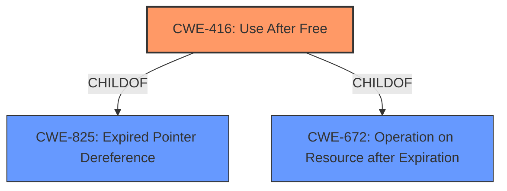

# Raw Analyzer Response for CVE-2022-2613

# Summary
| CWE ID | CWE Name | Confidence | CWE Abstraction Level | CWE Vulnerability Mapping Label | CWE-Vulnerability Mapping Notes |
|---|---|---|---|---|---|
| CWE-416 | Use After Free | 1.0 | Variant | Primary | Allowed |

## Evidence and Confidence

*   **Confidence Score:** 1.0
*   **Evidence Strength:** HIGH

## Relationship Analysis
The primary identified CWE is CWE-416 (Use After Free), which is a Variant level CWE. This vulnerability occurs when memory is reused or referenced after it has been freed, potentially leading to exploitable conditions such as heap corruption. CWE-416 is a child of CWE-825 (Expired Pointer Dereference) and CWE-672 (Operation on Resource after Expiration). The relationship between these CWEs highlights a hierarchy where a broader category of expired resource usage can lead to a specific instance of use-after-free.

## Vulnerability Chain
The vulnerability chain starts with a **use after free** condition which leads to **heap corruption** as the impact of the vulnerability.

## Summary of Analysis
The analysis strongly supports classifying this vulnerability as CWE-416 (Use After Free). The vulnerability description explicitly mentions "use after free" as the root cause. The description states: "Use after free in Input in Google Chrome on Chrome OS prior to 104.0.5112.79 allowed a remote attacker who convinced a user to engage in specific user interactions to potentially exploit **heap corruption** via specific UI interactions." The CVE reference summary also confirms "Use after free" as the root cause.

The retriever results also support this classification, with CWE-416 being the top match. The mapping guidance for CWE-416 indicates that it is at the Variant level of abstraction, which is the preferred level.

Based on the evidence, relationship analysis, and mapping guidance, CWE-416 is the most appropriate classification for this vulnerability.