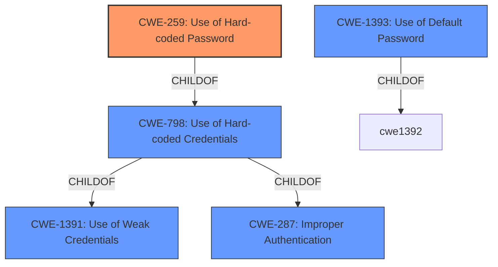

# Analysis Report for CVE-2022-26138

# Vulnerability Analysis Report: CVE-2022-26138

## Description


## Analysis (with Relationship Data)

# Summary
| CWE ID | CWE Name | Confidence | CWE Abstraction Level | CWE Vulnerability Mapping Label | CWE-Vulnerability Mapping Notes |
|---|---|---|---|---|---|
| CWE-259 | Use of Hard-coded Password | 1.0 | Variant | Allowed | Primary CWE |
| CWE-798 | Use of Hard-coded Credentials | 0.8 | Base | Allowed | Secondary Candidate |
| CWE-1393 | Use of Default Password | 0.6 | Base | Allowed | Secondary Candidate |

## Evidence and Confidence

*   **Confidence Score:** 0.9
*   **Evidence Strength:** HIGH

## Relationship Analysis
The primary weakness is the **use of a hard-coded password**, specifically CWE-259. This is a variant of the more general CWE-798, which describes the **use of hard-coded credentials**. CWE-259 is more specific because it focuses on passwords, while CWE-798 can also include cryptographic keys. CWE-798 is a child of CWE-1391, Use of Weak Credentials, and CWE-287 Improper Authentication. CWE-1393, Use of Default Password, is related, but less specific than CWE-259 because the password is not only a default, but also hard-coded.



## Vulnerability Chain
The vulnerability chain starts with the **hard-coded password** (CWE-259), which allows a remote, unauthenticated attacker to log into Confluence and access content (impact).

## Summary of Analysis
The initial analysis identified several candidate CWEs, with CWE-259, CWE-798 and CWE-1393 being the most relevant.
The vulnerability description and CVE reference links content summary clearly indicate the **root cause** is the **use of a hard-coded password** for the `disabledsystemuser` account. This allows an attacker to bypass authentication and access sensitive information.

*   **CWE-259: Use of Hard-coded Password** is the most specific and accurate match. The vulnerability description explicitly states that the application creates a user account with a **hardcoded password**. The "CVE Reference Links Content Summary" also highlights the **hardcoded password** as a key weakness. The description of CWE-259 aligns perfectly: "The product contains a hard-coded password, which it uses for its own inbound authentication or for outbound communication to external components." The abstraction level is Variant, which is preferred.
*   **CWE-798: Use of Hard-coded Credentials** is a more general case of CWE-259, as it covers all types of hard-coded credentials (passwords, keys, etc.). While applicable, it is less specific than CWE-259. The description matches: "The product contains hard-coded credentials, such as a password or cryptographic key." The abstraction level is Base.
*   **CWE-1393: Use of Default Password** is also applicable, as the **hard-coded password** can be considered a default password. However, the "hard-coded" aspect is the primary concern here, making CWE-259 a better fit.
*   Other CWEs like CWE-321 (Use of Hard-coded Cryptographic Key) and CWE-917 (Improper Neutralization of Special Elements used in an Expression Language Statement) are not relevant because the vulnerability does not involve cryptographic keys or expression language injection.

The final selection of CWE-259 is based on the explicit mention of a **hard-coded password** in the vulnerability description and supporting evidence. This CWE is at the optimal level of specificity (Variant) and directly addresses the root cause of the vulnerability.


## CWE Relationship Analysis

Current CWEs represent these abstraction levels: .


### Vulnerability Chain Analysis

**Chain starting from CWE-321:**
- 321 (Use of Hard-coded Cryptographic Key) - ROOT


**Chain starting from CWE-259:**
- 259 (Use of Hard-coded Password) - ROOT


### CWE Relationship Diagram

```mermaid
graph TD
    classDef primary fill:#f96,stroke:#333,stroke-width:2px
    classDef secondary fill:#69f,stroke:#333
    classDef tertiary fill:#9e9,stroke:#333
```


*Report generated on 2025-03-30 14:58:10*
