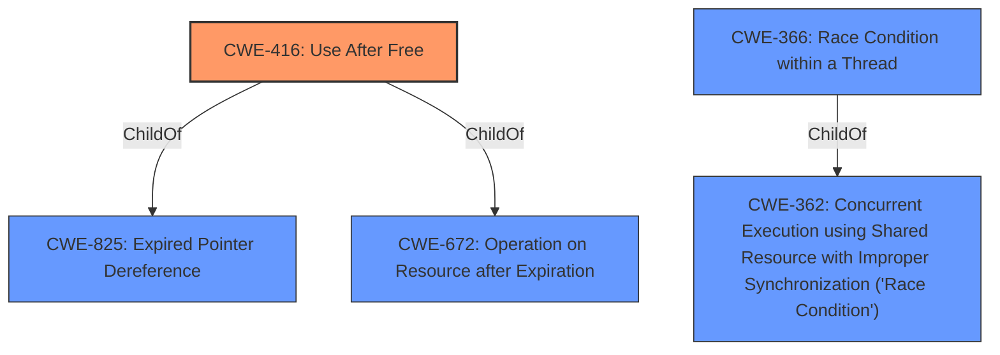

# Analysis for CVE-2022-2617

# Summary
| CWE ID  | CWE Name                      | Confidence | CWE Abstraction Level | CWE Vulnerability Mapping Label | CWE-Vulnerability Mapping Notes |
|---------|-------------------------------|------------|-----------------------|---------------------------------|---------------------------------|
| CWE-416 | Use After Free                | 1          | Variant               | Primary                         | Allowed                         |
| CWE-366 | Race Condition within a Thread | 0.6        | Base                  | Secondary                       | Allowed                         |

## Evidence and Confidence

*   **Confidence Score:** 0.8
*   **Evidence Strength:** HIGH

## Relationship Analysis
The primary CWE is CWE-416, "Use After Free," which is a variant-level CWE. This is related to CWE-825 "Expired Pointer Dereference," and CWE-672 "Operation on Resource after Expiration". CWE-366 "Race Condition within a Thread" is a base level CWE and related to CWE-362 "Concurrent Execution using Shared Resource with Improper Synchronization ('Race Condition')"

## Vulnerability Chain
The vulnerability chain starts with a **use after free** (**CWE-416**) in the Extensions API of Google Chrome. This **use after free** can lead to heap corruption. An attacker can trigger this by convincing a user to install a malicious extension and performing specific UI interactions.

## Summary of Analysis
The primary weakness is **CWE-416: Use After Free**, indicated by the vulnerability description. The key phrase "**rootcause: use after free**" strongly suggests this CWE. The CVE Reference Links Content Summary also confirms this with the statement: "root_cause: Use after free in Extensions API" and the weaknesses listed as "**Use after free**". The impact is heap corruption, which can potentially lead to remote code execution. This aligns well with the description of **CWE-416**, which involves reusing memory after it has been freed, potentially leading to invalid operations.

The retriever results and similar CVE descriptions list **CWE-416** as the primary match, further reinforcing this choice. The abstraction level of **Variant** for **CWE-416** is appropriate as it's a specific type of memory management error.

**CWE-366: Race Condition within a Thread** was also considered as a secondary CWE, due to Extension API, UI interactions, and the retriever results. There isn't sufficient evidence to confirm a race condition, so it is a secondary candidate.

Other CWEs considered but not used:
*   CWE-122: Heap-based Buffer Overflow - While heap corruption is mentioned, the root cause is **use after free**, not a buffer overflow directly.
*   CWE-451: User Interface (UI) Misrepresentation of Critical Information - The UI interaction is a vector but the root cause isn't misrepresentation.
*   CWE-356: Product UI does not Warn User of Unsafe Actions - Similar to **CWE-451**, the UI is involved, but the core issue is memory management.

Relevant CWE Information:

# Enhanced Context (25 CWEs)
The following CWEs were identified as potentially relevant to this vulnerability:

## CWE-356: Product UI does not Warn User of Unsafe Actions
**Abstraction Level**: Base
**Similarity Score**: 0.80
**Source**: dense

**Description**:
The product's user interface does not warn the user before undertaking an unsafe action on behalf of that user. This makes it easier for attackers to trick users into inflicting damage to their system.

**Mapping Guidance**:
- Usage: Allowed
- Rationale: This CWE entry is at the Base level of abstraction, which is a preferred level of abstraction for mapping to the root causes of vulnerabilities.

## CWE-451: User Interface (UI) Misrepresentation of Critical Information
**Abstraction Level**: Class
**Similarity Score**: 0.76
**Source**: dense

**Description**:
The user interface (UI) does not properly represent critical information to the user, allowing the information - or its source - to be obscured or spoofed. This is often a component in phishing attacks.

**Mapping Guidance**:
- Usage: Allowed-with-Review
- Rationale: This CWE entry is a Class and might have Base-level children that would be more appropriate

## CWE-404: Improper Resource Shutdown or Release
**Abstraction Level**: Class
**Similarity Score**: 0.76
**Source**: dense

**Description**:
The product does not release or incorrectly releases a resource before it is made available for re-use.

**Mapping Guidance**:
- Usage: Allowed-with-Review
- Rationale: This CWE entry is a Class and might have Base-level children that would be more appropriate

## CWE-226: Sensitive Information in Resource Not Removed Before Reuse
**Abstraction Level**: Base
**Similarity Score**: 0.75
**Source**: dense

**Description**:
The product releases a resource such as memory or a file so that it can be made available for reuse, but it does not clear or "zeroize" the information contained in the resource before the product performs a critical state transition or makes the resource available for reuse by other entities.

**Mapping Guidance**:
- Usage: Allowed
- Rationale: This CWE entry is at the Base level of abstraction, which is a preferred level of abstraction for mapping to the root causes of vulnerabilities.

## CWE-366: Race Condition within a Thread
**Abstraction Level**: Base
**Similarity Score**: 0.75
**Source**: dense

**Description**:
If two threads of execution use a resource simultaneously, there exists the possibility that resources may be used while invalid, in turn making the state of execution undefined.

**Mapping Guidance**:
- Usage: Allowed
- Rationale: This CWE entry is at the Base level of abstraction, which is a preferred level of abstraction for mapping to the root causes of vulnerabilities.

## CWE-667: Improper Locking
**Abstraction Level**: Class
**Similarity Score**: 0.75
**Source**: dense

**Description**:
The product does not properly acquire or release a lock on a resource, leading to unexpected resource state changes and behaviors.

**Mapping Guidance**:
- Usage: Allowed-with-Review
- Rationale: This CWE entry is a Class and might have Base-level children that would be more appropriate

## CWE-754: Improper Check for Unusual or Exceptional Conditions
**Abstraction Level**: Class
**Similarity Score**: 0.74
**Source**: dense

**Description**:
The product does not check or incorrectly checks for unusual or exceptional conditions that are not expected to occur frequently during day to day operation of the product.

**Mapping Guidance**:
- Usage: Allowed-with-Review
- Rationale: This CWE entry is a Class and might have Base-level children that would be more appropriate

## CWE-1289: Improper Validation of Unsafe Equivalence in Input
**Abstraction Level**: Base
**Similarity Score**: 0.74
**Source**: dense

**Description**:
The product receives an input value that is used as a resource identifier or other type of reference, but it does not validate or incorrectly validates that the input is equivalent to a potentially-unsafe value.

**Mapping Guidance**:
- Usage: Allowed
- Rationale: This CWE entry is at the Base level of abstraction, which is a preferred level of abstraction for mapping to the root causes of vulnerabilities.

## CWE-416: Use After Free
**Abstraction Level**: Variant
**Similarity Score**: 0.74
**Source**: dense

**Description**:
The product reuses or references memory after it has been freed. At some point afterward, the memory may be allocated again and saved in another pointer, while the original pointer references a location somewhere within the new allocation. Any operations using the original pointer are no longer valid because the memory "belongs" to the code that operates on the new pointer.

**Mapping Guidance**:
- Usage: Allowed
- Rationale: This CWE entry is at the Variant level of abstraction, which is a preferred level of abstraction for mapping to the root causes of vulnerabilities.

## CWE-357: Insufficient UI Warning of Dangerous Operations
**Abstraction Level**: Base
**Similarity Score**: 0.74
**