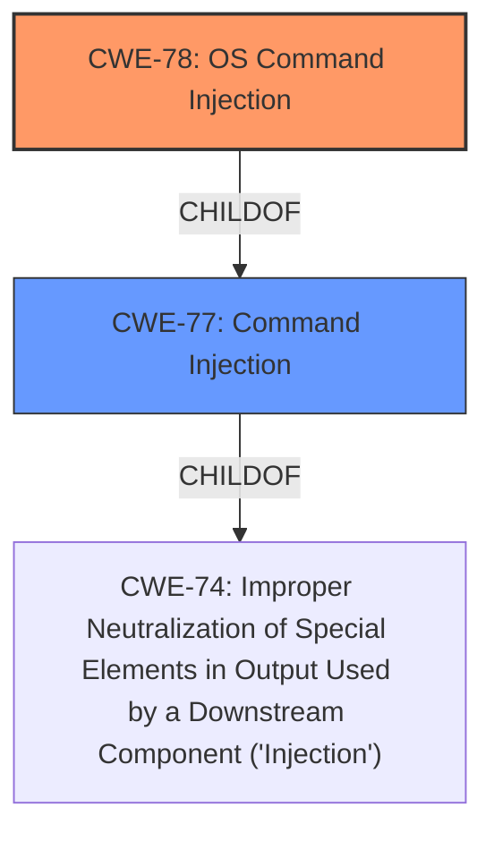

# Analysis Report for CVE-2022-26187

# Vulnerability Analysis Report: CVE-2022-26187

## Description


## Analysis (with Relationship Data)

# Summary
| CWE ID | CWE Name | Confidence | CWE Abstraction Level | CWE Vulnerability Mapping Label | CWE-Vulnerability Mapping Notes |
|---|---|---|---|---|---|
| CWE-78 | Improper Neutralization of Special Elements used in an OS Command ('OS Command Injection') | 1.0 | Base | Allowed | Primary CWE |
| CWE-77 | Improper Neutralization of Special Elements used in a Command ('Command Injection') | 0.7 | Class | Allowed-with-Review | Secondary Candidate |

## Evidence and Confidence

*   **Confidence Score:** 0.9
*   **Evidence Strength:** MEDIUM

## Relationship Analysis
The primary CWE is CWE-78, which is a base-level CWE and a child of CWE-77. CWE-77 is a more general class-level CWE. The relationship indicates that CWE-78 is a specific type of command injection related to OS commands.



## Vulnerability Chain
The vulnerability chain starts with the **improper neutralization** of special elements in the pingCheck function, leading to **OS command injection**.

## Summary of Analysis
The vulnerability description clearly states "**command injection** vulnerability via the pingCheck function." The Retriever Results lists CWE-77 and CWE-78 as the top candidates. CWE-78, "Improper Neutralization of Special Elements used in an OS Command ('OS Command Injection')" is a Base level CWE, which is preferred. Since the context is network-related and the vulnerable function is named "pingCheck," it's highly probable that the command injection involves OS commands.

The evidence directly supports CWE-78. While CWE-77 could also apply, it is less specific. The vulnerability involves the execution of commands on the operating system. Therefore, CWE-78 is the more appropriate choice.

Relevant CWE Information:

# Enhanced Context (25 CWEs)
The following CWEs were identified as potentially relevant to this vulnerability:

## CWE-74: Improper Neutralization of Special Elements in Output Used by a Downstream Component ('Injection')
**Abstraction Level**: Class
**Similarity Score**: 0.78
**Source**: dense

**Description**:
The product constructs all or part of a command, data structure, or record using externally-influenced input from an upstream component, but it does not neutralize or incorrectly neutralizes special elements that could modify how it is parsed or interpreted when it is sent to a downstream component.

**Mapping Guidance**:
- Usage: Discouraged
- Rationale: CWE-74 is high-level and often misused when lower-level weaknesses are more appropriate.

## CWE-77: Improper Neutralization of Special Elements used in a Command ('Command Injection')
**Abstraction Level:** Class
**Status:** Draft

### Description
The product constructs all or part of a command using externally-influenced input from an upstream component, but it does not neutralize or incorrectly neutralizes special elements that could modify the intended command when it is sent to a downstream component.

### Extended Description
Many protocols and products have their own custom command language. While OS or shell command strings are frequently discovered and targeted, developers may not realize that these other command languages might also be vulnerable to attacks.

### Relationships
ChildOf -> CWE-74

### Mapping Guidance
**Usage:** Allowed-with-Review
**Rationale:** CWE-77 is often misused when OS command injection (CWE-78) was intended instead [REF-1287].

## CWE-78: Improper Neutralization of Special Elements used in an OS Command ('OS Command Injection')
**Abstraction:** Base
**Status:** Stable

### Description
The product constructs all or part of an OS command using externally-influenced input from an upstream component, but it does not neutralize or incorrectly neutralizes special elements that could modify the intended OS command when it is sent to a downstream component.

### Relationships
ChildOf -> CWE-77
ChildOf -> CWE-74

### Mapping Guidance
**Usage:** Allowed
**Rationale:** This CWE entry is at the Base level of abstraction, which is a preferred level of abstraction for mapping to the root causes of vulnerabilities.

CWE-77 was considered but not chosen as the primary because it is a more general class. CWE-78 is more specific to OS commands, aligning better with the "pingCheck" function context.
CWE-74 was not selected because it is a very high-level class.

CWE-184, CWE-138, CWE-116, CWE-95, CWE-79, CWE-434, CWE-22, CWE-259, CWE-321, CWE-98, CWE-426, CWE-257, CWE-80, CWE-73, CWE-1289, CWE-134, CWE-917, CWE-653, CWE-88, CWE-94, CWE-96, CWE-790, CWE-121, CWE-294 were not considered because they did not match the vulnerability description.


## CWE Relationship Analysis

Current CWEs represent these abstraction levels: .


### Vulnerability Chain Analysis

**Chain starting from CWE-259:**
- 259 (Use of Hard-coded Password) - ROOT


**Chain starting from CWE-917:**
- 917 (Improper Neutralization of Special Elements used in an Expression Language Statement ('Expression Language Injection')) - ROOT


### CWE Relationship Diagram

```mermaid
graph TD
    classDef primary fill:#f96,stroke:#333,stroke-width:2px
    classDef secondary fill:#69f,stroke:#333
    classDef tertiary fill:#9e9,stroke:#333
```


*Report generated on 2025-03-30 13:01:23*
