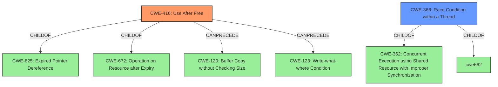

# Enhanced Analysis for CVE-2022-2620

# Summary
| CWE ID | CWE Name | Confidence | CWE Abstraction Level | CWE Vulnerability Mapping Label | CWE-Vulnerability Mapping Notes |
|---|---|---|---|---|---|
| CWE-416 | Use After Free | 1.0 | Variant | Allowed | Primary CWE |
| CWE-366 | Race Condition within a Thread | 0.6 | Base | Allowed | Secondary Candidate |

## Evidence and Confidence

*   **Confidence Score:** 0.9
*   **Evidence Strength:** HIGH

## Relationship Analysis
The primary CWE, CWE-416 (Use After Free), is a Variant and is part of a CanPrecede chain involving CWE-120 (Buffer Copy without Checking Size) and CWE-123 (Write-what-where Condition). It's also a child of CWE-825 (Expired Pointer Dereference) and CWE-672 (Operation on Resource after Expiry). CWE-366 (Race Condition within a Thread), a potential secondary CWE, is a Base level weakness and a child of CWE-362 (Concurrent Execution using Shared Resource with Improper Synchronization) and CWE-662 (Operation on Resource after Expiry).



## Vulnerability Chain
The vulnerability chain starts with a **use-after-free** condition (CWE-416) occurring in the WebUI component. This leads to **heap corruption**, potentially allowing a remote attacker to execute arbitrary code. The attacker exploits this by convincing a user to engage in specific UI interactions.

## Summary of Analysis
The primary assessment is based on the clear identification of a **use-after-free** vulnerability in the provided vulnerability description and CVE details:

*   "**rootcause:** **use after free**"
*   "**Weaknesses/vulnerabilities present:** Use-after-free (UAF). This occurs when a program attempts to access memory after it has been freed, leading to unpredictable behavior, crashes, or security vulnerabilities."

This aligns directly with CWE-416 (Use After Free), which describes the condition where memory is reused or referenced after it has been freed. The description notes that this can lead to the original pointer referencing an invalid memory location, which matches the vulnerability's potential for **heap corruption** and remote code execution.

CWE-366 (Race Condition within a Thread) was considered because the vulnerability occurs in WebUI, which likely involves multiple threads. The CVE details don't explicitly mention a race condition, but the possibility exists that the **use-after-free** is triggered due to concurrent access to the freed memory. The observed examples of CWE-366 include CVE-2022-2621 that notes a chain "two threads in a web browser use the same resource (CWE-366), but one of those threads can destroy the resource before the other has completed (CWE-416)." This chain aligns with this Chrome vulnerability. However, without explicit evidence of a race condition, CWE-416 is the more direct and accurate mapping.

CWE-665 (Improper Initialization) and CWE-122 (Heap-based Buffer Overflow) were also considered based on retriever results, but these don't directly fit the provided evidence.

CWE-416 is chosen as the primary CWE because the vulnerability description and CVE summary explicitly state a **use-after-free** condition. This is a Variant level CWE, providing a specific and accurate description of the weakness.

Relevant CWE Information:

# Enhanced Context (25 CWEs)

## CWE-356: Product UI does not Warn User of Unsafe Actions
**Abstraction Level**: Base
**Similarity Score**: 0.80
**Source**: dense

**Description**:
The product's user interface does not warn the user before undertaking an unsafe action on behalf of that user. This makes it easier for attackers to trick users into inflicting damage to their system.

**Mapping Guidance**:
- Usage: Allowed
- Rationale: This CWE entry is at the Base level of abstraction, which is a preferred level of abstraction for mapping to the root causes of vulnerabilities.

## CWE-404: Improper Resource Shutdown or Release
**Abstraction Level**: Class
**Similarity Score**: 0.79
**Source**: dense

**Description**:
The product does not release or incorrectly releases a resource before it is made available for re-use.

**Mapping Guidance**:
- Usage: Allowed-with-Review
- Rationale: This CWE entry is a Class and might have Base-level children that would be more appropriate

## CWE-667: Improper Locking
**Abstraction Level**: Class
**Similarity Score**: 0.78
**Source**: dense

**Description**:
The product does not properly acquire or release a lock on a resource, leading to unexpected resource state changes and behaviors.

**Mapping Guidance**:
- Usage: Allowed-with-Review
- Rationale: This CWE entry is a Class and might have Base-level children that would be more appropriate

## CWE-226: Sensitive Information in Resource Not Removed Before Reuse
**Abstraction Level**: Base
**Similarity Score**: 0.78
**Source**: dense

**Description**:
The product releases a resource such as memory or a file so that it can be made available for reuse, but it does not clear or "zeroize" the information contained in the resource before the product performs a critical state transition or makes the resource available for reuse by other entities.

**Mapping Guidance**:
- Usage: Allowed
- Rationale: This CWE entry is at the Base level of abstraction, which is a preferred level of abstraction for mapping to the root causes of vulnerabilities.

## CWE-451: User Interface (UI) Misrepresentation of Critical Information
**Abstraction Level**: Class
**Similarity Score**: 0.78
**Source**: dense

**Description**:
The user interface (UI) does not properly represent critical information to the user, allowing the information - or its source - to be obscured or spoofed. This is often a component in phishing attacks.

**Mapping Guidance**:
- Usage: Allowed-with-Review
- Rationale: This CWE entry is a Class and might have Base-level children that would be more appropriate

## CWE-366: Race Condition within a Thread
**Abstraction Level**: Base
**Similarity Score**: 0.77
**Source**: dense

**Description**:
If two threads of execution use a resource simultaneously, there exists the possibility that resources may be used while invalid, in turn making the state of execution undefined.

**Mapping Guidance**:
- Usage: Allowed
- Rationale: This CWE entry is at the Base level of abstraction, which is a preferred level of abstraction for mapping to the root causes of vulnerabilities.

## CWE-668: Exposure of Resource to Wrong Sphere
**Abstraction Level**: Class
**Similarity Score**: 0.77
**Source**: dense

**Description**:
The product exposes a resource to the wrong control sphere, providing unintended actors with inappropriate access to the resource.

**Mapping Guidance**:
- Usage: Discouraged
- Rationale: CWE-668 is high-level and is often misused as a catch-all when lower-level CWE IDs might be applicable. It is sometimes used for low-information vulnerability reports [REF-1287]. It is a level-1 Class (i.e., a child of a Pillar). It is not useful for trend analysis.

## CWE-754: Improper Check for Unusual or Exceptional Conditions
**Abstraction Level**: Class
**Similarity Score**: 0.77
**Source**: dense

**Description**:
The product does not check or incorrectly checks for unusual or exceptional conditions that are not expected to occur frequently during day to day operation of the product.


## CWE Relationship Analysis

Current CWEs represent these abstraction levels: .


### Vulnerability Chain Analysis

**Chain starting from CWE-226:**
- 226 (Sensitive Information in Resource Not Removed Before Reuse) - ROOT


**Chain starting from CWE-825:**
- 825 (Expired Pointer Dereference) - ROOT


### CWE Relationship Diagram

```mermaid
graph TD
    classDef primary fill:#f96,stroke:#333,stroke-width:2px
    classDef secondary fill:#69f,stroke:#333
    classDef tertiary fill:#9e9,stroke:#333
```