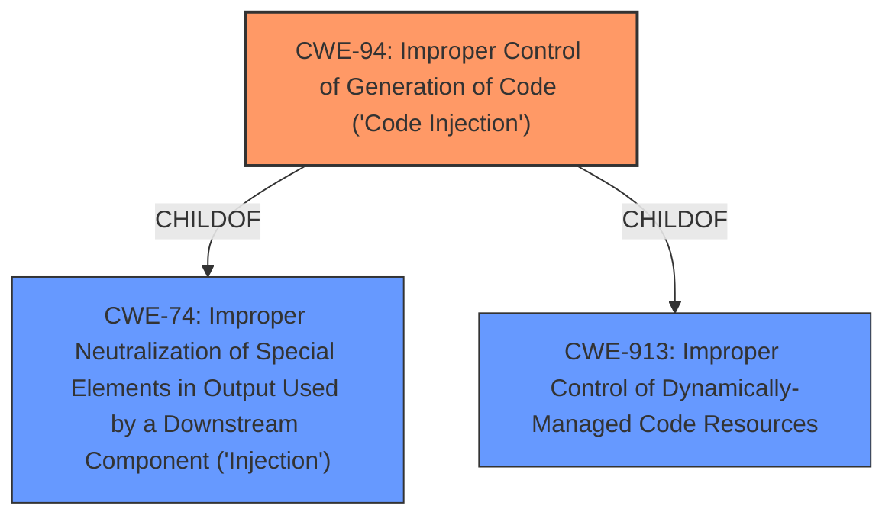

# Enhanced Analysis for CVE-2022-26205

# Summary
| CWE ID | CWE Name | Confidence | CWE Abstraction Level | CWE Vulnerability Mapping Label | CWE-Vulnerability Mapping Notes |
|---|---|---|---|---|---|
| CWE-94 | Improper Control of Generation of Code ('Code Injection') | 0.9 | Base | Allowed-with-Review | Primary CWE. The vulnerability allows attackers to execute arbitrary code via injection of a crafted payload, which aligns with the CWE's focus on improper neutralization of special elements that could modify the syntax or behavior of the intended code segment. |
| CWE-74 | Improper Neutralization of Special Elements in Output Used by a Downstream Component ('Injection') | 0.7 | Class | Discouraged | Secondary Candidate. The vulnerability involves the injection of a crafted payload, suggesting a failure to neutralize special elements in output used by a downstream component. However, CWE-94 is more specific to code injection, making it the primary choice. |

## Evidence and Confidence

*   **Confidence Score:** 0.9
*   **Evidence Strength:** HIGH

## Relationship Analysis
The primary relationship that influenced the decision was the parent-child relationship between CWE-74 and CWE-94. CWE-94, as a child of CWE-74, provides a more specific classification for code injection vulnerabilities. Additionally, CWE-94's relationship to CWE-913 (Improper Control of Dynamically-Managed Code Resources) indicates a potential for dynamically generated code to be exploited. The "Allowed-with-Review" usage for CWE-94 acknowledges the potential for misuse but is appropriate in this case due to the explicit mention of code execution.



## Vulnerability Chain
The vulnerability chain involves the following sequence:
  1. **Improper Input Handling:** The application **fails to neutralize special elements** in the input. (Implicit)
  2. **Code Injection (CWE-94):** The **lack of neutralization** allows an attacker to inject a crafted payload into the "Display text fields," leading to the generation of malicious code.
  3. **Remote Code Execution:** The injected code is executed, granting the attacker the ability to run arbitrary commands on the system.

## Summary of Analysis
The initial assessment focused on identifying the root cause of the remote code execution vulnerability. The key phrase "injection of a crafted payload" strongly suggests an injection-related weakness. The Retriever Results highlighted CWE-74 and CWE-94 as potential candidates. While CWE-74 is a broader category, CWE-94 specifically addresses code injection, aligning more closely with the vulnerability's description.

The relationship analysis further solidified the selection of CWE-94. Its hierarchical relationship with CWE-74 as a child CWE indicates a more specific classification. The chain relationship also supports the idea that improper input handling (though not explicitly stated) leads directly to code injection and subsequent remote code execution.

The final decision to assign CWE-94 is based on the evidence from the vulnerability description, which explicitly mentions "remote code execution" and "injection of a crafted payload." This aligns with CWE-94's focus on the improper control of code generation. The choice of CWE-94 as a Base level CWE provides the optimal level of specificity, accurately representing the weakness without being overly broad or narrow.

Relevant CWE Information:
-   **CWE-94:** Best fit because the description has **impact:** remote code execution and **vector:** crafted payload.

I considered the following CWEs but did not use them:
*   **CWE-74:** While relevant due to the injection aspect, it's a broader category and less specific than CWE-94.
*   **CWE-79 (Improper Neutralization of Input During Web Page Generation ('Cross-site Scripting')):** Although the vulnerability involves a web application, the primary issue is code execution rather than script injection into a web page. Therefore, CWE-79 is not the most appropriate choice.
*   **CWE-78 (Improper Neutralization of Special Elements used in an OS Command ('OS Command Injection')):** Similar to CWE-79, while the vulnerability leads to code execution, it doesn't specifically involve OS command injection. The crafted payload is injected into "Display text fields," implying a different injection context.
*   **CWE-1336 (Improper Neutralization of Special Elements Used in a Template Engine):** Considered, but the description does not indicate a template engine is being used.
*   **CWE-502 (Deserialization of Untrusted Data):** Not relevant as the vulnerability description doesn't mention deserialization.
*   **CWE-116 (Improper Encoding or Escaping of Output):** Considered, but the focus is on code generation and execution rather than general output encoding issues.


## CWE Relationship Analysis

Current CWEs represent these abstraction levels: .


### Vulnerability Chain Analysis

**Chain starting from CWE-913:**
- 913 (Improper Control of Dynamically-Managed Code Resources) - ROOT


**Chain starting from CWE-502:**
- 502 (Deserialization of Untrusted Data) - ROOT


### CWE Relationship Diagram

```mermaid
graph TD
    classDef primary fill:#f96,stroke:#333,stroke-width:2px
    classDef secondary fill:#69f,stroke:#333
    classDef tertiary fill:#9e9,stroke:#333
```