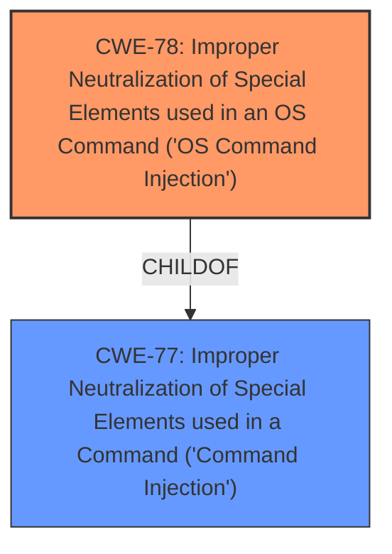

# Analysis for CVE-2022-26206

# Summary
| CWE ID | CWE Name | Confidence | CWE Abstraction Level | CWE Vulnerability Mapping Label | CWE-Vulnerability Mapping Notes |
|---|---|---|---|---|---|
| CWE-78 | Improper Neutralization of Special Elements used in an OS Command ('OS Command Injection') | 1.0 | Base | Allowed | Primary CWE |

## Evidence and Confidence

*   **Confidence Score:** 1.0
*   **Evidence Strength:** HIGH

## Relationship Analysis
The primary relationship that influenced the decision was the ChildOf relationship between CWE-78 and CWE-77, where CWE-78 is a more specific Base case of the Class CWE-77. There aren't strong chains here. The abstraction level was important because the base level is preferred, and CWE-78 aligns with that principle.

## Vulnerability Chain
The vulnerability chain is **Improper Neutralization of Special Elements used in an OS Command** (CWE-78) leading to arbitrary command execution.

## Summary of Analysis
The initial assessment identified a **command injection** vulnerability via the langType parameter in the setLanguageCfg function. The vulnerability description clearly states that attackers can execute arbitrary commands via a crafted request.

The primary CWE match from similar CVE descriptions is CWE-78. The retriever results also list CWE-78 as a strong candidate.

The final decision is based on the evidence from the vulnerability description, which mentions **command injection** and the ability to execute arbitrary commands, aligning perfectly with CWE-78. The relationship analysis confirmed that CWE-78 is a more specific and appropriate choice than its parent, CWE-77. CWE-78 is a Base level CWE, which is the preferred level.

Relevant CWE Information:

# Enhanced Context (25 CWEs)

## CWE-78: Improper Neutralization of Special Elements used in an OS Command ('OS Command Injection')
**CWE-78** is the most appropriate choice because the vulnerability description explicitly mentions **command injection** leading to the execution of arbitrary commands. The function setLanguageCfg is vulnerable via the langType parameter, allowing attackers to execute commands via a crafted request. This perfectly aligns with the description of CWE-78: "The product constructs all or part of an OS command using externally-influenced input from an upstream component, but it does not neutralize or incorrectly neutralizes special elements that could modify the intended OS command when it is sent to a downstream component."
The vulnerability description mentions "command injection" which is an alternate term for CWE-78.
Confidence: 1

## CWE-77: Improper Neutralization of Special Elements used in a Command ('Command Injection')
CWE-77 was considered but not chosen because CWE-78 is a more specific case of **command injection**, focusing on OS commands. While the description does state **command injection**, the CWE-78 alternate terms lists "OS Command Injection" and "Shell Injection". This is preferred since it explicitly is for operating system commands.
Confidence: 0.7

## CWE-259: Use of Hard-coded Password
CWE-259 was considered but not chosen because there is no evidence of hard-coded passwords being involved in this vulnerability. The description focuses on **command injection** via a crafted request, not authentication bypass or use of hard-coded credentials.
Confidence: 0

## CWE-790: Improper Filtering of Special Elements
CWE-790 was considered but not chosen because it is a more general class of weakness, and CWE-78 specifically addresses the **improper neutralization** of special elements in OS commands. The description of CWE-78 aligns more closely with the vulnerability's details.
Confidence: 0

## CWE-121: Stack-based Buffer Overflow
CWE-121 was considered but not chosen because the vulnerability is related to **command injection**, not a buffer overflow. The description focuses on the execution of arbitrary commands, not memory corruption.
Confidence: 0

## CWE-94: Improper Control of Generation of Code ('Code Injection')
CWE-94 was considered but not chosen because it applies when the product constructs code segments. The vulnerability is about injecting OS commands, not code segments.
Confidence: 0

## CWE-184: Incomplete List of Disallowed Inputs
CWE-184 was considered but not chosen because the primary issue isn't an incomplete list of disallowed inputs. While input validation is likely missing, the core issue is the **improper neutralization** of special elements that allow arbitrary command execution.
Confidence: 0

## CWE-96: Improper Neutralization of Directives in Statically Saved Code ('Static Code Injection')
CWE-96 was considered but not chosen because there's no indication that the injected content modifies statically saved code.
Confidence: 0

## CWE-208: Observable Timing Discrepancy
CWE-208 was considered but not chosen because the vulnerability does not involve timing discrepancies to reveal security-relevant information.
Confidence: 0

## CWE-138: Improper Neutralization of Special Elements
CWE-138 was considered but not chosen because CWE-78 is a more specific case of **improper neutralization** related to OS commands. CWE-138 is also discouraged.
Confidence: 0