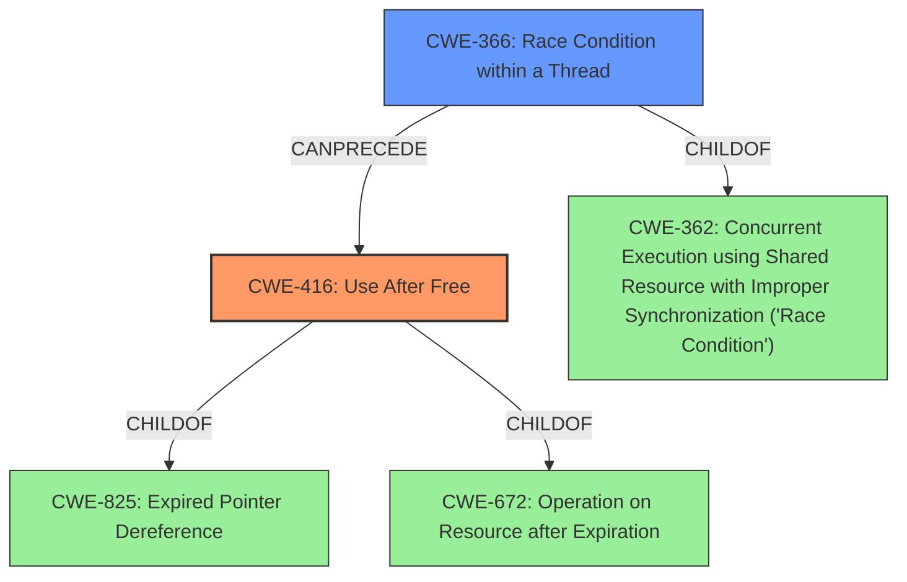

# Analysis Report for CVE-2022-2621

# Vulnerability Analysis Report: CVE-2022-2621

## Description


## Analysis (with Relationship Data)

# Summary
| CWE ID | CWE Name | Confidence | CWE Abstraction Level | CWE Vulnerability Mapping Label | CWE-Vulnerability Mapping Notes |
|---|---|---|---|---|---|
| CWE-416 | Use After Free | 1 | Variant | Primary | Allowed |
| CWE-366 | Race Condition within a Thread | 0.6 | Base | Secondary | Allowed |

## Evidence and Confidence

*   **Confidence Score:** 0.8
*   **Evidence Strength:** HIGH

## Relationship Analysis
The primary CWE is CWE-416 (**Use After Free**), which is a Variant level CWE. CWE-416 is a child of CWE-825 (**Expired Pointer Dereference**) and CWE-672 (**Operation on Resource after Expiration**). CWE-366 (**Race Condition within a Thread**) is a Base level CWE and a potential secondary CWE. CWE-366 is a child of CWE-362 (**Concurrent Execution using Shared Resource with Improper Synchronization ('Race Condition')**).
The high-level relationship is that a race condition can lead to a use-after-free vulnerability.



## Vulnerability Chain
The vulnerability chain starts with a **use after free** condition, possibly triggered by specific UI interactions. This **use after free** can lead to **heap corruption**. A race condition may exist where two threads access the same resource, and one frees it before the other is done using it.
  - Root Cause: **Use After Free**
  - Weakness: **Heap Corruption**

## Summary of Analysis
The initial assessment identified **Use After Free** as the primary weakness, leading to **heap corruption**. The presence of UI interactions suggests a potential race condition. The Retriever Results and CWE specifications supported this assessment.

The vulnerability description explicitly mentions "**use after free**" and "**heap corruption**". The CVE Reference Links Content Summary also confirms "**Use after free**" as the root cause.

CWE-416 (**Use After Free**) is the primary CWE because it directly matches the vulnerability description and the root cause identified in the CVE Reference Links Content Summary. The "CWE for similar CVE Descriptions" also lists CWE-416 as the primary match.

CWE-366 (**Race Condition within a Thread**) is considered as a secondary CWE because the vulnerability description mentions "specific UI interactions", which might imply a race condition. Also, observed examples for CWE-416 include chaining with CWE-366. The retriever also identifies CWE-366 as a candidate.

CWE-122 (**Heap-based Buffer Overflow**) was considered because the vulnerability leads to "**heap corruption**". However, the root cause is **use after free** which leads to **heap corruption**. Therefore, CWE-122 is not chosen.

CWE-415 (**Double Free**) was considered because it is related to memory management issues. However, the vulnerability description specifically indicates "**use after free**" instead of double free. Therefore, CWE-415 is not chosen.

CWE-843 (**Access of Resource Using Incompatible Type ('Type Confusion')**) was considered but not chosen because the root cause is "**use after free**" rather than type confusion.

CWE-362 (**Concurrent Execution using Shared Resource with Improper Synchronization ('Race Condition')**) was considered but the more specific CWE-366 (**Race Condition within a Thread**) was chosen because it is a more specific base level CWE.

The final selection of CWE-416 and CWE-366 is based on the evidence of "**use after free**" and the possibility of a race condition due to UI interactions. These CWEs are at the optimal level of specificity (Variant and Base, respectively).

Relevant CWE Information:

# Enhanced Context (25 CWEs)
The following CWEs were identified as potentially relevant to this vulnerability:

## CWE-356: Product UI does not Warn User of Unsafe Actions
**Abstraction Level**: Base
**Similarity Score**: 0.80
**Source**: dense

**Description**:
The product's user interface does not warn the user before undertaking an unsafe action on behalf of that user. This makes it easier for attackers to trick users into inflicting damage to their system.

**Mapping Guidance**:
- Usage: Allowed
- Rationale: This CWE entry is at the Base level of abstraction, which is a preferred level of abstraction for mapping to the root causes of vulnerabilities.


## CWE-451: User Interface (UI) Misrepresentation of Critical Information
**Abstraction Level**: Class
**Similarity Score**: 0.77
**Source**: dense

**Description**:
The user interface (UI) does not properly represent critical information to the user, allowing the information - or its source - to be obscured or spoofed. This is often a component in phishing attacks.

**Mapping Guidance**:
- Usage: Allowed-with-Review
- Rationale: This CWE entry is a Class and might have Base-level children that would be more appropriate


## CWE-366: Race Condition within a Thread
**Abstraction Level**: Base
**Similarity Score**: 0.76
**Source**: dense

**Description**:
If two threads of execution use a resource simultaneously, there exists the possibility that resources may be used while invalid, in turn making the state of execution undefined.

**Mapping Guidance**:
- Usage: Allowed
- Rationale: This CWE entry is at the Base level of abstraction, which is a preferred level of abstraction for mapping to the root causes of vulnerabilities.


## CWE-667: Improper Locking
**Abstraction Level**: Class
**Similarity Score**: 0.76
**Source**: dense

**Description**:
The product does not properly acquire or release a lock on a resource, leading to unexpected resource state changes and behaviors.

**Mapping Guidance**:
- Usage: Allowed-with-Review
- Rationale: This CWE entry is a Class and might have Base-level children that would be more appropriate


## CWE-226: Sensitive Information in Resource Not Removed Before Reuse
**Abstraction Level**: Base
**Similarity Score**: 0.76
**Source**: dense

**Description**:
The product releases a resource such as memory or a file so that it can be made available for reuse, but it does not clear or "zeroize" the information contained in the resource before the product performs a critical state transition or makes the resource available for reuse by other entities.

**Mapping Guidance**:
- Usage: Allowed
- Rationale: This CWE entry is at the Base level of abstraction, which is a preferred level of abstraction for mapping to the root causes of vulnerabilities.


## CWE-404: Improper Resource Shutdown or Release
**Abstraction Level**: Class
**Similarity Score**: 0.76
**Source**: dense

**Description**:
The product does not release or incorrectly releases a resource before it is made available for re-use.

**Mapping Guidance**:
- Usage: Allowed-with-Review
- Rationale: This CWE entry is a Class and might have Base-level children that would be more appropriate


## CWE-754: Improper Check for Unusual or Exceptional Conditions
**Abstraction Level**: Class
**Similarity Score**: 0.76
**Source**: dense

**Description**:
The product does not check or incorrectly checks for unusual or exceptional conditions that are not expected to occur frequently during day to day operation of the product.

**Mapping Guidance**:
- Usage: Allowed-with-Review
- Rationale: This CWE entry is a Class and might have Base-level children that would be more appropriate


## CWE-362: Concurrent Execution using Shared Resource with Improper Synchronization ('Race Condition')
**Abstraction Level**: Class
**Similarity Score**: 0.76
**Source**: dense

**Description**:
The product contains a concurrent code sequence that requires temporary, exclusive access to a shared resource, but a timing window exists in which the shared resource can be modified by another code sequence operating concurrently.

**Mapping Guidance**:
- Usage: Allowed-with-Review
- Rationale: This CWE entry is a Class and might have Base-level children that would be more appropriate


## CWE-843: Access of Resource Using Incompatible Type ('Type Confusion')
**Abstraction Level


## CWE Relationship Analysis

Current CWEs represent these abstraction levels: .


### Vulnerability Chain Analysis

**Chain starting from CWE-226:**
- 226 (Sensitive Information in Resource Not Removed Before Reuse) - ROOT


**Chain starting from CWE-825:**
- 825 (Expired Pointer Dereference) - ROOT


### CWE Relationship Diagram

```mermaid
graph TD
    classDef primary fill:#f96,stroke:#333,stroke-width:2px
    classDef secondary fill:#69f,stroke:#333
    classDef tertiary fill:#9e9,stroke:#333
```


*Report generated on 2025-03-31 02:57:41*
