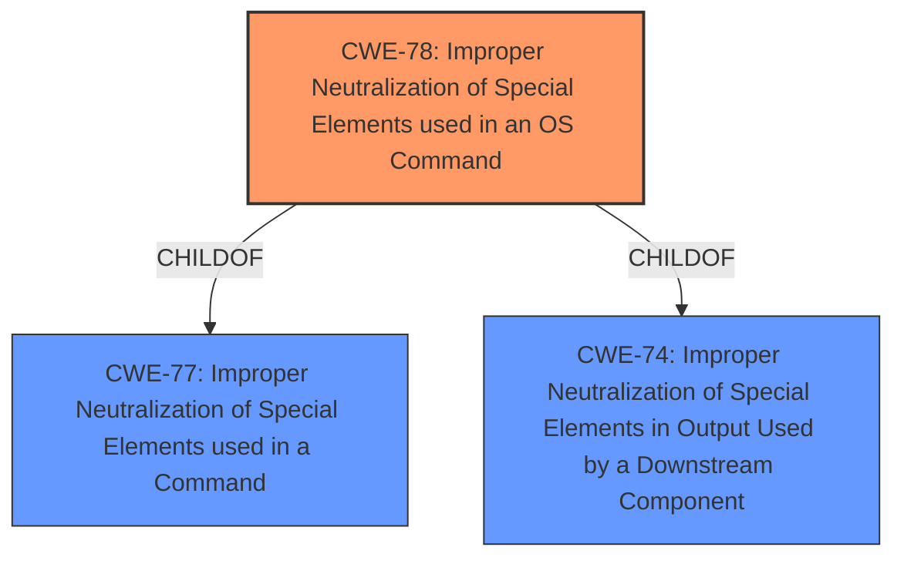

# Analysis Report for CVE-2022-26213

# Vulnerability Analysis Report: CVE-2022-26213

## Description


## Analysis (with Relationship Data)

# Summary
| CWE ID | CWE Name | Confidence | CWE Abstraction Level | CWE Vulnerability Mapping Label | CWE-Vulnerability Mapping Notes |
|---|---|---|---|---|---|
| CWE-78 | Improper Neutralization of Special Elements used in an OS Command ('OS Command Injection') | 1.0 | Base | Allowed | Primary CWE |

## Evidence and Confidence

*   **Confidence Score:** 1.0
*   **Evidence Strength:** HIGH

## Relationship Analysis
The primary CWE is CWE-78, which is a base level CWE. It is a child of CWE-77 (Improper Neutralization of Special Elements used in a Command) and CWE-74 (Improper Neutralization of Special Elements in Output Used by a Downstream Component ('Injection')). The relationship analysis confirms the selection of a base-level CWE and also shows the broader injection context.



## Vulnerability Chain
The vulnerability chain starts with the **improper neutralization** of special elements in the `tz` parameter, leading to **OS command injection**, and ultimately resulting in the ability to **execute arbitrary commands**.

## Summary of Analysis
The vulnerability description clearly states a **command injection** vulnerability in the `setNtpCfg` function via the `tz` parameter. This allows attackers to execute arbitrary commands.

The primary CWE match is CWE-78, "Improper Neutralization of Special Elements used in an OS Command ('OS Command Injection')". The description of CWE-78 aligns directly with the vulnerability description: "The product constructs all or part of an OS command using externally-influenced input from an upstream component, but it does not neutralize or incorrectly neutralizes special elements that could modify the intended OS command when it is sent to a downstream component." The **weakness** is the **improper neutralization** of special elements within the command, and the impact is the ability to execute arbitrary commands.

The retriever results also list CWE-77 "Improper Neutralization of Special Elements used in a Command ('Command Injection')" as the top candidate with a score of 1.0, and CWE-78 with a score of 0.7. While CWE-77 is a more general case, the vulnerability description specifies an OS command, making CWE-78 a more accurate and specific fit. The mapping guidance for CWE-77 suggests considering CWE-78 when OS command injection is involved.

The selection of CWE-78 is further supported by the evidence: "Totolink X5000R_Firmware v9.1.0u.6118_B20201102 was discovered to contain a **command injection** vulnerability in the function setNtpCfg, via the tz parameters. This vulnerability allows attackers to execute arbitrary commands via a crafted request."

CWE-77 was considered, but given that the description specified an OS command, CWE-78 was a more specific and accurate classification. Other CWEs such as CWE-88 (Improper Neutralization of Argument Delimiters in a Command) and CWE-89 (Improper Neutralization of Special Elements used in an SQL Command) were considered but were not applicable as the vulnerability involves direct command injection rather than argument or SQL injection.


## CWE Relationship Analysis

Current CWEs represent these abstraction levels: .


### Vulnerability Chain Analysis

**Chain starting from CWE-89:**
- 89 (Improper Neutralization of Special Elements used in an SQL Command ('SQL Injection')) - ROOT


**Chain starting from CWE-78:**
- 78 (Improper Neutralization of Special Elements used in an OS Command ('OS Command Injection')) - ROOT


### CWE Relationship Diagram

```mermaid
graph TD
    classDef primary fill:#f96,stroke:#333,stroke-width:2px
    classDef secondary fill:#69f,stroke:#333
    classDef tertiary fill:#9e9,stroke:#333
```


*Report generated on 2025-03-30 17:53:54*
