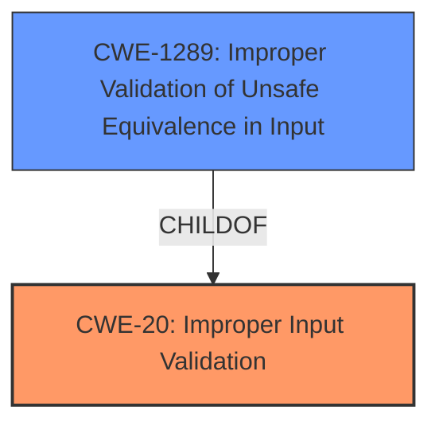

# Enhanced Analysis for CVE-2022-2622

# Summary
| CWE ID | CWE Name | Confidence | CWE Abstraction Level | CWE Vulnerability Mapping Label | CWE-Vulnerability Mapping Notes |
|---|---|---|---|---|---|
| CWE-20 | Improper Input Validation | 0.7 | Class | Discouraged | Primary CWE |
| CWE-1289 | Improper Validation of Unsafe Equivalence in Input | 0.6 | Base | Allowed | Secondary Candidate |

## Evidence and Confidence

*   **Confidence Score:** 0.7
*   **Evidence Strength:** MEDIUM

## Relationship Analysis
The primary relationship that influenced the CWE selection was the parent-child relationship between CWE-20 and CWE-1289. While CWE-20 is a general class, CWE-1289 provides a more specific description of the **improper validation** involving potentially unsafe values. However, since the description only provides the root cause as **insufficient validation of untrusted input**, it is hard to be more specific. Therefore, I selected CWE-20 as primary.



## Vulnerability Chain
The vulnerability chain starts with **insufficient validation of untrusted input** (CWE-20 or CWE-1289), which then leads to the bypassing of download restrictions.
  - The chain is: **Insufficient validation** -> Bypass download restrictions.
  - The root cause is the **insufficient validation**, and the impact is the bypass.

## Summary of Analysis
The initial assessment identified CWE-20 as the primary weakness due to the **insufficient validation of untrusted input**. This aligns with the description of CWE-20, which covers scenarios where the product receives input but **does not validate or incorrectly validates** that the input has the properties that are required to process the data safely and correctly. However, CWE-20 is discouraged, so looking at it's children, CWE-1289 is a good fit.

The evidence from the "Vulnerability Description Key Phrases" supports this, as it explicitly mentions **insufficient validation of untrusted input** as the root cause. Additionally, the "CVE Reference Links Content Summary" confirms the presence of **improper input validation** as a key weakness.

The selection of CWE-20 is at a higher level of abstraction (Class) than preferred, but the information provided in the vulnerability description is not detailed enough to pinpoint a more specific (Base or Variant) CWE. While CWE-1289 could be a better fit, it requires more evidence that the input is equivalent to a potentially-unsafe value.

Relevant CWE Information:

# Enhanced Context (25 CWEs)

## CWE-59: Improper Link Resolution Before File Access ('Link Following')
**Abstraction Level**: Base
**Similarity Score**: 0.79

## CWE-1289: Improper Validation of Unsafe Equivalence in Input
**Abstraction Level**: Base
**Similarity Score**: 0.78

## CWE-184: Incomplete List of Disallowed Inputs
**Abstraction Level**: Base
**Similarity Score**: 0.77

## CWE-41: Improper Resolution of Path Equivalence
**Abstraction Level**: Base
**Similarity Score**: 0.76

## CWE-427: Uncontrolled Search Path Element
**Abstraction Level**: Base
**Similarity Score**: 0.76

## CWE-64: Windows Shortcut Following (.LNK)
**Abstraction Level**: Variant
**Similarity Score**: 0.76

## CWE-451: User Interface (UI) Misrepresentation of Critical Information
**Abstraction Level**: Class
**Similarity Score**: 0.76

## CWE-61: UNIX Symbolic Link (Symlink) Following
**Abstraction Level**: Compound
**Similarity Score**: 0.75

## CWE-73: External Control of File Name or Path
**Abstraction Level**: Base
**Similarity Score**: 0.75

## CWE-356: Product UI does not Warn User of Unsafe Actions
**Abstraction Level**: Base
**Similarity Score**: 0.74

## CWE-451: User Interface (UI) Misrepresentation of Critical Information
**Abstraction Level**: Class
**Similarity Score**: 8163.04

## CWE-116: Improper Encoding or Escaping of Output
**Abstraction Level**: Class
**Similarity Score**: 7718.80

## CWE-184: Incomplete List of Disallowed Inputs
**Abstraction Level**: Base
**Similarity Score**: 7208.87

## CWE-1289: Improper Validation of Unsafe Equivalence in Input
**Abstraction Level**: Base
**Similarity Score**: 7176.65

## CWE-22: Improper Limitation of a Pathname to a Restricted Directory ('Path Traversal')
**Abstraction Level**: Base
**Similarity Score**: 7171.00

## CWE-123: Write-what-where Condition
**Abstraction Level**: base
**Similarity Score**: 4.82

## CWE-416: Use After Free
**Abstraction Level**: variant
**Similarity Score**: 4.33

## CWE-770: Allocation of Resources Without Limits or Throttling
**Abstraction Level**: base
**Similarity Score**: 4.33

## CWE-22: Improper Limitation of a Pathname to a Restricted Directory ('Path Traversal')
**Abstraction Level**: base
**Similarity Score**: 4.33

## CWE-120: Buffer Copy without Checking Size of Input ('Classic Buffer Overflow')
**Abstraction Level**: base
**Similarity Score**: 4.33

## CWE-825: Expired Pointer Dereference
**Abstraction Level**: base
**Similarity Score**: 4.33

## CWE-787: Out-of-bounds Write
**Abstraction Level**: base
**Similarity Score**: 4.33

## CWE-1284: Improper Validation of Specified Quantity in Input
**Abstraction Level**: base
**Similarity Score**: 4.33

## CWE-190: Integer Overflow or Wraparound
**Abstraction Level**: base
**Similarity Score**: 4.33

## CWE-789: Memory Allocation with Excessive Size Value
**Abstraction Level**: variant
**Similarity Score**: 3.88

CWEs Considered but Not Used:

*   CWE-356, CWE-451, CWE-116, CWE-64: These CWEs were considered due to their relevance scores but were ultimately discarded as they did not directly address the root cause of the vulnerability, which is **improper input validation**.
*   CWE-123, CWE-416, CWE-770, CWE-22, CWE-120, CWE-825, CWE-787, CWE-1284, CWE-190, CWE-789: These CWEs are too specific and there is not enough evidence to confirm that they are present.


## CWE Relationship Analysis

Current CWEs represent these abstraction levels: .


### Vulnerability Chain Analysis

**Chain starting from CWE-41:**
- 41 (Improper Resolution of Path Equivalence) - ROOT


**Chain starting from CWE-356:**
- 356 (Product UI does not Warn User of Unsafe Actions) - ROOT


### CWE Relationship Diagram

```mermaid
graph TD
    classDef primary fill:#f96,stroke:#333,stroke-width:2px
    classDef secondary fill:#69f,stroke:#333
    classDef tertiary fill:#9e9,stroke:#333
```