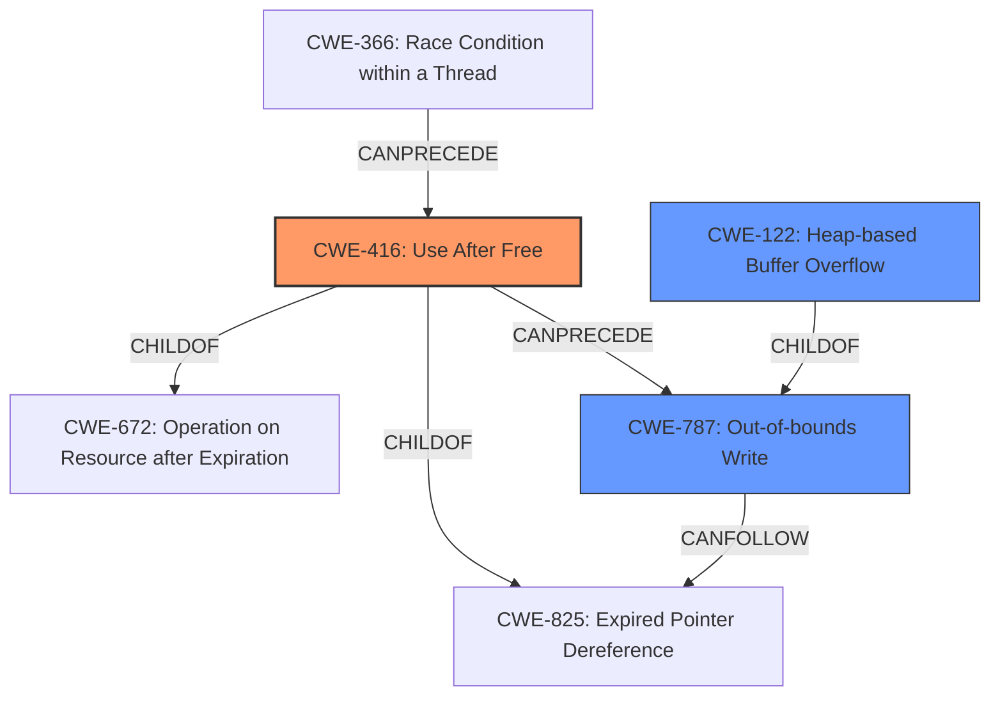

# Analysis for CVE-2022-2623

# Summary
| CWE ID  | CWE Name                                                                                     | Confidence | CWE Abstraction Level | CWE Vulnerability Mapping Label | CWE-Vulnerability Mapping Notes |
| :-------- | :------------------------------------------------------------------------------------------- | :---------- | :---------------------- | :------------------------------ | :------------------------------ |
| CWE-416 | Use After Free                                                                               | 1          | Variant               | Primary                         | Allowed                       |
| CWE-787 | CWE-787: Out-of-bounds Write                                                                 | 0.5        | Base                  | Secondary                      | Allowed                        |
| CWE-122 | CWE-122: Heap-based Buffer Overflow                                                            | 0.4        | Variant               | Secondary                      | Allowed                        |

## Evidence and Confidence

*   **Confidence Score:** 0.8
*   **Evidence Strength:** HIGH

## Relationship Analysis
The primary CWE, CWE-416, is a variant of CWE-825 (Expired Pointer Dereference) and CWE-672 (Operation on Resource after Expiration). A use-after-free can potentially lead to out-of-bounds write (CWE-787) if the freed memory is reallocated and overwritten. It can also be a result of race conditions, like CWE-366 (Race Condition within a Thread).

## Vulnerability Chain
The vulnerability chain starts with a **Use after free** (CWE-416), potentially leading to **heap corruption**. This can be exploited by a remote attacker through specific UI interactions.
- Initial Flaw: **Use after free** (CWE-416)
- Resulting Weakness: **Heap corruption** 

## Summary of Analysis
The vulnerability is clearly described as a **Use after free** in Google Chrome on Android. The "Vulnerability Description Key Phrases" section confirms the **rootcause** as **Use after free**. The "CVE Reference Links Content Summary" also highlights **Use after free** as the **root_cause**.

The primary CWE match from similar CVE descriptions is CWE-416 (Use After Free), which aligns perfectly with the vulnerability description. The Retriever Results also list CWE-416 as a top candidate.

CWE-416 (Use After Free) is at the Variant level of abstraction, which is the preferred level. The mapping guidance for CWE-416 is "Allowed."

The **heap corruption** aspect suggests a potential out-of-bounds write (CWE-787) or heap-based buffer overflow (CWE-122), but these are consequences of the **Use after free**, not the root cause itself. Thus, they are considered as secondary candidates.

*   **CWE-416: Use After Free**
    *   The vulnerability description explicitly states "**Use after free**".
    *   This aligns with CWE-416's description: "The product reuses or references memory after it has been freed."
    *   Security Implications: Allows an attacker to potentially execute arbitrary code by manipulating the freed memory.
    *   This is the primary weakness.

*   **CWE-787: Out-of-bounds Write**
    *   The **heap corruption** could potentially lead to an out-of-bounds write if the freed memory is reallocated and then written to incorrectly.
    *   This aligns with CWE-787's description: "The product writes data past the end, or before the beginning, of the intended buffer."
    *   This is a potential secondary weakness.

*   **CWE-122: Heap-based Buffer Overflow**
    *   The **heap corruption** could also potentially lead to heap-based buffer overflow.
    *   This aligns with CWE-122's description: "A heap overflow condition is a buffer overflow, where the buffer that can be overwritten is allocated in the heap portion of memory".
    *   This is a potential secondary weakness.

Other CWEs Considered and Rejected:

*   CWE-366 (Race Condition within a Thread): While race conditions can lead to use-after-free vulnerabilities, there is no explicit mention of concurrency or threading issues in the vulnerability description.
*   CWE-665 (Improper Initialization): This CWE is not directly related to the **Use after free** vulnerability.
*   CWE-1021 (Improper Restriction of Rendered UI Layers or Frames): This is related to clickjacking, which is not the vulnerability described.
*   CWE-364 (Signal Handler Race Condition): This CWE is specific to signal handlers, which are not mentioned in the vulnerability description.
*   CWE-843 (Access of Resource Using Incompatible Type ('Type Confusion')): There is no mention of type confusion in the provided information.
*   CWE-356 (Product UI does not Warn User of Unsafe Actions): The vulnerability is related to memory management, not user interface warnings.
*   CWE-415 (Double Free): The vulnerability description clearly states **Use after free**, not double free.

The selected CWEs are at the optimal level of specificity, with CWE-416 being a Variant and CWE-787 and CWE-122 being at the Base and Variant level, respectively. They accurately represent the vulnerability based on the provided evidence.