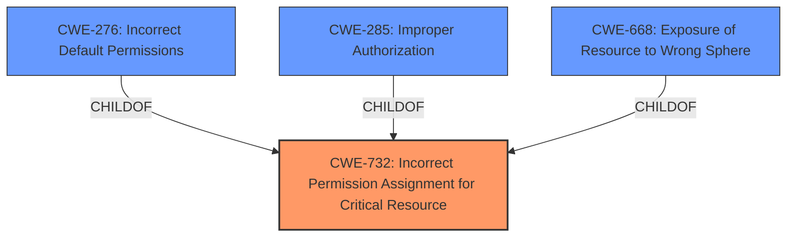

# Raw Analyzer Response for CVE-2022-26237

# Summary
| CWE ID | CWE Name | Confidence | CWE Abstraction Level | CWE Vulnerability Mapping Label | CWE-Vulnerability Mapping Notes |
|---|---|---|---|---|---|
| CWE-732 | Incorrect Permission Assignment for Critical Resource | 1.0 | Class | Allowed-with-Review | Primary CWE |
| CWE-276 | Incorrect Default Permissions | 0.7 | Base | Allowed | Secondary Candidate |

## Evidence and Confidence

*   **Confidence Score:** 0.9
*   **Evidence Strength:** HIGH

## Relationship Analysis
The primary CWE is CWE-732, which is a Class-level CWE. CWE-732 has child relationships to CWE-285 (Improper Authorization) and CWE-668 (Exposure of Resource to Wrong Sphere). The secondary CWE candidate, CWE-276, is a Base-level CWE and is a child of CWE-732. The vulnerability is related to incorrect permission assignment which is the reason CWE-732 is appropriate.

## Vulnerability Chain
The chain of events is as follows:
1.  **Root Cause:** **Incorrect default permissions** (CWE-276, a more specific type of CWE-732) are assigned to critical resources during installation.
2.  These **incorrect permissions** lead to an **incorrect permission assignment for a critical resource** (CWE-732).
3.  **Impact:** Non-privileged users can overwrite and manipulate executables and libraries, leading to potential elevation of privilege and unauthorized access to sensitive data.

## Summary of Analysis
The initial assessment identified CWE-732 as the primary CWE, which aligns with the vulnerability description and the "CWE for similar CVE Descriptions". The retriever results also listed CWE-732 as the top candidate.

The vulnerability description states that "The **default privileges** for the running service Normand Viewer Service in Beckman Coulter Remisol Advance v2.0.12.1 and prior allows non-privileged users to overwrite and manipulate executables and libraries." The **rootcause** is **default privileges for running service**. The "CVE Reference Links Content Summary" section states "The primary vulnerability is the excessively permissive file system permissions granted to non-privileged users on the files belonging to the Normand ViewerService."

CWE-732 (Incorrect Permission Assignment for Critical Resource) is a Class-level CWE that describes a scenario where "The product specifies permissions for a security-critical resource in a way that allows that resource to be read or modified by unintended actors." This aligns well with the vulnerability, making it the most appropriate primary CWE. The Mapping Guidance for CWE-732 is "Allowed-with-Review" because it's often misused when permissions aren't checked. In this case, permissions were incorrectly assigned.

CWE-276 (Incorrect Default Permissions) is a Base-level CWE that describes "During installation, installed file permissions are set to allow anyone to modify those files." This is a more specific case of CWE-732 and is a strong secondary candidate as the **rootcause** as the **default privileges** were the reason. The mapping guidance is "Allowed".

CWE-269 (Improper Privilege Management) was considered but ultimately not chosen as the primary CWE. While the vulnerability involves privileges, the root cause is more specifically related to the incorrect assignment of permissions, making CWE-732 a better fit. The mapping guidance for CWE-269 is "Discouraged" due to frequent misuse.

CWE-668 (Exposure of Resource to Wrong Sphere) was also considered, but it is too general. CWE-732 provides a more precise description of the vulnerability related to incorrect permission assignments. The mapping guidance for CWE-668 is "Discouraged".

CWE-22 (Improper Limitation of a Pathname to a Restricted Directory ('Path Traversal')) and CWE-427 (Uncontrolled Search Path Element) were not selected as they describe different types of vulnerabilities not directly related to the root cause of incorrect permission assignment.

The final selection of CWE-732 as the primary CWE and CWE-276 as a secondary candidate is based on the evidence of incorrect default permissions leading to the ability of non-privileged users to modify critical resources. This aligns with the descriptions and relationships of the selected CWEs, and the mapping guidance provided by MITRE.