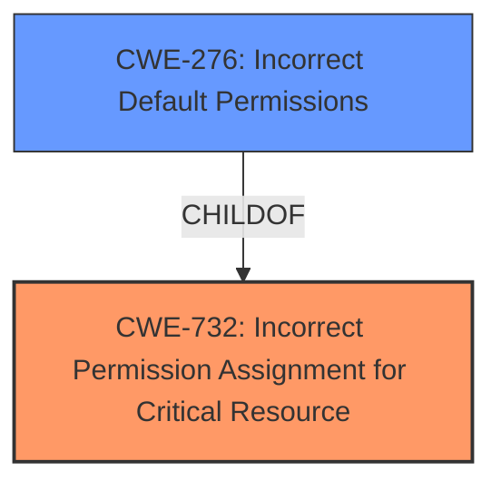

# Enhanced Analysis for CVE-2022-26250

# Summary
| CWE ID | CWE Name | Confidence | CWE Abstraction Level | CWE Vulnerability Mapping Label | CWE-Vulnerability Mapping Notes |
|---|---|---|---|---|---|
| CWE-732 | Incorrect Permission Assignment for Critical Resource | 1.0 | Class | Allowed-with-Review | Primary CWE |
| CWE-276 | Incorrect Default Permissions | 0.9 | Base | Allowed | Secondary Candidate |

## Evidence and Confidence

*   **Confidence Score:** 0.95
*   **Evidence Strength:** HIGH

## Relationship Analysis
The primary CWE selected is CWE-732 (Incorrect Permission Assignment for Critical Resource), which is a Class-level CWE. A more specific Base CWE, CWE-276 (Incorrect Default Permissions), was also considered and included as a secondary candidate. CWE-276 is a child of CWE-732, indicating a hierarchical relationship where CWE-276 is a specific type of CWE-732.



## Vulnerability Chain
The vulnerability chain starts with the **weak file permissions** assigned to the installation directory, which allows authenticated users to modify the `SynaMan.exe` file. This leads to privilege escalation because the service runs as `LocalSystem`.

**Chain:**
1.  **Root Cause:** **Weak file permissions** on the installation directory.
2.  **Weakness:** Authenticated users can modify the `SynaMan.exe` executable.
3.  **Impact:** Privilege escalation to `NT AUTHORITY\SYSTEM` when the service restarts.

## Summary of Analysis
The initial assessment focused on the **weak file permissions** as the root cause of the privilege escalation vulnerability. The detailed analysis of the "CVE Reference Links Content Summary" confirmed that the Synaman installer places the application in `C:\Synaman` with weak directory permissions, allowing authenticated users to modify or replace the `SynaMan.exe` executable.

The retriever results suggested CWE-732 (Incorrect Permission Assignment for Critical Resource) as the top candidate. The description of CWE-732 aligns well with the vulnerability description, as it involves specifying permissions for a security-critical resource (the `SynaMan.exe` executable) in a way that allows modification by unintended actors (authenticated users).

CWE-276 (Incorrect Default Permissions) was also considered because it is a child of CWE-732 and more specific. Given that the **weak file permissions** are assigned during installation, CWE-276 is a relevant secondary candidate.

The MITRE mapping guidance for CWE-732 advises caution, noting that it is often misused for vulnerabilities where "permissions" are not checked. However, in this case, the **weak file permissions** are explicitly assigned, making CWE-732 appropriate.

The selection of CWE-732 is based on the explicit evidence of **weak file permissions** and the potential for privilege escalation. The selection of the secondary candidate CWE-276 is based on the fact that the weak file permissions are assigned during installation.

The chosen CWEs are at an appropriate level of specificity, with CWE-732 as a general classification and CWE-276 as a more specific variant.

Relevant CWE Information:

# Enhanced Context (25 CWEs)
The following CWEs were identified as potentially relevant to this vulnerability:

## CWE-274: Improper Handling of Insufficient Privileges
**Abstraction Level**: Base
**Similarity Score**: 0.76
**Source**: dense

**Description**:
The product does not handle or incorrectly handles when it has insufficient privileges to perform an operation, leading to resultant weaknesses.

**Mapping Guidance**:
- Usage: Discouraged
- Rationale: This CWE entry could be deprecated in a future version of CWE.

*Rationale for Not Selecting*: This CWE focuses on the product's inability to handle insufficient privileges, whereas the described vulnerability stems from assigning incorrect permissions to a resource.

## CWE-653: Improper Isolation or Compartmentalization
**Abstraction Level**: Class
**Similarity Score**: 0.75
**Source**: dense

**Description**:
The product does not properly compartmentalize or isolate functionality, processes, or resources that require different privilege levels, rights, or permissions.

**Mapping Guidance**:
- Usage: Allowed
- Rationale: This CWE entry is at the Base level of abstraction, which is a preferred level of abstraction for mapping to the root causes of vulnerabilities.

*Rationale for Not Selecting*: While related to privilege management, this CWE is more about the lack of separation between components with different privilege requirements, not the assignment of permissions.

## CWE-1391: Use of Weak Credentials
**Abstraction Level**: Class
**Similarity Score**: 0.75
**Source**: dense

**Description**:
The product uses weak credentials (such as a default key or hard-coded password) that can be calculated, derived, reused, or guessed by an attacker.

**Mapping Guidance**:
- Usage: Allowed-with-Review
- Rationale: This CWE entry is a Class and might have Base-level children that would be more appropriate

*Rationale for Not Selecting*: This CWE is specific to weak credentials, such as passwords or keys, which is not the case in this vulnerability.

## CWE-280: Improper Handling of Insufficient Permissions or Privileges
**Abstraction Level**: Base
**Similarity Score**: 0.75
**Source**: dense

**Description**:
The product does not handle or incorrectly handles when it has insufficient privileges to access resources or functionality as specified by their permissions. This may cause it to follow unexpected code paths that may leave the product in an invalid state.

**Mapping Guidance**:
- Usage: Allowed
- Rationale: This CWE entry is at the Base level of abstraction, which is a preferred level of abstraction for mapping to the root causes of vulnerabilities.

*Rationale for Not Selecting*: Similar to CWE-274, this CWE focuses on the product's handling of insufficient privileges, not the incorrect assignment of permissions.

## CWE-41: Improper Resolution of Path Equivalence
**Abstraction Level**: Base
**Similarity Score**: 0.75
**Source**: dense

**Description**:
The product is vulnerable to file system contents disclosure through path equivalence. Path equivalence involves the use of special characters in file and directory names. The associated manipulations are intended to generate multiple names for the same object.

**Mapping Guidance**:
- Usage: Allowed
- Rationale: This CWE entry is at the Base level of abstraction, which is a preferred level of abstraction for mapping to the root causes of vulnerabilities.

*Rationale for Not Selecting*: This CWE is related to path manipulation vulnerabilities, which is not the focus of this vulnerability.

## CWE-74: Improper Neutralization of Special Elements in Output Used by a Downstream Component ('Injection')
**Abstraction Level**: Class
**Similarity Score**: 0.75
**Source**: dense

**Description**:
The product constructs all or part of a command, data structure, or record using externally-influenced input from an upstream component, but it does not neutralize or incorrectly neutralizes special elements that could modify how it is parsed or interpreted when it is sent to a downstream component.

**Mapping Guidance**:
- Usage: Discouraged
- Rationale: CWE-74 is high-level and often misused when lower-level weaknesses are more appropriate.

*Rationale for Not Selecting*: This CWE is related to injection vulnerabilities, which is not the focus of this vulnerability.

## CWE-345: Insufficient Verification of Data Authenticity
**Abstraction Level**: Class
**Similarity Score**: 0.74
**Source**: dense

**Description**:
The product does not sufficiently verify the origin or authenticity of data, in a way that causes it to accept invalid data.

**Mapping Guidance**:
- Usage: Discouraged
- Rationale: This CWE entry is a level-1 Class (i.e., a child of a Pillar). It might have lower-level children that would be more appropriate

*Rationale for Not Selecting*: This CWE is related to data authenticity, which is not the focus of this vulnerability.

## CWE-330: Use of Insufficiently Random Values
**Abstraction Level**: Class
**Similarity Score**: 0.74
**Source**: dense

**Description**:
The product uses insufficiently random numbers or values in a security context that depends on unpredictable numbers.

**Mapping Guidance**:
- Usage: Discouraged
- Rationale: This CWE entry is a level-1 Class (i.e., a child of a Pillar). It might have lower-level children that would be more appropriate

*Rationale for Not Selecting*: This CWE is related to randomness, which is not the focus of this vulnerability.

## CWE-668: Exposure of Resource to Wrong Sphere
**Abstraction Level**: Class
**Similarity Score**: 0.74
**Source**: dense

**Description**:
The product exposes a resource to the wrong control sphere, providing unintended actors with inappropriate access to the resource.


## CWE Relationship Analysis

Current CWEs represent these abstraction levels: .


### Vulnerability Chain Analysis

**Chain starting from CWE-330:**
- 330 (Use of Insufficiently Random Values) - ROOT


**Chain starting from CWE-280:**
- 280 (Improper Handling of Insufficient Permissions or Privileges ) - ROOT


### CWE Relationship Diagram

```mermaid
graph TD
    classDef primary fill:#f96,stroke:#333,stroke-width:2px
    classDef secondary fill:#69f,stroke:#333
    classDef tertiary fill:#9e9,stroke:#333
```