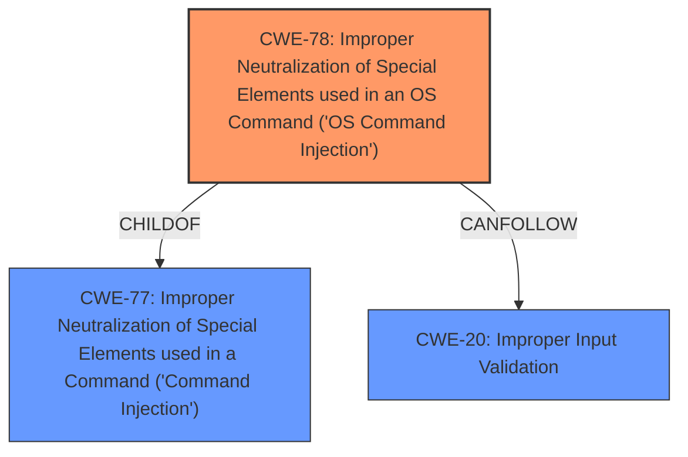

# Enhanced Analysis for CVE-2022-26258

# Summary
| CWE ID | CWE Name | Confidence | CWE Abstraction Level | CWE Vulnerability Mapping Label | CWE-Vulnerability Mapping Notes |
|---|---|---|---|---|---|
| CWE-78 | Improper Neutralization of Special Elements used in an OS Command ('OS Command Injection') | 1 | Base | Allowed | Primary CWE |
| CWE-20 | Improper Input Validation | 0.7 | Class | Allowed | Secondary Candidate |

## Evidence and Confidence

*   **Confidence Score:** 0.9
*   **Evidence Strength:** HIGH

## Relationship Analysis
The primary relationship that impacted the decision was the ChildOf relationship. CWE-78 is a child of CWE-77, however, the vulnerability specifically involves OS commands making CWE-78 a better fit.



## Vulnerability Chain
The vulnerability chain starts with **improper input validation** (CWE-20), which leads to **OS Command Injection** (CWE-78). The injection allows for remote code execution.

## Summary of Analysis
The initial analysis identified CWE-78 as the primary weakness due to the **improper neutralization** of special elements used in OS commands. This is supported by the vulnerability description which states that the vulnerability allows an attacker to inject and execute arbitrary system commands due to insufficient input sanitization. The "CVE Reference Links Content Summary" section indicates that the application fails to properly sanitize the "Device Name" parameter, leading to command injection. This confirms that the root cause is related to the **improper handling of special elements** within the input, which directly aligns with CWE-78.

CWE-20 was considered as a possible root cause, and it's certainly true the **improper input validation** is what ultimately leads to the **OS Command Injection**.

The selection of CWE-78 is at the optimal level of specificity, as it directly describes the type of injection that occurs.

Relevant CWE Information:

# Enhanced Context (25 CWEs)

## CWE-78: Improper Neutralization of Special Elements used in an OS Command ('OS Command Injection')
**Abstraction:** Base
**Similarity Score**: 5.03
**Source**: graph

**Description**:
CWE-78: Improper Neutralization of Special Elements used in an OS Command ('OS Command Injection')

**Mapping Guidance**:
- Usage: Allowed
- Rationale: This CWE entry is at the Base level of abstraction, which is a preferred level of abstraction for mapping to the root causes of vulnerabilities.

**Relationships**:
- CANFOLLOW -> CWE-184
- CANALSOBE -> CWE-88
- CHILDOF -> CWE-77
- CHILDOF -> CWE-77
- CHILDOF -> CWE-74

### Technical Explanation for CWE-78
The vulnerability involves the **improper neutralization** of special elements used in an OS command, leading to command injection. This occurs because the application does not adequately sanitize user-supplied input, allowing an attacker to inject arbitrary commands into the system. The "CVE Reference Links Content Summary" states that the `Device Name` parameter is vulnerable to command injection because the backend filter does not filter the newline character (`\n`). This newline character is then used to break out of the intended command and inject a new one.

*   **How the vulnerability's details match the CWE's characteristics:** The vulnerability precisely matches the CWE's description, as the application constructs an OS command using externally influenced input (Device Name) and fails to neutralize special elements (newline character), enabling command injection.
*   **The security implications and potential impact:** The impact is severe, as it allows for remote code execution. An attacker can execute arbitrary commands on the router's operating system, potentially gaining full control of the system.
*   **Any parent-child relationships or chain patterns that influenced your mapping:** CWE-78 is a child of CWE-77 (Improper Neutralization of Special Elements used in a Command), indicating a more general form of command injection. However, since this specific vulnerability involves OS commands, CWE-78 is the more accurate choice.
*   **Whether the weakness is primary or secondary in the vulnerability:** CWE-78 is the primary weakness, as it directly describes the vulnerability.
*   **How the official MITRE mapping guidance influenced your decision:** The MITRE mapping guidance recommends using Base-level CWEs when possible, and CWE-78 is a Base-level CWE that accurately describes the vulnerability.

### Technical Explanation for CWE-20
The vulnerability stems from the **improper validation** of input, which allows attackers to inject malicious commands. The `lanHostCfg_DeviceName_1.1.1.0` parameter is not properly validated, and the backend filter `hasInjectionString` in `lib/libleopard.so` **does not filter the newline character (`\n`)**. This lack of proper input validation allows an attacker to inject arbitrary commands.

*   **How the vulnerability's details match the CWE's characteristics:** The vulnerability matches the CWE's description because the application does not properly validate the user-supplied input.
*   **The security implications and potential impact:** The impact is remote code execution.
*   **Any parent-child relationships or chain patterns that influenced your mapping:** No direct parent-child relationships influenced the mapping.
*   **Whether the weakness is primary or secondary in the vulnerability:** CWE-20 is a secondary weakness, as it describes the root cause of the vulnerability (lack of input validation) that leads to command injection.
*   **How the official MITRE mapping guidance influenced your decision:** The MITRE mapping guidance recommends focusing on the root cause of the vulnerability. While CWE-78 is the more direct description of the vulnerability, CWE-20 represents the underlying cause.

### Other CWEs Considered:
*   CWE-77: Improper Neutralization of Special Elements used in a Command ('Command Injection'): While related, it's a more general case of command injection. CWE-78 is more specific because the commands are OS commands.
*   CWE-121: Stack-based Buffer Overflow: This was considered but is not applicable because the vulnerability is related to command injection rather than buffer overflows.
*   CWE-138: Improper Neutralization of Special Elements: Too generic.
*   CWE-96: Improper Neutralization of Directives in Statically Saved Code ('Static Code Injection'): This is not applicable because the vulnerability is not related to static code injection.
*   CWE-259: Use of Hard-coded Password: Not applicable.
*   CWE-184: Incomplete List of Disallowed Inputs: While the backend filter is incomplete, the core issue is command injection.
*   CWE-23: Relative Path Traversal: Not applicable.
*   CWE-116: Improper Encoding or Escaping of Output: Not the primary issue, which is command injection.
*   CWE-790: Improper Filtering of Special Elements: Too generic.


## CWE Relationship Analysis

Current CWEs represent these abstraction levels: .


### Vulnerability Chain Analysis

**Chain starting from CWE-96:**
- 96 (Improper Neutralization of Directives in Statically Saved Code ('Static Code Injection')) - ROOT


**Chain starting from CWE-184:**
- 184 (Incomplete List of Disallowed Inputs) - ROOT


### CWE Relationship Diagram

```mermaid
graph TD
    classDef primary fill:#f96,stroke:#333,stroke-width:2px
    classDef secondary fill:#69f,stroke:#333
    classDef tertiary fill:#9e9,stroke:#333
```