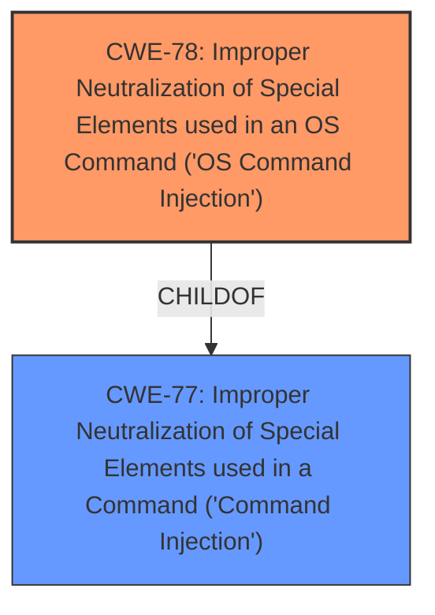

# Enhanced Analysis for CVE-2022-26265

# Summary
| CWE ID | CWE Name | Confidence | CWE Abstraction Level | CWE Vulnerability Mapping Label | CWE-Vulnerability Mapping Notes |
|---|---|---|---|---|---|
| CWE-78 | Improper Neutralization of Special Elements used in an OS Command ('OS Command Injection') | 0.9 | Base | Allowed | Primary CWE |
| CWE-77 | Improper Neutralization of Special Elements used in a Command ('Command Injection') | 0.6 | Class | Allowed-with-Review | Secondary Candidate |

## Evidence and Confidence

*   **Confidence Score:** 0.9
*   **Evidence Strength:** MEDIUM

## Relationship Analysis
The primary relationship that impacted my decision was the parent-child relationship between CWE-77 (Command Injection) and CWE-78 (OS Command Injection). Since the vulnerability description explicitly mentions command execution via a parameter that would directly interact with the operating system, CWE-78 was chosen as the more specific and appropriate classification.



## Vulnerability Chain
The vulnerability chain involves the following sequence:
1.  **Improper Input Handling:** The application fails to adequately neutralize special elements within the `php_cli` parameter.
2.  **OS Command Injection (CWE-78):** This failure allows an attacker to inject arbitrary OS commands.
3.  **Remote Command Execution (Impact):** Successful injection leads to the ability to execute commands remotely on the system.

The chain highlights the initial cause (improper input handling) leading directly to the vulnerability (OS command injection) and resulting in the impact (remote command execution).

## Summary of Analysis
The initial assessment indicated a remote command execution vulnerability. The evidence from the vulnerability description, particularly the "php_cli parameter" vector, suggests direct interaction with the operating system.

The primary CWE, CWE-78 (Improper Neutralization of Special Elements used in an OS Command ('OS Command Injection')), aligns well with the vulnerability description. The **impact** (remote command execution) is a direct consequence of the **weakness** which occurs because the application **does not neutralize or incorrectly neutralizes special elements that could modify the intended OS command**.

The graph relationships influenced the final selection by highlighting the specificity of CWE-78 over its parent CWE-77. The vulnerability description's reference to the `php_cli` parameter, which directly suggests interaction with the operating system's command-line interface, solidifies the choice of CWE-78.

The selected CWEs are at the optimal level of specificity. CWE-78 is a Base level CWE, preferred by MITRE for root cause analysis. It accurately describes the vulnerability where the application fails to neutralize special elements in an OS command, leading to remote command execution.

Relevant CWE Information:

# Enhanced Context (25 CWEs)
The following CWEs were identified as potentially relevant to this vulnerability:

## CWE-434: Unrestricted Upload of File with Dangerous Type
**Abstraction Level**: Base

## CWE-184: Incomplete List of Disallowed Inputs
**Abstraction Level**: Base

## CWE-74: Improper Neutralization of Special Elements in Output Used by a Downstream Component ('Injection')
**Abstraction Level**: Class

## CWE-73: External Control of File Name or Path
**Abstraction Level**: Base

## CWE-552: Files or Directories Accessible to External Parties
**Abstraction Level**: Base

## CWE-1289: Improper Validation of Unsafe Equivalence in Input
**Abstraction Level**: Base

## CWE-41: Improper Resolution of Path Equivalence
**Abstraction Level**: Base

## CWE-183: Permissive List of Allowed Inputs
**Abstraction Level**: Base

## CWE-538: Insertion of Sensitive Information into Externally-Accessible File or Directory
**Abstraction Level**: Base

## CWE-23: Relative Path Traversal
**Abstraction Level**: Base

## CWE-1336: Improper Neutralization of Special Elements Used in a Template Engine
**Abstraction Level**: Base

## CWE-95: Improper Neutralization of Directives in Dynamically Evaluated Code ('Eval Injection')
**Abstraction Level**: Variant

## CWE-88: Improper Neutralization of Argument Delimiters in a Command ('Argument Injection')
**Abstraction Level**: Base

## CWE-94: Improper Control of Generation of Code ('Code Injection')
**Abstraction Level**: Base

## CWE-116: Improper Encoding or Escaping of Output
**Abstraction Level**: Class

## CWE-78: Improper Neutralization of Special Elements used in an OS Command ('OS Command Injection')
**Abstraction Level**: base

## CWE-79: Improper Neutralization of Input During Web Page Generation ('Cross-site Scripting')
**Abstraction Level**: base

## CWE-471: Modification of Assumed-Immutable Data (MAID)
**Abstraction Level**: base

## CWE-1336: Improper Neutralization of Special Elements Used in a Template Engine
**Abstraction Level**: base

## CWE-917: Improper Neutralization of Special Elements used in an Expression Language Statement ('Expression Language Injection')
**Abstraction Level**: base

## CWE-88: Improper Neutralization of Argument Delimiters in a Command ('Argument Injection')
**Abstraction Level**: base

## CWE-625: Permissive Regular Expression
**Abstraction Level**: base

## CWE-430: Deployment of Wrong Handler
**Abstraction Level**: base

## CWE-351: Insufficient Type Distinction
**Abstraction Level**: base

## CWE-434: Unrestricted Upload of File with Dangerous Type
**Abstraction Level**: Base

Based on the above information, provide your analysis.
Consider the following key aspects:

1.  **Content Matching**
    *   Match the vulnerability description against CWE descriptions
    *   Identify technical indicators that align with specific CWE characteristics
    *   Pay special attention to CWEs with high relevance scores

2.  **Relationship Analysis**
    *   Evaluate hierarchical relationships (ChildOf, ParentOf) to find the optimal level of specificity
    *   Examine chain relationships (CanPrecede, CanFollow, RequiredBy, Requires) to identify potential vulnerability chains
    *   Consider peer relationships (PeerOf, CanAlsoBe) that may offer alternative classifications
    *   Assess abstraction levels (Pillar, Class, Base, Variant) to ensure appropriate granularity

3.  **Mapping Guidance Analysis**
    *   Consider the official MITRE mapping guidance when selecting CWEs
    *   Pay attention to Usage recommendations (ALLOWED, DISCOURAGED, PROHIBITED)
    *   Review the provided rationale for mapping decisions
    *   Consider suggested alternative mappings where appropriate

4.  **Mitigation Analysis**
    *   Consider how the potential mitigations align with the vulnerability description
    *   Use mitigation information to help understand the nature of the weakness
    *   Evaluate whether the mitigations would address the specific vulnerability described

5.  **Evidence-Based Decision Making**
    *   Use specific evidence from the vulnerability description to justify your classification
    *   Consider how relationship context enhances your understanding of the vulnerability
    *   Evaluate confidence based on both direct evidence and relationship insights
    *   Consider the retriever scores as supporting evidence for your decisions


## CWE Relationship Analysis

Current CWEs represent these abstraction levels: .


### Vulnerability Chain Analysis

**Chain starting from CWE-41:**
- 41 (Improper Resolution of Path Equivalence) - ROOT


**Chain starting from CWE-917:**
- 917 (Improper Neutralization of Special Elements used in an Expression Language Statement ('Expression Language Injection')) - ROOT


### CWE Relationship Diagram

```mermaid
graph TD
    classDef primary fill:#f96,stroke:#333,stroke-width:2px
    classDef secondary fill:#69f,stroke:#333
    classDef tertiary fill:#9e9,stroke:#333
```