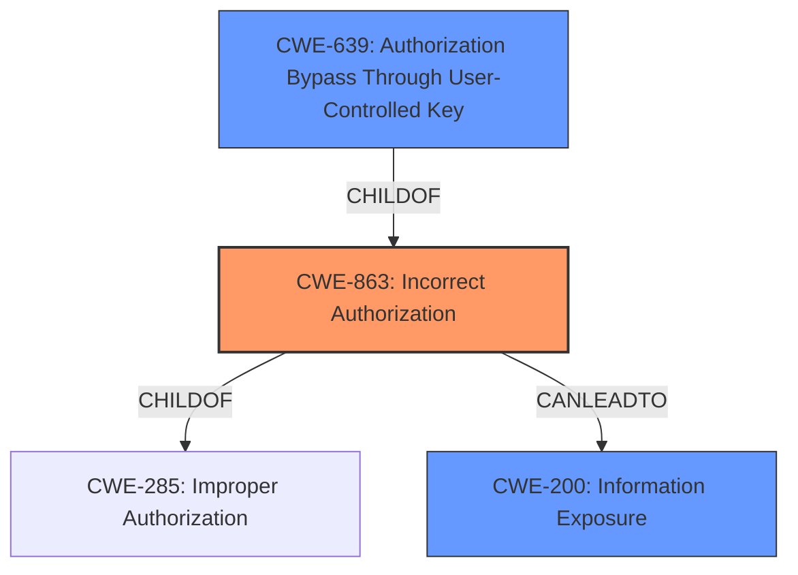

# Enhanced Analysis for CVE-2022-2630

# Summary
| CWE ID | CWE Name | Confidence | CWE Abstraction Level | CWE Vulnerability Mapping Label | CWE-Vulnerability Mapping Notes |
|---|---|---|---|---|---|
| CWE-863 | Incorrect Authorization | 0.9 | Class | Primary | Allowed-with-Review |
| CWE-639 | Authorization Bypass Through User-Controlled Key | 0.7 | Base | Secondary | Allowed |
| CWE-200 | Information Exposure | 0.6 | Class | Secondary | Allowed |

## Evidence and Confidence

*   **Confidence Score:** 0.8
*   **Evidence Strength:** HIGH

## Relationship Analysis
The primary CWE is CWE-863 (Incorrect Authorization), which falls under CWE-285 (Improper Authorization). CWE-639 (Authorization Bypass Through User-Controlled Key) is a child of CWE-863, representing a more specific type of authorization failure. CWE-200 (Information Exposure) arises as a consequence of the authorization issues. Choosing CWE-863 captures the authorization check failure while allowing for the consideration of CWE-639 for its more specific nature in key modification scenarios.



## Vulnerability Chain
The vulnerability chain starts with **improper access control**, leading to the incorrect rendering of GitLab Flavored Markdown (GFM) references. This results in the exposure of titles for private/confidential resources to unauthorized users, ultimately causing information disclosure.
  - **Root Cause:** **Improper access control** when rendering GFM references.
  - **Weakness:** Failure to redact private/confidential resource titles.
  - **Impact:** Disclosure of confidential information.

## Summary of Analysis
Initially, the **improper access control** issue pointed towards CWE-284 (Improper Access Control). However, the retriever results and the detailed vulnerability description indicated more specific CWEs related to authorization. The description highlights that the system performs authorization checks, but these checks are **incorrect**, leading to the exposure of confidential information. This aligns well with CWE-863 (Incorrect Authorization). CWE-639 (Authorization Bypass Through User-Controlled Key) was also considered, but CWE-863 was chosen as the primary because the issue isn't solely about key modification but the overall authorization process when rendering GFM references. CWE-200 captures the resulting information exposure.

The selection of CWE-863 is based on evidence from the "CVE Reference Links Content Summary," which states, "Inadequate access control when rendering GFM references in Incident Timeline Events" and "Failure to redact private/confidential resource titles when rendering timeline event descriptions for users who lack permission to access those resources." This directly supports the "incorrect authorization" aspect of the vulnerability. The retriever also listed CWE-863 with a high score.

CWE-284 was deemed too high-level, and the relationship analysis confirmed that CWE-863 is a more specific child of CWE-284. The MITRE mapping guidance for CWE-284 discourages its use when more specific CWEs are available.

Relevant CWE Information:

# Enhanced Context (25 CWEs)
The following CWEs were identified as potentially relevant to this vulnerability:

## CWE-639: Authorization Bypass Through User-Controlled Key
**Abstraction Level**: Base
**Similarity Score**: 0.78
**Source**: dense

**Description**:
The system's authorization functionality does not prevent one user from gaining access to another user's data or record by modifying the key value identifying the data.

**Mapping Guidance**:
- Usage: Allowed
- Rationale: This CWE entry is at the Base level of abstraction, which is a preferred level of abstraction for mapping to the root causes of vulnerabilities.

**Explanation**: This CWE is relevant because the vulnerability involves potentially modifying references (keys) to access data. However, it's not the primary issue, as the core problem lies in the authorization check itself, not just key modification.

## CWE-668: Exposure of Resource to Wrong Sphere
**Abstraction Level**: Class
**Similarity Score**: 0.77
**Source**: dense

**Description**:
The product exposes a resource to the wrong control sphere, providing unintended actors with inappropriate access to the resource.

**Mapping Guidance**:
- Usage: Discouraged
- Rationale: CWE-668 is high-level and is often misused as a catch-all when lower-level CWE IDs might be applicable. It is sometimes used for low-information vulnerability reports [REF-1287]. It is a level-1 Class (i.e., a child of a Pillar). It is not useful for trend analysis.

**Explanation**: While the vulnerability does involve exposing resources to the wrong sphere, it's better captured by more specific authorization-related CWEs.

## CWE-41: Improper Resolution of Path Equivalence
**Abstraction Level**: Base
**Similarity Score**: 0.76
**Source**: dense

**Description**:
The product is vulnerable to file system contents disclosure through path equivalence. Path equivalence involves the use of special characters in file and directory names. The associated manipulations are intended to generate multiple names for the same object.

**Mapping Guidance**:
- Usage: Allowed
- Rationale: This CWE entry is at the Base level of abstraction, which is a preferred level of abstraction for mapping to the root causes of vulnerabilities.

**Explanation**: This CWE is not applicable as the vulnerability is not related to path equivalence or file system manipulation.

## CWE-664: Improper Control of a Resource Through its Lifetime
**Abstraction Level**: Pillar
**Similarity Score**: 0.76
**Source**: dense

**Description**:
The product does not maintain or incorrectly maintains control over a resource throughout its lifetime of creation, use, and release.

**Mapping Guidance**:
- Usage: Discouraged
- Rationale: This CWE entry is high-level when lower-level children are available.

**Explanation**: This CWE is too general and doesn't accurately represent the specific authorization flaw.

## CWE-404: Improper Resource Shutdown or Release
**Abstraction Level**: Class
**Similarity Score**: 0.76
**Source**: dense

**Description**:
The product does not release or incorrectly releases a resource before it is made available for re-use.

**Mapping Guidance**:
- Usage: Allowed-with-Review
- Rationale: This CWE entry is a Class and might have Base-level children that would be more appropriate

**Explanation**: This CWE is not relevant as the vulnerability is not related to resource shutdown or release.

## CWE-425: Direct Request ('Forced Browsing')
**Abstraction Level**: Base
**Similarity Score**: 0.76
**Source**: dense

**Description**:
The web application does not adequately enforce appropriate authorization on all restricted URLs, scripts, or files.

**Mapping Guidance**:
- Usage: Allowed
- Rationale: This CWE entry is at the Base level of abstraction, which is a preferred level of abstraction for mapping to the root causes of vulnerabilities.

**Explanation**: While there might be an element of direct access, the core issue is not about directly accessing URLs but about the incorrect authorization when rendering references.

## CWE-274: Improper Handling of Insufficient Privileges
**Abstraction Level**: Base
**Similarity Score**: 0.76
**Source**: dense

**Description**:
The product does not handle or incorrectly handles when it has insufficient privileges to perform an operation, leading to resultant weaknesses.

**Mapping Guidance**:
- Usage: Discouraged
- Rationale: This CWE entry could be deprecated in a future version of CWE.

**Explanation**: This CWE is not directly applicable as the issue is not about handling insufficient privileges but about the incorrect authorization logic.

## CWE-184: Incomplete List of Disallowed Inputs
**Abstraction Level**: Base
**Similarity Score**: 0.75
**Source**: dense

**Description**:
The product implements a protection mechanism that relies on a list of inputs (or properties of inputs) that are not allowed by policy or otherwise require other action to neutralize before additional processing takes place, but the list is incomplete.

**Mapping Guidance**:
- Usage: Allowed
- Rationale: This CWE entry is at the Base level of abstraction, which is a preferred level of abstraction for mapping to the root causes of vulnerabilities.

**Explanation**: This CWE is not directly applicable as the vulnerability doesn't involve an incomplete list of disallowed inputs.

## CWE-472: External Control of Assumed-Immutable Web Parameter


## CWE Relationship Analysis

Current CWEs represent these abstraction levels: .


### Vulnerability Chain Analysis

**Chain starting from CWE-200:**
- 200 (Exposure of Sensitive Information to an Unauthorized Actor) - ROOT


**Chain starting from CWE-425:**
- 425 (Direct Request ('Forced Browsing')) - ROOT


### CWE Relationship Diagram

```mermaid
graph TD
    classDef primary fill:#f96,stroke:#333,stroke-width:2px
    classDef secondary fill:#69f,stroke:#333
    classDef tertiary fill:#9e9,stroke:#333
```