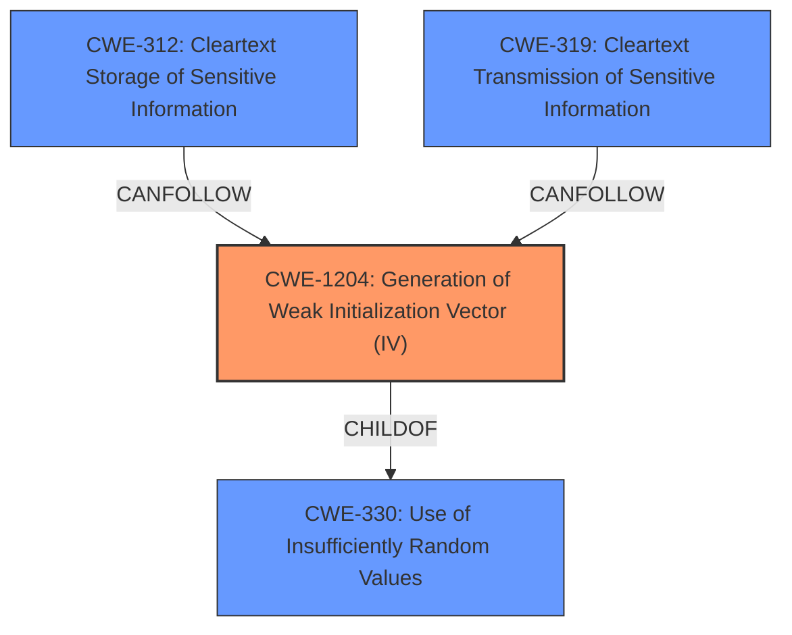

# Raw Analyzer Response for CVE-2022-26306

# Summary
| CWE ID    | CWE Name                                          | Confidence | CWE Abstraction Level | CWE Vulnerability Mapping Label | CWE-Vulnerability Mapping Notes |
| :-------- | :------------------------------------------------ | :--------- | :-------------------- | :------------------------------ | :------------------------------ |
| CWE-1204 | Generation of Weak Initialization Vector (IV) | 1          | Base                  | Allowed                         | Primary CWE                     |
| CWE-312 | Cleartext Storage of Sensitive Information | 0.5         | Base                  | Allowed                         | Secondary Candidate             |
| CWE-319 | Cleartext Transmission of Sensitive Information | 0.5         | Base                  | Allowed                         | Secondary Candidate             |

## Evidence and Confidence

*   **Confidence Score:** 0.8
*   **Evidence Strength:** HIGH

## Relationship Analysis
The primary CWE is CWE-1204, which describes the **weakness** where the Initialization Vector (IV) is not generated in a sufficiently unpredictable or unique way. This is a child of CWE-330, which covers the broader issue of insufficient randomness. The vulnerability could potentially lead to the sensitive information being stored (CWE-312) and transmitted (CWE-319) in cleartext if the encryption is compromised.

## Vulnerability Chain
The vulnerability chain starts with the **root cause**, which is the **use of a static initialization vector** (CWE-1204). This **weakens the encryption**, potentially leading to the exposure of sensitive data. If an attacker gains access to the user's configuration data, they can potentially decrypt the stored passwords. This could lead to sensitive information being stored in cleartext (CWE-312) or being transmitted in cleartext (CWE-319).

## Summary of Analysis
The analysis is based on the provided vulnerability description and the CVE reference links content summary, which clearly points to the use of a static initialization vector as the **root cause** of the vulnerability.

The description states: "A flaw in LibreOffice existed where the **required initialization vector for encryption was always the same** which **weakens the security of the encryption** making them vulnerable if an attacker has access to the users configuration data."

The CVE reference links content summary states: "The vulnerability stems from the use of a static (always the same) initialization vector (IV) when encrypting passwords for web connections stored in LibreOffice's user configuration database... The primary **weakness** is the **use of a static IV**... Reusing the same IV with the same key compromises the security of the encryption... An attacker with access to the user's configuration data could recover the stored web connection passwords without knowing the master password because of the **weak encryption**."

Based on this evidence, CWE-1204 is the most appropriate choice because it directly addresses the **root cause** of the vulnerability. The other CWEs are considered as secondary issues that could arise as a consequence of the primary weakness.

Relevant CWE Information:

# Enhanced Context (25 CWEs)
The following CWEs were identified as potentially relevant to this vulnerability:

## CWE-1204: Generation of Weak Initialization Vector (IV)
**Abstraction Level**: Base
**Similarity Score**: 0.77
**Source**: dense

**Description**:
The product uses a cryptographic primitive that uses an Initialization
			Vector (IV), but the product does not generate IVs that are
			sufficiently unpredictable or unique according to the expected
			cryptographic requirements for that primitive.
			

**Mapping Guidance**:
- Usage: Allowed
- Rationale: This CWE entry is at the Base level of abstraction, which is a preferred level of abstraction for mapping to the root causes of vulnerabilities.

**[Justification for selection:]**
CWE-1204 is selected because the **root cause** of the vulnerability is the **use of a static initialization vector (IV)**, and this CWE directly addresses that issue. The vulnerability description states: "A flaw in LibreOffice existed where the **required initialization vector for encryption was always the same** which weakens the security of the encryption making them vulnerable if an attacker has access to the users configuration data." The "Retriever Results" also identifies CWE-1204 as the top combined result.

## CWE-312: Cleartext Storage of Sensitive Information
**Abstraction Level**: Base
**Similarity Score**: 0.81
**Source**: dense

**Description**:
The product stores sensitive information in cleartext within a resource that might be accessible to another control sphere.

**Mapping Guidance**:
- Usage: Allowed
- Rationale: This CWE entry is at the Base level of abstraction, which is a preferred level of abstraction for mapping to the root causes of vulnerabilities.

**[Justification for consideration but not selection as primary:]**
CWE-312 is considered as the resulting impact of the **weak encryption** where an attacker could access the passwords. The **root cause** is not **cleartext storage**, but **weak encryption**.

## CWE-319: Cleartext Transmission of Sensitive Information
**Abstraction Level**: Base
**Similarity Score**: 0.79
**Source**: dense

**Description**:
The product transmits sensitive or security-critical data in cleartext in a communication channel that can be sniffed by unauthorized actors.

**Mapping Guidance**:
- Usage: Allowed
- Rationale: This CWE entry is at the Base level of abstraction, which is a preferred level of abstraction for mapping to the root causes of vulnerabilities.

**[Justification for consideration but not selection as primary:]**
CWE-319 is considered as the resulting impact of the **weak encryption** where an attacker could access the passwords. The **root cause** is not **cleartext transmission**, but **weak encryption**.

## CWE-331: Insufficient Entropy
**Abstraction Level**: Base
**Similarity Score**: 0.607
**Source**: sparse

**Description**:
The product uses an algorithm or scheme that produces insufficient entropy, leaving patterns or clusters of values that are more likely to occur than others.

**Mapping Guidance**:
- Usage: Allowed
- Rationale: This CWE entry is at the Base level of abstraction, which is a preferred level of abstraction for mapping to the root causes of vulnerabilities.
**[Justification for consideration but not selection as primary:]**
CWE-331 is related to CWE-1204, but the description specifically states a static IV, not just insufficient entropy.