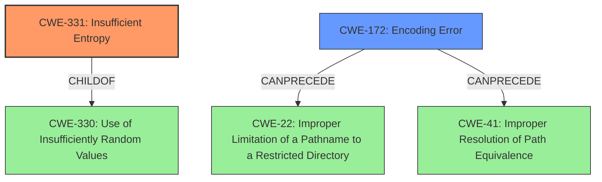

# Raw Analyzer Response for CVE-2022-26307

# Summary
| CWE ID | CWE Name | Confidence | CWE Abstraction Level | CWE Vulnerability Mapping Label | CWE-Vulnerability Mapping Notes |
|---|---|---|---|---|---|
| CWE-331 | Insufficient Entropy | 0.9 | Base | Primary | Allowed |
| CWE-172 | Encoding Error | 0.7 | Class | Secondary | Allowed-with-Review |

## Evidence and Confidence

*   **Confidence Score:** 0.8
*   **Evidence Strength:** HIGH

## Relationship Analysis
The primary CWE is CWE-331, which is a base-level weakness indicating the **insufficient entropy** of the master key. The secondary CWE, CWE-172, is a class-level weakness describing a general **encoding error**. CWE-331 is a child of CWE-330 (Use of Insufficiently Random Values), indicating that **insufficient entropy** is a specific type of using insufficient random values. CWE-172 can precede CWE-22 (Improper Limitation of a Pathname to a Restricted Directory) and CWE-41 (Improper Resolution of Path Equivalence), suggesting that **encoding errors** can sometimes lead to path traversal vulnerabilities, though that is not the case here. The abstraction levels influenced the selection by favoring the base-level CWE-331 for its specificity over the class-level CWE-172.

## Vulnerability Chain
The chain of vulnerabilities starts with the **poor encoding** of the master key, leading to **insufficient entropy**. This, in turn, makes the stored passwords vulnerable to brute-force attacks. The root cause is the **poor encoding**, which directly leads to the primary weakness of **insufficient entropy** in the encryption key.

## Summary of Analysis
The analysis is based on the provided evidence, specifically the "Vulnerability Description Key Phrases" and "CVE Reference Links Content Summary." The primary weakness is the **insufficient entropy** of the master key due to the **poor encoding**. This is supported by the vulnerability description stating "**master key was poorly encoded** resulting in weakening its entropy from 128 to 43 bits". The CVE reference summary confirms that the **weakness is the inadequate encoding of the master key, which reduces its effective strength** from 128 bits to 43 bits.

CWE-331 (Insufficient Entropy) is chosen as the primary CWE because it directly reflects the core issue of the weakened master key. It is at the Base level of abstraction, providing a specific representation of the vulnerability. The relationship graph shows that CWE-331 is a child of CWE-330 (Use of Insufficiently Random Values), which provides a broader context for the weakness.

CWE-172 (Encoding Error) is considered as a secondary CWE because the **poor encoding** is the direct cause of the **insufficient entropy**. However, CWE-172 is a more general classification and doesn't fully capture the cryptographic aspect of the vulnerability.

Other CWEs considered but not used:

*   CWE-1204 (Generation of Weak Initialization Vector (IV)): While related to cryptography, this CWE is specific to Initialization Vectors, which is not the case in this vulnerability.
*   CWE-522 (Insufficiently Protected Credentials): This CWE is too broad, as the core issue is not just the protection of credentials but specifically the **insufficient entropy** of the encryption key.
*   CWE-312 (Cleartext Storage of Sensitive Information): This CWE does not apply because the passwords are encrypted, albeit with a weak key.
*   CWE-798 (Use of Hard-coded Credentials), CWE-321 (Use of Hard-coded Cryptographic Key): These CWEs are not applicable because the master key is not hard-coded. It is provided by the user.

The selected CWEs are at the optimal level of specificity because they accurately represent the root cause and the resulting weakness without being overly broad or specific to a different type of vulnerability. CWE-331 directly addresses the entropy issue, while CWE-172 provides additional context about the **encoding error**.