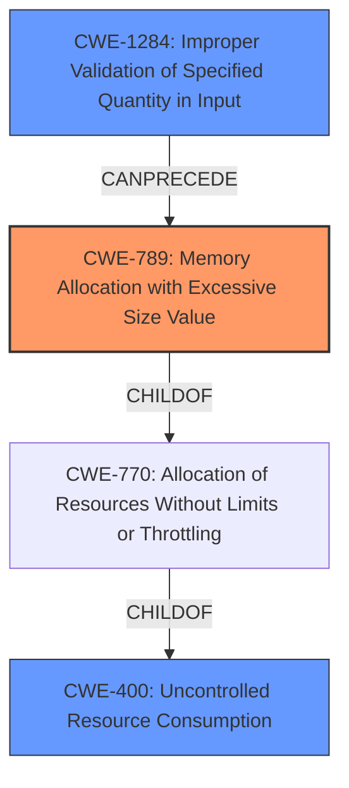

# Enhanced Analysis for CVE-2022-26336

# Summary
| CWE ID | CWE Name | Confidence | CWE Abstraction Level | CWE Vulnerability Mapping Label | CWE-Vulnerability Mapping Notes |
|---|---|---|---|---|---|
| CWE-789 | Memory Allocation with Excessive Size Value | 0.9 | Variant | Allowed | Primary CWE. The vulnerability description and CVE reference indicate that a carefully crafted file can cause an Out of Memory exception due to excessive memory allocation. |
| CWE-400 | Uncontrolled Resource Consumption | 0.7 | Class | Allowed | Secondary CWE. While CWE-789 is more specific, uncontrolled resource consumption leading to denial of service is a broader impact. |
| CWE-1284 | Improper Validation of Specified Quantity in Input | 0.6 | Base | Allowed | Secondary CWE. The crafted file likely contains a field specifying an excessive size, which the application fails to validate. |

## Evidence and Confidence

*   **Confidence Score:** 0.9
*   **Evidence Strength:** HIGH

## Relationship Analysis
The primary weakness is CWE-789 **Memory Allocation with Excessive Size Value**, a Variant of CWE-770 **Allocation of Resources Without Limits or Throttling**, which is a child of CWE-400 **Uncontrolled Resource Consumption**. The crafted file leading to excessive memory allocation suggests a potential **Improper Validation of Specified Quantity in Input (CWE-1284)**, which could precede CWE-789.



## Vulnerability Chain
The vulnerability chain starts with a **shortcoming in the HMEF package of poi-scratchpad** that leads to **Improper Validation of Specified Quantity in Input (CWE-1284)**. This results in **Memory Allocation with Excessive Size Value (CWE-789)**, causing an **Out of Memory exception**, which is a form of **Uncontrolled Resource Consumption (CWE-400)**, and ultimately leading to a Denial of Service.

## Summary of Analysis
The initial analysis points to an **Out of Memory** condition caused by a crafted file, which strongly suggests excessive memory allocation. The evidence provided in the "Vulnerability Description" and "CVE Reference Links Content Summary" supports this. Specifically, the phrases "carefully crafted file can cause an Out of Memory exception" and "successful exploitation could lead to a Denial of Service (DoS)" are key. The graph relationships highlight the connection between excessive memory allocation and uncontrolled resource consumption, with improper input validation potentially preceding the memory allocation issue.

The primary CWE, CWE-789, is selected because it directly addresses the root cause of the vulnerability: **Memory Allocation with Excessive Size Value**. The crafted file likely exploits a **shortcoming in the HMEF package of poi-scratchpad** that does not properly limit the size of allocated memory based on the file's content. This aligns well with the CWE-789 description: "The product allocates memory based on an untrusted, large size value, but it does not ensure that the size is within expected limits, allowing arbitrary amounts of memory to be allocated."

CWE-400 **Uncontrolled Resource Consumption** is included as a secondary CWE because the **Out of Memory** condition directly leads to a denial-of-service, which aligns with CWE-400's description.

CWE-1284 **Improper Validation of Specified Quantity in Input** is considered a secondary CWE because the crafted file likely contains a field specifying a quantity (e.g., size or length) that the application **does not validate**. This **lack of validation** enables the excessive memory allocation.

The selected CWEs are at the optimal level of specificity. CWE-789 is a Variant, which is preferred when the specific type of memory allocation issue is known. CWE-400 and CWE-1284 are broader but still relevant in describing the overall impact and contributing factors.

Other CWEs Considered:

*   CWE-20: Improper Input Validation - While input validation is generally relevant, CWE-1284 is more specific to the improper validation of a specified quantity.
*   CWE-190: Integer Overflow or Wraparound - While an integer overflow could potentially contribute to excessive memory allocation, the description focuses on the lack of validation of size values, making CWE-789 and CWE-1284 more appropriate.
* CWE-776: Improper Restriction of Recursive Entity References in DTDs ('XML Entity Expansion') - This is specific to XML documents and DTDs, which is not explicitly mentioned in the vulnerability description.
* CWE-1333: Inefficient Regular Expression Complexity - This is related to regular expression processing, which is not mentioned in the description.

Relevant CWE Information:

# Enhanced Context (25 CWEs)
The following CWEs were identified as potentially relevant to this vulnerability:

## CWE-74: Improper Neutralization of Special Elements in Output Used by a Downstream Component ('Injection')
**Abstraction Level**: Class
**Similarity Score**: 0.78
**Source**: dense

**Description**:
The product constructs all or part of a command, data structure, or record using externally-influenced input from an upstream component, but it does not neutralize or incorrectly neutralizes special elements that could modify how it is parsed or interpreted when it is sent to a downstream component.

**Mapping Guidance**:
- Usage: Discouraged
- Rationale: CWE-74 is high-level and often misused when lower-level weaknesses are more appropriate.


## CWE-918: Server-Side Request Forgery (SSRF)
**Abstraction Level**: Base
**Similarity Score**: 0.77
**Source**: dense

**Description**:
The web server receives a URL or similar request from an upstream component and retrieves the contents of this URL, but it does not sufficiently ensure that the request is being sent to the expected destination.

**Mapping Guidance**:
- Usage: Allowed
- Rationale: This CWE entry is at the Base level of abstraction, which is a preferred level of abstraction for mapping to the root causes of vulnerabilities.


## CWE-1289: Improper Validation of Unsafe Equivalence in Input
**Abstraction Level**: Base
**Similarity Score**: 0.77
**Source**: dense

**Description**:
The product receives an input value that is used as a resource identifier or other type of reference, but it does not validate or incorrectly validates that the input is equivalent to a potentially-unsafe value.

**Mapping Guidance**:
- Usage: Allowed
- Rationale: This CWE entry is at the Base level of abstraction, which is a preferred level of abstraction for mapping to the root causes of vulnerabilities.


## CWE-113: Improper Neutralization of CRLF Sequences in HTTP Headers ('HTTP Request/Response Splitting')
**Abstraction Level**: Variant
**Similarity Score**: 0.77
**Source**: dense

**Description**:
The product receives data from an HTTP agent/component (e.g., web server, proxy, browser, etc.), but it does not neutralize or incorrectly neutralizes CR and LF characters before the data is included in outgoing HTTP headers.

**Mapping Guidance**:
- Usage: Allowed
- Rationale: This CWE entry is at the Variant level of abstraction, which is a preferred level of abstraction for mapping to the root causes of vulnerabilities.


## CWE-611: Improper Restriction of XML External Entity Reference
**Abstraction Level**: Base
**Similarity Score**: 0.77
**Source**: dense

**Description**:
The product processes an XML document that can contain XML entities with URIs that resolve to documents outside of the intended sphere of control, causing the product to embed incorrect documents into its output.

**Mapping Guidance**:
- Usage: Allowed
- Rationale: This CWE entry is at the Base level of abstraction, which is a preferred level of abstraction for mapping to the root causes of vulnerabilities.


## CWE-184: Incomplete List of Disallowed Inputs
**Abstraction Level**: Base
**Similarity Score**: 0.76
**Source**: dense

**Description**:
The product implements a protection mechanism that relies on a list of inputs (or properties of inputs) that are not allowed by policy or otherwise require other action to neutralize before additional processing takes place, but the list is incomplete.

**Mapping Guidance**:
- Usage: Allowed
- Rationale: This CWE entry is at the Base level of abstraction, which is a preferred level of abstraction for mapping to the root causes of vulnerabilities.


## CWE-807


## CWE Relationship Analysis

Current CWEs represent these abstraction levels: .


### Vulnerability Chain Analysis

**Chain starting from CWE-190:**
- 190 (Integer Overflow or Wraparound) - ROOT


**Chain starting from CWE-918:**
- 918 (Server-Side Request Forgery (SSRF)) - ROOT


### CWE Relationship Diagram

```mermaid
graph TD
    classDef primary fill:#f96,stroke:#333,stroke-width:2px
    classDef secondary fill:#69f,stroke:#333
    classDef tertiary fill:#9e9,stroke:#333
```