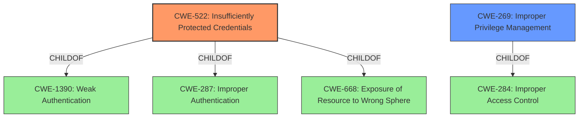

# Raw Analyzer Response for CVE-2022-26341

# Summary

| CWE ID | CWE Name | Confidence | CWE Abstraction Level | CWE Vulnerability Mapping Label | CWE-Vulnerability Mapping Notes |
|---|---|---|---|---|---|
| CWE-522 | Insufficiently Protected Credentials | 1.0 | Class | Allowed-with-Review | Primary CWE |
| CWE-269 | Improper Privilege Management | 0.7 | Class | Discouraged | Secondary Candidate |

## Evidence and Confidence

*   **Confidence Score:** 0.9
*   **Evidence Strength:** HIGH

## Relationship Analysis
The primary CWE selected is CWE-522 (**Insufficiently Protected Credentials**), which is a Class-level CWE. This CWE is related to other CWEs through ChildOf relationships, specifically CWE-1390 (**Weak Authentication**), CWE-287 (**Improper Authentication**), and CWE-668 (**Exposure of Resource to Wrong Sphere**). The vulnerability indicates a direct issue with credential protection, making CWE-522 a relevant fit. While CWE-269 (**Improper Privilege Management**) is also considered due to the impact of privilege escalation, it is a less direct match than CWE-522. CWE-284 (**Improper Access Control**) is a high-level Pillar that could be considered, but it's too broad to accurately represent the vulnerability.

## Vulnerability Chain
The vulnerability chain begins with **insufficiently protected credentials**. This **WEAKNESS** allows an authenticated user to escalate privileges via network access, ultimately impacting system security.
  - **Root Cause:** CWE-522 (**Insufficiently Protected Credentials**)
  - **Impact:** Privilege escalation

## Summary of Analysis
The initial analysis focused on identifying the root cause of the vulnerability. The key phrase "**Insufficiently protected credentials**" directly points to CWE-522. The CVE Reference Links Content Summary confirms that the **ROOT CAUSE** is insufficiently protected credentials, leading to privilege escalation.
The retriever results also listed CWE-522 as the top combined result.
The relationship graph shows how CWE-522 relates to other authentication-related CWEs.
The final decision to classify this vulnerability as CWE-522 is based on the evidence that the credentials are not adequately protected and is a more direct cause than improper privilege management.
The CWE-522 is at the optimal level of specificity because it directly addresses the weakness of insufficient protection of credentials.

Relevant CWE Information:

# Enhanced Context (25 CWEs)

## CWE-653: Improper Isolation or Compartmentalization
**Abstraction Level**: Class
**Similarity Score**: 0.76
**Source**: dense

**Description**:
The product does not properly compartmentalize or isolate functionality, processes, or resources that require different privilege levels, rights, or permissions.

**Why Not Used**: Not directly related to credential protection.

## CWE-131: Incorrect Calculation of Buffer Size
**Abstraction Level**: Base
**Similarity Score**: 0.76
**Source**: dense

**Description**:
The product does not correctly calculate the size to be used when allocating a buffer, which could lead to a buffer overflow.

**Why Not Used**: Not applicable to the vulnerability.

## CWE-274: Improper Handling of Insufficient Privileges
**Abstraction Level**: Base
**Similarity Score**: 0.76
**Source**: dense

**Description**:
The product does not handle or incorrectly handles when it has insufficient privileges to perform an operation, leading to resultant weaknesses.

**Why Not Used**: This is more about how the system responds to insufficient privileges rather than the **ROOT CAUSE** of **insufficiently protected credentials**.

## CWE-404: Improper Resource Shutdown or Release
**Abstraction Level**: Class
**Similarity Score**: 0.75
**Source**: dense

**Description**:
The product does not release or incorrectly releases a resource before it is made available for re-use.

**Why Not Used**: Irrelevant to credential protection.

## CWE-667: Improper Locking
**Abstraction Level**: Class
**Similarity Score**: 0.75
**Source**: dense

**Description**:
The product does not properly acquire or release a lock on a resource, leading to unexpected resource state changes and behaviors.

**Why Not Used**: Not related to credential protection.

## CWE-691: Insufficient Control Flow Management
**Abstraction Level**: Pillar
**Similarity Score**: 0.75
**Source**: dense

**Description**:
The code does not sufficiently manage its control flow during execution, creating conditions in which the control flow can be modified in unexpected ways.

**Why Not Used**: Too abstract and not directly relevant.

## CWE-703: Improper Check or Handling of Exceptional Conditions
**Abstraction Level**: Pillar
**Similarity Score**: 0.75
**Source**: dense

**Description**:
The product does not properly anticipate or handle exceptional conditions that rarely occur during normal operation of the product.

**Why Not Used**: Too abstract and not directly relevant.

## CWE-119: Improper Restriction of Operations within the Bounds of a Memory Buffer
**Abstraction Level**: Class
**Similarity Score**: 0.75
**Source**: dense

**Description**:
The product performs operations on a memory buffer, but it reads from or writes to a memory location outside the buffer's intended boundary. This may result in read or write operations on unexpected memory locations that could be linked to other variables, data structures, or internal program data.

**Why Not Used**: Not applicable to credential protection.

## CWE-754: Improper Check for Unusual or Exceptional Conditions
**Abstraction Level**: Class
**Similarity Score**: 0.75
**Source**: dense

**Description**:
The product does not check or incorrectly checks for unusual or exceptional conditions that are not expected to occur frequently during day to day operation of the product.

**Why Not Used**: Not directly related to the **ROOT CAUSE**.

## CWE-280: Improper Handling of Insufficient Permissions or Privileges
**Abstraction Level**: Base
**Similarity Score**: 0.74
**Source**: dense

**Description**:
The product does not handle or incorrectly handles when it has insufficient privileges to access resources or functionality as specified by their permissions. This may cause it to follow unexpected code paths that may leave the product in an invalid state.

**Why Not Used**: This is about handling privileges rather than the **ROOT CAUSE** of **insufficiently protected credentials**.

## CWE-863: Incorrect Authorization
**Abstraction Level**: Class
**Similarity Score**: 4501.78
**Source**: sparse

**Description**:
The product performs an authorization check when an actor attempts to access a resource or perform an action, but it does not correctly perform the check.

**Why Not Used**: While privilege escalation is an impact, the **ROOT CAUSE** is **insufficiently protected credentials**.

## CWE-287: Improper Authentication
**Abstraction Level**: Class
**Similarity Score**: 4497.05
**Source**: sparse

**Description**:
When an actor claims to have a given identity, the product does not prove or insufficiently proves that the claim is correct.

**Why Not Used**: Too general; the issue is with the protection of credentials, not necessarily the authentication process itself.

## CWE-639: Authorization Bypass Through User-Controlled Key
**Abstraction Level**: Base
**Similarity Score**: 4480.32
**Source**: sparse

**Description**:
The system's authorization functionality does not prevent one user from gaining access to another user's data or record by modifying the key value identifying the data.

**Why Not Used**: Not directly applicable to the **ROOT CAUSE**.

## CWE-1390: Weak Authentication
**Abstraction Level**: Class
**Similarity Score**: 4401.34
**Source**: sparse

**Description**:
The product uses an authentication mechanism to restrict access to specific users or identities, but the mechanism does not sufficiently prove that the claimed identity is correct.

**Why Not Used**: While related, the core issue is with the