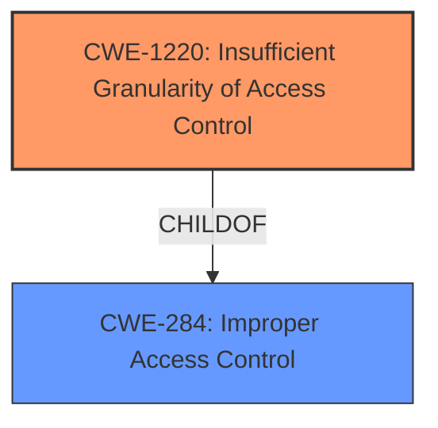

# Analysis for CVE-2022-26343

# Summary
| CWE ID | CWE Name | Confidence | CWE Abstraction Level | CWE Vulnerability Mapping Label | CWE-Vulnerability Mapping Notes |
|---|---|---|---|---|---|
| CWE-1220 | Insufficient Granularity of Access Control | 0.8 | Base | ALLOWED | Primary CWE |
| CWE-284 | Improper Access Control | 0.6 | Pillar | DISCOURAGED | Secondary Candidate |

## Evidence and Confidence

*   **Confidence Score:** 0.8
*   **Evidence Strength:** HIGH

## Relationship Analysis
The primary CWE, CWE-1220, is a child of CWE-284, representing a more specific form of access control issue. While CWE-284 is a high-level "Pillar" and discouraged, CWE-1220 offers a "Base" level of abstraction, aligning well with the need for specificity. The relationship indicates that the vulnerability is not merely a general access control problem (CWE-284) but a specific issue of insufficient granularity within the access control mechanisms (CWE-1220).

## Vulnerability Chain
The vulnerability chain starts with **improper access control**, specifically **insufficient granularity**, which leads to an escalation of privilege. The root cause is the **improper** implementation or configuration of access control mechanisms within the BIOS firmware, allowing a privileged user to potentially gain even higher privileges.

## Summary of Analysis
The analysis is based primarily on the vulnerability description and the CVE Reference Links Content Summary. The key phrase "Improper access control" and the impact "escalation of privilege" are critical pieces of evidence. The analysis of the CVE Reference Links Content Summary reinforces that the root cause is "Improper access control in the BIOS firmware."

The Retriever Results suggest several candidate CWEs, including CWE-691 (Insufficient Control Flow Management), CWE-284 (Improper Access Control), and CWE-1220 (Insufficient Granularity of Access Control). CWE-284 is discouraged due to its high-level nature. CWE-691, while relevant to control flow, doesn't directly address the access control issue. CWE-1220, however, specifically addresses insufficient granularity of access control, making it the most appropriate choice.

The decision to select CWE-1220 is based on its direct relevance to the vulnerability description, its "Base" level of abstraction, and the MITRE mapping guidance that allows its usage. The CWE's description aligns well with the vulnerability, which states that the **improper access control** in the BIOS firmware allows a privileged user to potentially enable escalation of privilege. The selection is at the optimal level of specificity because it goes beyond a general access control issue (CWE-284) and identifies the specific problem of insufficient granularity (CWE-1220).

Relevant CWE Information:

# Enhanced Context (25 CWEs)
The following CWEs were identified as potentially relevant to this vulnerability:

## CWE-1220: Insufficient Granularity of Access Control
**Abstraction Level**: Base
**Similarity Score**: 0.78
**Source**: dense

**Description**:
The product implements access controls via a policy or other feature with the intention to disable or restrict accesses (reads and/or writes) to assets in a system from untrusted agents. However, implemented access controls lack required granularity, which renders the control policy too broad because it allows accesses from unauthorized agents to the security-sensitive assets.

**Mapping Guidance**:
- Usage: Allowed
- Rationale: This CWE entry is at the Base level of abstraction, which is a preferred level of abstraction for mapping to the root causes of vulnerabilities.

## CWE-284: Improper Access Control
**Abstraction Level**: Pillar
**Similarity Score**: 0.77
**Source**: dense

**Description**:
The product does not restrict or incorrectly restricts access to a resource from an unauthorized actor.

**Mapping Guidance**:
- Usage: Discouraged
- Rationale: CWE-284 is extremely high-level, a Pillar. Its name, "Improper Access Control," is often misused in low-information vulnerability reports [REF-1287] or by active use of the OWASP Top Ten, such as "A01:2021-Broken Access Control". It is not useful for trend analysis.

## CWE-691: Insufficient Control Flow Management
**Abstraction Level**: Pillar
**Similarity Score**: 0.77
**Source**: dense

**Description**:
The code does not sufficiently manage its control flow during execution, creating conditions in which the control flow can be modified in unexpected ways.

**Mapping Guidance**:
- Usage: Discouraged
- Rationale: This CWE entry is extremely high-level, a Pillar. However, classification research is limited for weaknesses of this type, so there can be gaps or organizational difficulties within CWE that force use of this weakness, even at such a high level of abstraction.

### Summary of other CWEs Considered but Not Used:

*   **CWE-284 (Improper Access Control):** While the vulnerability involves **improper access control**, CWE-284 is a high-level "Pillar" and is discouraged. CWE-1220 provides a more specific and accurate representation of the weakness.
*   **CWE-691 (Insufficient Control Flow Management):** Although control flow might be indirectly affected, the core issue is about the granularity of access control, making CWE-1220 a better fit.
*   **CWE-119 (Improper Restriction of Operations within the Bounds of a Memory Buffer):** This CWE is related to memory buffer issues and is not relevant to the described vulnerability.
*   **CWE-1256 (Improper Restriction of Software Interfaces to Hardware Features):** This CWE is more specific to interfaces with hardware features and does not align with the **improper access control** issue.
*   **CWE-287 (Improper Authentication):** The vulnerability is not related to Authentication but Authorization.