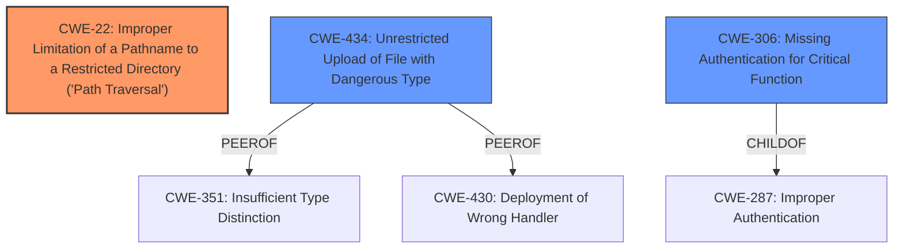

# Analysis Report for CVE-2022-26352

# Vulnerability Analysis Report: CVE-2022-26352

## Description


## Analysis (with Relationship Data)

# Summary
| CWE ID  | CWE Name                                                                      | Confidence | CWE Abstraction Level | CWE Vulnerability Mapping Label | CWE-Vulnerability Mapping Notes |
| :-------- | :---------------------------------------------------------------------------- | :--------- | :-------------------- | :------------------------------ | :------------------------------ |
| CWE-22    | Improper Limitation of a Pathname to a Restricted Directory ('Path Traversal') | 1          | Base                  | Primary                         | Allowed                         |
| CWE-434   | Unrestricted Upload of File with Dangerous Type                             | 0.7        | Base                  | Secondary                       | Allowed                         |
| CWE-306   | Missing Authentication for Critical Function                                  | 0.6        | Base                  | Secondary                       | Allowed                         |

## Evidence and Confidence

*   **Confidence Score:** 0.8
*   **Evidence Strength:** HIGH

## Relationship Analysis
The primary CWE is CWE-22, which describes the **improper limitation of a pathname to a restricted directory ('Path Traversal')**. This is a base-level CWE. The vulnerability description clearly states that the application allows **directory traversal** by not sanitizing filenames, allowing files to be saved outside the intended storage location.

CWE-434 (Unrestricted Upload of File with Dangerous Type) is a peer of CWE-430 (Deployment of Wrong Handler) and CWE-351 (Insufficient Type Distinction), suggesting related vulnerabilities might be present.

CWE-306 (Missing Authentication for Critical Function) is included as a secondary CWE because the description states that the issue is more severe if anonymous content creation is enabled.



## Vulnerability Chain
The vulnerability chain starts with **improper input sanitization**, leading to **directory traversal**, which then allows an unauthenticated attacker to upload an executable file, ultimately resulting in remote code execution.

CWE-22 (Improper Limitation of a Pathname to a Restricted Directory ('Path Traversal')) is the root cause.
CWE-434 (Unrestricted Upload of File with Dangerous Type) is a consequence of the traversal, enabling the upload of malicious files.
CWE-306 (Missing Authentication for Critical Function) exacerbates the issue by allowing unauthenticated attackers to exploit the vulnerability.

## Summary of Analysis
The initial analysis strongly points to CWE-22 as the primary weakness due to the explicit mention of **directory traversal** and the **improper limitation of a pathname**. The vulnerability description states, "Attackers can craft a multipart form request to post a file whose filename is not initially sanitized. This allows **directory traversal**, in which the file is saved outside of the intended storage location."

The graph relationships reinforce this choice, as CWE-22 is related to other path traversal variants and has clear parent-child relationships that help to understand its context. The retriever results also support this, with CWE-22 having the highest score.

The selection of CWE-22 is at the optimal level of specificity because it directly addresses the root cause of the vulnerability: the application's failure to properly restrict pathnames, allowing attackers to access files outside the intended directory. The other CWEs are secondary factors that contribute to the overall impact of the vulnerability but are not the primary cause.

Relevant CWE Information:

# Enhanced Context (25 CWEs)
The following CWEs were identified as potentially relevant to this vulnerability:

## CWE-23: Relative Path Traversal
**Abstraction Level**: Base
**Similarity Score**: 0.81
**Source**: dense

**Description**:
The product uses external input to construct a pathname that should be within a restricted directory, but it does not properly neutralize sequences such as ".." that can resolve to a location that is outside of that directory.

**Mapping Guidance**:
- Usage: Allowed
- Rationale: This CWE entry is at the Base level of abstraction, which is a preferred level of abstraction for mapping to the root causes of vulnerabilities.

## CWE-434: Unrestricted Upload of File with Dangerous Type
**Abstraction Level**: Base
**Similarity Score**: 5443.82
**Source**: sparse

**Description**:
The product allows the upload or transfer of dangerous file types that are automatically processed within its environment.

**Mapping Guidance**:
- Usage: Allowed
- Rationale: This CWE entry is at the Base level of abstraction, which is a preferred level of abstraction for mapping to the root causes of vulnerabilities.


## CWE Relationship Analysis

Current CWEs represent these abstraction levels: .


### Vulnerability Chain Analysis

**Chain starting from CWE-430:**
- 430 (Deployment of Wrong Handler) - ROOT


**Chain starting from CWE-434:**
- 434 (Unrestricted Upload of File with Dangerous Type) - ROOT


### CWE Relationship Diagram

```mermaid
graph TD
    classDef primary fill:#f96,stroke:#333,stroke-width:2px
    classDef secondary fill:#69f,stroke:#333
    classDef tertiary fill:#9e9,stroke:#333
```


*Report generated on 2025-03-30 23:46:22*
