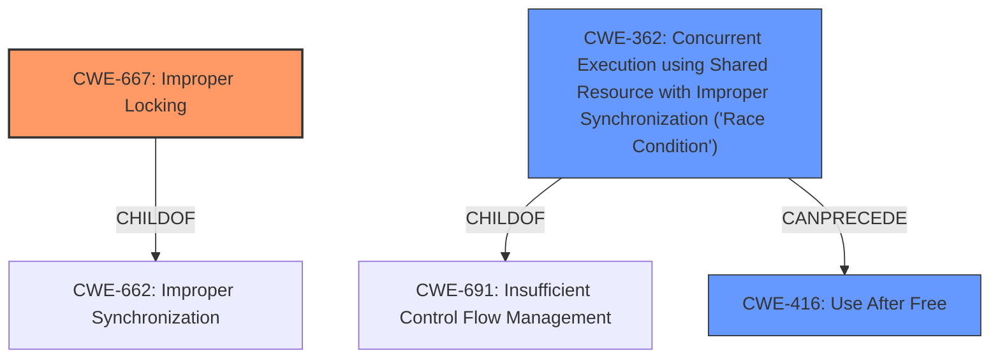

# Analysis Report for CVE-2022-26356

# Vulnerability Analysis Report: CVE-2022-26356

## Description


## Analysis (with Relationship Data)

# Summary
| CWE ID | CWE Name | Confidence | CWE Abstraction Level | CWE Vulnerability Mapping Label | CWE-Vulnerability Mapping Notes |
|---|---|---|---|---|---|
| CWE-667 | Improper Locking | 0.9 | Class | Allowed-with-Review | Primary CWE |
| CWE-362 | Concurrent Execution using Shared Resource with Improper Synchronization ('Race Condition') | 0.8 | Class | Allowed-with-Review | Secondary Candidate |
| CWE-416 | Use After Free | 0.6 | Variant | Allowed | Secondary Candidate |

## Evidence and Confidence

*   **Confidence Score:** 0.8
*   **Evidence Strength:** HIGH

## Relationship Analysis
The primary relationship influencing the decision is that CWE-667 (Improper Locking) can lead to CWE-362 (Race Condition). The vulnerability description explicitly mentions the **lack of mutually exclusive locking** as the cause of the **racy interactions**. Also, CWE-416 is related, as race conditions can lead to use-after-free scenarios, but the primary impact described is a memory leak which is more generally related to improper resource management caused by the race condition.


## Vulnerability Chain
The vulnerability chain starts with the **lack of mutually exclusive locking** (CWE-667), leading to **racy interactions** (CWE-362) and ultimately causing a **memory leak**. A potential consequence of memory corruption could be a use-after-free (CWE-416), although this is not the primary observed impact.

## Summary of Analysis
The initial assessment focused on identifying the root cause of the vulnerability, which is the **lack of mutually exclusive locking**. The vulnerability description key phrases highlight the "**racy interactions between dirty vram tracking and paging log dirty hypercalls**" and the "memory leak" impact. The CVE Reference Links Content Summary reinforces this by stating, "The core issue is the lack of proper synchronization between the operations that enable and disable the log dirty mode, which causes a race," and "Missing Locking: The absence of mutual exclusion (locking) mechanisms between the two operations is the primary weakness that leads to the race condition and memory corruption."

The retriever results also strongly suggest CWE-667 (Improper Locking) and CWE-362 (Race Condition) as the most relevant CWEs.

The graph relationships confirm that Improper Locking can lead to a Race Condition, which can further lead to memory corruption issues such as Use-After-Free.

The selected CWEs are at the optimal level of specificity because CWE-667 directly addresses the **root cause** (missing locking), while CWE-362 and CWE-416 describe the consequences of this missing lock.

Relevant CWE Information:

# Enhanced Context (25 CWEs)
The following CWEs were identified as potentially relevant to this vulnerability:

## CWE-667: Improper Locking
**Abstraction Level**: Class
**Similarity Score**: 0.80
**Source**: dense

**Description**:
The product does not properly acquire or release a lock on a resource, leading to unexpected resource state changes and behaviors.

**Mapping Guidance**:
- Usage: Allowed-with-Review
- Rationale: This CWE entry is a Class and might have Base-level children that would be more appropriate

## CWE-362: Concurrent Execution using Shared Resource with Improper Synchronization ('Race Condition')
**Abstraction Level**: Class
**Similarity Score**: 0.78
**Source**: dense

**Description**:
The product contains a concurrent code sequence that requires temporary, exclusive access to a shared resource, but a timing window exists in which the shared resource can be modified by another code sequence operating concurrently.

**Mapping Guidance**:
- Usage: Allowed-with-Review
- Rationale: This CWE entry is a Class and might have Base-level children that would be more appropriate

## CWE-416: Use After Free
**Abstraction Level**: Variant
**Similarity Score**: 0.78
**Source**: dense

**Description**:
The product reuses or references memory after it has been freed. At some point afterward, the memory may be allocated again and saved in another pointer, while the original pointer references a location somewhere within the new allocation. Any operations using the original pointer are no longer valid because the memory "belongs" to the code that operates on the new pointer.

**Mapping Guidance**:
- Usage: Allowed
- Rationale: This CWE entry is at the Variant level of abstraction, which is a preferred level of abstraction for mapping to the root causes of vulnerabilities.

I considered other CWEs such as CWE-476 (NULL Pointer Dereference), CWE-123 (Write-what-where Condition) and CWE-787 (Out-of-bounds Write), but these are less directly relevant to the **root cause** which is the **lack of locking**. While these issues can arise as a consequence, they are not the primary weakness. The evidence strongly points to the **absence of locking** as the initial flaw that triggers the race condition and memory leak.


## CWE Relationship Analysis

Current CWEs represent these abstraction levels: .


### Vulnerability Chain Analysis

**Chain starting from CWE-476:**
- 476 (NULL Pointer Dereference) - ROOT


**Chain starting from CWE-662:**
- 662 (Improper Synchronization) - ROOT


### CWE Relationship Diagram

```mermaid
graph TD
    classDef primary fill:#f96,stroke:#333,stroke-width:2px
    classDef secondary fill:#69f,stroke:#333
    classDef tertiary fill:#9e9,stroke:#333
```


*Report generated on 2025-03-30 17:19:49*
