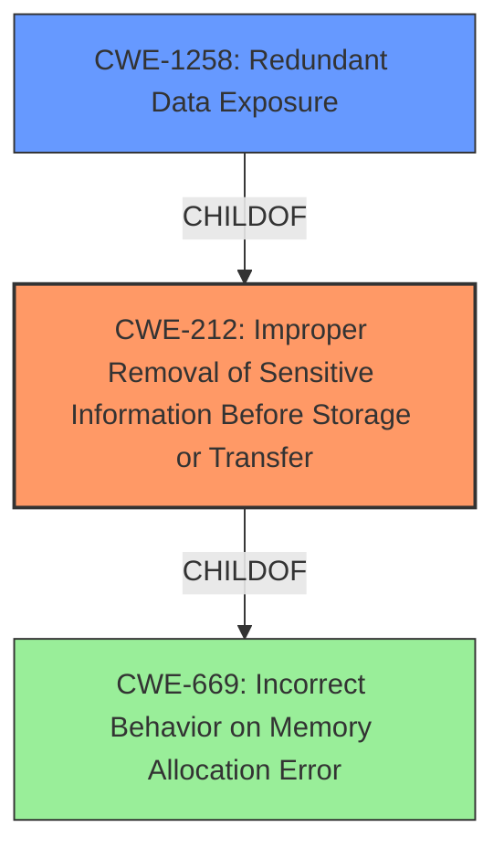

# Analysis for CVE-2022-26365

```markdown
# Summary
| CWE ID    | CWE Name                                                              | Confidence | CWE Abstraction Level | CWE Vulnerability Mapping Label | CWE-Vulnerability Mapping Notes |
| --------- | --------------------------------------------------------------------- | ---------- | --------------------- | ------------------------------- | ------------------------------- |
| CWE-212   | Improper Removal of Sensitive Information Before Storage or Transfer | 0.9        | Base                  | Primary                         | Allowed                       |
| CWE-1258  | Redundant Data Exposure                                                 | 0.7        | Base                  | Secondary                       | Allowed                       |

## Evidence and Confidence

*   **Confidence Score:** 0.8
*   **Evidence Strength:** HIGH

## Relationship Analysis
The primary relationship that influenced the CWE selection is the parent-child relationship between CWE-669: Incorrect Behavior on Memory Allocation Error and CWE-212. Additionally, the parent relationship between CWE-212 and CWE-1258 was considered since there is exposure of sensitive data as a result of the **failure to remove data before transfer**. CWE-212 is a Base level CWE which is the preferred level of abstraction.



## Vulnerability Chain
The vulnerability chain starts with the **failure to zero memory regions before sharing them**, leading to **information disclosure** and **unrelated data residing in the same 4K page** being accessible.
  - Root Cause: **Improper Removal of Sensitive Information Before Storage or Transfer** (CWE-212)
  - Impact: Exposure of sensitive information.

## Summary of Analysis
The analysis focused on the provided keyphrases and their relationship to potential CWEs. The primary **root cause** identified is the **failure to zero memory regions before sharing them with the backend**, directly aligning with **CWE-212 (Improper Removal of Sensitive Information Before Storage or Transfer)**. This CWE accurately captures the essence of the vulnerability, where sensitive information is not properly removed before being made accessible to unauthorized actors. The high retriever score for CWE-212 across multiple keyphrases further supports this selection.

CWE-1258 Redundant Data Exposure was considered as a secondary weakness because the **failure to properly sanitize memory before sharing it results in redundant data exposure**.

The final decision is based on direct evidence from the vulnerability description, particularly the phrase **"don't zero memory regions before sharing them with the backend"**, which clearly indicates **improper removal of sensitive information**. The selected CWEs are at the optimal level of specificity, providing a clear and accurate representation of the vulnerability.

Relevant CWE Information:

# Enhanced Context (25 CWEs)
The following CWEs were identified as potentially relevant to this vulnerability:

## CWE-226: Sensitive Information in Resource Not Removed Before Reuse
**Abstraction Level**: Base
**Similarity Score**: 0.75
**Source**: dense

**Description**:
The product releases a resource such as memory or a file so that it can be made available for reuse, but it does not clear or "zeroize" the information contained in the resource before the product performs a critical state transition or makes the resource available for reuse by other entities.

**Mapping Guidance**:
- Usage: Allowed
- Rationale: This CWE entry is at the Base level of abstraction, which is a preferred level of abstraction for mapping to the root causes of vulnerabilities.


## CWE-667: Improper Locking
**Abstraction Level**: Class
**Similarity Score**: 0.75
**Source**: dense

**Description**:
The product does not properly acquire or release a lock on a resource, leading to unexpected resource state changes and behaviors.

**Mapping Guidance**:
- Usage: Allowed-with-Review
- Rationale: This CWE entry is a Class and might have Base-level children that would be more appropriate


## CWE-497: Exposure of Sensitive System Information to an Unauthorized Control Sphere
**Abstraction Level**: Base
**Similarity Score**: 0.74
**Source**: dense

**Description**:
The product does not properly prevent sensitive system-level information from being accessed by unauthorized actors who do not have the same level of access to the underlying system as the product does.

**Mapping Guidance**:
- Usage: Allowed
- Rationale: This CWE entry is at the Base level of abstraction, which is a preferred level of abstraction for mapping to the root causes of vulnerabilities.


## CWE-212: Improper Removal of Sensitive Information Before Storage or Transfer
**Abstraction Level**: Base
**Similarity Score**: 0.74
**Source**: dense

**Description**:
The product stores, transfers, or shares a resource that contains sensitive information, but it does not properly remove that information before the product makes the resource available to unauthorized actors.

**Mapping Guidance**:
- Usage: Allowed
- Rationale: This CWE entry is at the Base level of abstraction, which is a preferred level of abstraction for mapping to the root causes of vulnerabilities.


## CWE-1391: Use of Weak Credentials
**Abstraction Level**: Class
**Similarity Score**: 0.73
**Source**: dense

**Description**:
The product uses weak credentials (such as a default key or hard-coded password) that can be calculated, derived, reused, or guessed by an attacker.

**Mapping Guidance**:
- Usage: Allowed-with-Review
- Rationale: This CWE entry is a Class and might have Base-level children that would be more appropriate


## CWE-665: Improper Initialization
**Abstraction Level**: Class
**Similarity Score**: 0.73
**Source**: dense

**Description**:
The product does not initialize or incorrectly initializes a resource, which might leave the resource in an unexpected state when it is accessed or used.

**Mapping Guidance**:
- Usage: Discouraged
- Rationale: This CWE entry is a level-1 Class (i.e., a child of a Pillar). It might have lower-level children that would be more appropriate


## CWE-404: Improper Resource Shutdown or Release
**Abstraction Level**: Class
**Similarity Score**: 0.73
**Source**: dense

**Description**:
The product does not release or incorrectly releases a resource before it is made available for re-use.

**Mapping Guidance**:
- Usage: Allowed-with-Review
- Rationale: This CWE entry is a Class and might have Base-level children that would be more appropriate


## CWE-703: Improper Check or Handling of Exceptional Conditions
**Abstraction Level**: Pillar
**Similarity Score**: 0.73
**Source**: dense

**Description**:
The product does not properly anticipate or handle exceptional conditions that rarely occur during normal operation of the product.

**Mapping Guidance**:
- Usage: Discouraged
- Rationale: This CWE entry is extremely high-level, a Pillar.


## CWE-824: Access of Uninitialized Pointer
**Abstraction Level**: Base
**Similarity Score**: 0.73
**Source**: dense

**Description**:
The product accesses or uses a pointer that has not been initialized.

**Mapping Guidance**:
- Usage: Allowed
- Rationale: This CWE entry is at the Base level of abstraction, which is a preferred level of abstraction for mapping to the root causes of vulnerabilities.


## CWE-657: Violation of Secure Design Principles
**Abstraction Level**: Class
**Similarity Score**: 0.72
**Source**: dense

**Description**:
The product violates well-established principles for secure design.

**Mapping Guidance**:
- Usage: Discouraged
- Rationale: This CWE entry is a level-1 Class (i.e., a child of a Pillar). It might have lower-level children that would be more appropriate


## CWE-362: Concurrent Execution using Shared Resource with Improper Synchronization ('Race Condition')
**Abstraction Level**: Class
**Similarity Score**: 2107.64
**Source**: sparse

**Description**:
The product contains a concurrent code sequence that requires temporary, exclusive access to a shared resource, but a timing window exists in which the shared resource can be modified by another code sequence operating concurrently.

**Mapping Guidance**:
- Usage: Allowed-with-Review
- Rationale: This CWE entry is a Class and might have Base-level children that would be more appropriate


## CWE-212: Improper Removal of Sensitive Information Before Storage or Transfer
**Abstraction Level**: Base
**Similarity Score**: 2065.85
**Source**: sparse

**Description**:
The product stores, transfers, or shares a resource that contains sensitive information, but it does not properly remove that information before the product makes the resource available to unauthorized actors.

# Enhanced Query for CVE-2022-26365

# Vulnerability Description

    Linux disk/nic frontends data leaks T[his CNA information record relates to multiple CVEs the text explains which aspects/vulnerabilities correspond to which CVE.] Linux Block and Network PV device frontends dont zero memory regions before sharing them with the backend (CVE-2022-26365, CVE-2022-33740). Additionally the granularity of the grant table doesnt allow sharing less than a 4K page, leading to **unrelated data residing in the same 4K page** as data shared with a backend being accessible by such backend (CVE-2022-33741, CVE-2022-33742).

    # Keyphrase-Specific CWE Analysis
    This vulnerability contains multiple keyphrases that may map to different CWEs. 
    Please analyze each keyphrase separately and determine the most appropriate CWE(s) for each.

    ## ROOTCAUSE: 'don't zero memory regions before sharing them with the backend'

Relevant CWEs for this ROOTCAUSE:

### 1. CWE-212: Improper Removal of Sensitive Information Before Storage or Transfer (Score: 981.19)

The product stores, transfers, or shares a resource that contains sensitive information, but it does not properly remove that information before the product makes the resource available to unauthorized actors....

### 2. CWE-362: Concurrent Execution using Shared Resource with Improper Synchronization ('Race Condition') (Score: 729.86)

The product contains a concurrent code sequence that requires temporary, exclusive access to a shared resource, but a timing window exists in which the shared resource can be modified by another code sequence operating concurrently....

### 3. CWE-401: Missing Release of Memory after Effective Lifetime (Score: 705.17)

The product does not sufficiently track and release allocated memory after it has been used, which slowly consumes remaining memory....

### 4. CWE-789: Memory Allocation with Excessive Size Value (Score: 544.96)

The product allocates memory based on an untrusted, large size value, but it does not ensure that the size is within expected limits, allowing arbitrary amounts of memory to be allocated....

### 5. CWE-833: Deadlock (Score: 540.82)

The product contains multiple threads or executable segments that are waiting for each other to release a necessary lock, resulting in deadlock....

## WEAKNESS: 'information disclosure'

Relevant CWEs for this WEAKNESS:

### 1. CWE-212: Improper Removal of Sensitive Information Before Storage or Transfer (Score: 981.19)

The product stores, transfers, or shares a resource that contains sensitive information, but it does not properly remove that information before the product makes the resource available to unauthorized actors....

### 2. CWE-362: Concurrent Execution using Shared Resource with Improper Synchronization ('Race Condition') (Score: 729.86)

The product contains a concurrent code sequence that requires temporary, exclusive access to a shared resource, but a timing window exists in which the shared resource can be modified by another code sequence operating concurrently....

### 3. CWE-401: Missing Release of Memory after Effective Lifetime (Score: 705.17)

The product does not sufficiently track and release allocated memory after it has been used, which slowly consumes remaining memory....

### 4. CWE-789: Memory Allocation with Excessive Size Value (Score: 544.96)

The product allocates memory based on an untrusted, large size value, but it does not ensure that the size is within expected limits, allowing arbitrary amounts of memory to be allocated....

### 5. CWE-833: Deadlock (Score: 540.82)

The product contains multiple threads or executable segments that are waiting for each other to release a necessary lock, resulting in deadlock....

## WEAKNESS: 'unrelated data residing in the same 4K page'

Relevant CWEs for this WEAKNESS:

### 1. CWE-212: Improper Removal of Sensitive Information Before Storage or Transfer (Score: 981.19)

The product stores, transfers, or shares a resource that contains sensitive information, but it does not properly remove that information before the product makes the resource available to unauthorized actors....

### 2. CWE-362: Concurrent Execution using Shared Resource with Improper Synchronization ('Race Condition') (Score: 729.86)

The product contains a concurrent code sequence that requires temporary, exclusive access to a shared resource, but a timing window exists in which the shared resource can be modified by another code sequence operating concurrently....

### 3. CWE-401: Missing Release of Memory after Effective Lifetime (Score: 705.17)

The product does not sufficiently track and release allocated memory after it has been used, which slowly consumes remaining memory....

### 4. CWE-789: Memory Allocation with Excessive Size Value (Score: 544.96)

The product allocates memory based on an untrusted, large size value, but it does not ensure that the size is within expected limits, allowing arbitrary amounts of memory to be allocated....

### 5. CWE-833: Deadlock (Score: 540.82)

The product contains multiple threads or executable segments that are waiting for each other to release a necessary lock, resulting in deadlock....

## PRODUCT: 'Linux'

Relevant CWEs for this PRODUCT:

### 1. CWE-212: Improper Removal of Sensitive Information Before Storage or Transfer (Score: 981.19)

The product stores, transfers, or shares a resource that contains sensitive information, but it does not properly remove that information before the product makes the resource available to unauthorized actors....

### 2. CWE-362: Concurrent Execution using Shared Resource with Improper Synchronization ('Race Condition') (Score: 729.86)

The product contains a concurrent code sequence that requires temporary, exclusive access to a shared resource, but a timing window exists in which the shared resource can be modified by another code sequence operating concurrently....

### 3. CWE-401: Missing Release of Memory after Effective Lifetime (Score: 705.17)

The product does not sufficiently track and release allocated memory after it has been used, which slowly consumes remaining memory....

### 4. CWE-789: Memory Allocation with Excessive Size Value (Score: 544.96)

The product allocates memory based on an untrusted, large size value, but it does not ensure that the size is within expected limits, allowing arbitrary amounts of memory to be allocated....

### 5. CWE-833: Deadlock (Score: 540.82)

The product contains multiple threads or executable segments that are waiting for each other to release a necessary lock, resulting in deadlock....

## COMPONENT: 'disk/nic frontends'

Relevant CWEs for this COMPONENT:

### 1. CWE-212: Improper Removal of Sensitive Information Before Storage or Transfer (Score: 981.19)

The product stores, transfers, or shares a resource that contains sensitive information, but it does not properly remove that information before the product makes the resource available to unauthorized actors....

### 2. CWE-362: Concurrent Execution using Shared Resource with Improper Synchronization ('Race Condition') (Score: 729.86)

The product contains a concurrent code sequence that requires temporary, exclusive access to a shared resource, but a timing window exists in which the shared resource can be modified by another code sequence operating concurrently....

### 3. CWE-401: Missing Release of Memory after Effective Lifetime (Score: 705.17)

The product does not sufficiently track and release allocated memory after it has been used, which slowly consumes remaining memory....

### 4. CWE-789: Memory Allocation with Excessive Size Value (Score: 544.96)

The product allocates memory based on an untrusted, large size value, but it does not ensure that the size is within expected limits, allowing arbitrary amounts of memory to be allocated....

### 5. CWE-833: Deadlock (Score: 540.82)

The product contains multiple threads or executable segments that are waiting for each other to release a necessary lock, resulting in deadlock....


    # Analysis Instructions
    1. For each keyphrase, identify the most appropriate CWE(s) that represent the weakness.
    2. Consider how the different keyphrases might relate to each other in the vulnerability chain.
    3. Provide a final determination of primary CWE(s) and any secondary CWEs.
    4. Format your response using the standard analysis template.

    Please analyze how these different weaknesses interact and provide a comprehensive CWE classification.
    