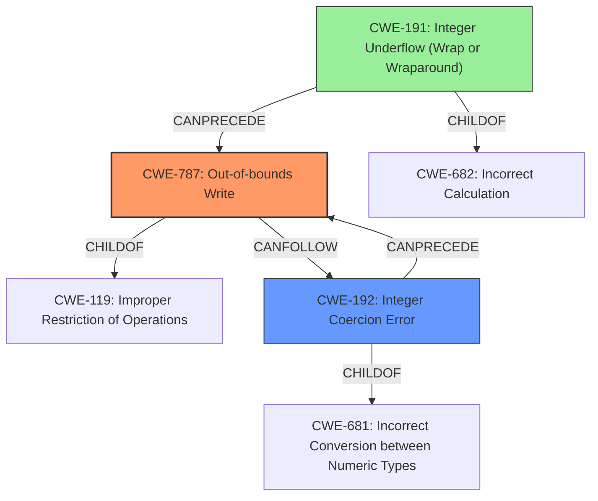

# Enhanced Analysis for CVE-2022-2639

# Summary
| CWE ID | CWE Name | Confidence | CWE Abstraction Level | CWE Vulnerability Mapping Label | CWE-Vulnerability Mapping Notes |
|---|---|---|---|---|---|
| CWE-787 | Out-of-bounds Write | 1.0 | Base | Allowed | Primary CWE |
| CWE-192 | Integer Coercion Error | 0.9 | Variant | Allowed | Secondary CWE |
| CWE-191 | Integer Underflow (Wrap or Wraparound) | 0.8 | Base | Allowed | Secondary CWE |

## Evidence and Confidence

*   **Confidence Score:** 0.9
*   **Evidence Strength:** HIGH

## Relationship Analysis
The primary weakness is an out-of-bounds write (CWE-787), which is triggered by an integer coercion error (CWE-192) leading to an integer underflow (CWE-191). CWE-787 is a child of CWE-119 (Improper Restriction of Operations within the Bounds of a Memory Buffer). CWE-192 is a child of CWE-681 (Incorrect Conversion between Numeric Types). CWE-191 is a child of CWE-682 (Incorrect Calculation). The integer coercion error leads to an incorrect size calculation, which then results in writing beyond the intended buffer boundary. The relationships indicate a chain of events where an initial type conversion error cascades into a memory corruption issue.



## Vulnerability Chain
The chain of events is as follows:
1.  **Integer Coercion Error (CWE-192):** An **integer coercion error** occurs during the calculation of the required buffer size.
2.  **Integer Underflow (CWE-191):** The **integer coercion error** leads to an **integer underflow** when `next_offset` is close to `MAX_ACTIONS_BUFSIZE` and a new action with `req_size` is added.
3.  **Out-of-Bounds Write (CWE-787):** The incorrect size calculation results in an **out-of-bounds write** when subsequent actions are copied beyond the allocated memory.
4.  **Impact:** This leads to a system crash or potential privilege escalation.

## Summary of Analysis
The vulnerability is primarily an out-of-bounds write (CWE-787) caused by an **integer coercion error** (CWE-192) leading to an **integer underflow** (CWE-191) during memory reservation. The evidence clearly points to memory corruption due to writing beyond buffer boundaries.

The analysis is based on the following evidence:
*   "An **integer coercion error** was found in the openvswitch kernel module."
*   "Given a sufficiently large number of actions... the reserve_sfa_size() function does not return -EMSGSIZE as expected, potentially leading to an out-of-bounds write access."
*   "The vulnerability occurs when calculating the required size for flow actions. Specifically, when `next_offset` is close to `MAX_ACTIONS_BUFSIZE` and a new action with `req_size` is added, instead of returning `-EMSGSIZE`, the code allocates `MAX_ACTIONS_BUFSIZE` bytes, incrementing `actions_len` by `req_size`. This leads to `actions_len` exceeding the allocated buffer size."

The relationships between CWEs are important. The **integer coercion error** sets the stage for the **integer underflow**, which directly causes the **out-of-bounds write**.

CWE-787 is the most specific and relevant CWE because the primary impact is writing data beyond the intended buffer, leading to memory corruption. CWE-192 and CWE-191 are included because they are part of the root cause.

Other CWEs considered but not used:

*   CWE-190 (Integer Overflow or Wraparound): While related, the description focuses on exceeding the maximum value, whereas this vulnerability involves an underflow due to an incorrect check.
*   CWE-125 (Out-of-bounds Read): The vulnerability is focused on writing, not reading, out of bounds.
*   CWE-193 (Off-by-one Error): Although there may be an off-by-one component, it's part of the broader integer handling issue, not a specific increment/decrement error.
*   CWE-1284 (Improper Validation of Specified Quantity in Input): This is a more general case and the integer errors are more specific.
*   CWE-681 (Incorrect Conversion between Numeric Types): The integer coercion error (CWE-192) is more specific.


## CWE Relationship Analysis

Current CWEs represent these abstraction levels: .


### Vulnerability Chain Analysis

**Chain starting from CWE-190:**
- 190 (Integer Overflow or Wraparound) - ROOT


**Chain starting from CWE-192:**
- 192 (Integer Coercion Error) - ROOT


### CWE Relationship Diagram

```mermaid
graph TD
    classDef primary fill:#f96,stroke:#333,stroke-width:2px
    classDef secondary fill:#69f,stroke:#333
    classDef tertiary fill:#9e9,stroke:#333
```