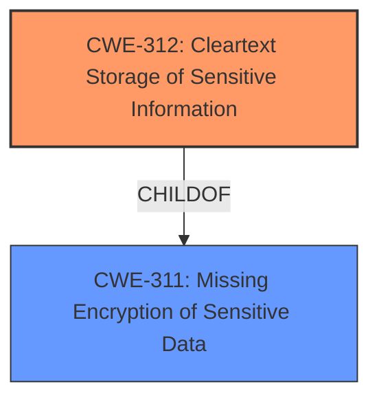

# Raw Analyzer Response for CVE-2022-26390

# Summary

| CWE ID  | CWE Name                                       | Confidence | CWE Abstraction Level | CWE Vulnerability Mapping Label | CWE-Vulnerability Mapping Notes |
| :------- | :--------------------------------------------- | :--------- | :-------------------- | :------------------------------ | :------------------------------ |
| CWE-312 | Cleartext Storage of Sensitive Information  | 1          | Base                  | Primary                         | Allowed                         |

## Evidence and Confidence

*   **Confidence Score:** 1
*   **Evidence Strength:** HIGH

## Relationship Analysis

The primary relationship is that CWE-312 is a child of CWE-311. This means it is more specific. The vulnerability description indicates **storage** of sensitive information rather than transmission, making CWE-312 the more accurate choice.

## Vulnerability Chain

The chain starts with the **weakness** of storing network credentials and PHI in unencrypted form (CWE-312). This leads to the impact of an attacker with physical access being able to extract sensitive information.

## Summary of Analysis

The initial analysis strongly suggests CWE-312 as the primary weakness. The vulnerability description and CVE reference both explicitly state that sensitive information is stored in an unencrypted form.

The vulnerability description states: "The Baxter Spectrum Wireless Battery Module (WBM) **stores network credentials and PHI (only applicable to Spectrum IQ pumps using auto programming) in unencrypted form**. An attacker with physical access to a device that hasnt had all data and settings erased may be able to extract sensitive information."

The CVE Reference Links Content Summary states that the **root_cause** is "The Baxter Spectrum WBM stores network credentials and patient health information (PHI) in unencrypted form." and cites "Missing Encryption of Sensitive Data (CWE-311)" as a weakness.

While CWE-311 is listed in the CVE reference, CWE-312 is a more specific child that applies more directly to the storage aspect of this vulnerability. Therefore, the final decision is to assign CWE-312 as the primary CWE. This is the optimal level of specificity based on the available evidence.

Relevant CWE Information:

# Enhanced Context (25 CWEs)

## CWE-312: Cleartext Storage of Sensitive Information
**Abstraction:** Base
**Similarity Score:** 0.82
**Source:** dense

**Description**:
The product stores sensitive information in cleartext within a resource that might be accessible to another control sphere.

**Mapping Guidance**:
- Usage: Allowed
- Rationale: This CWE entry is at the Base level of abstraction, which is a preferred level of abstraction for mapping to the root causes of vulnerabilities.

**Technical Explanation**:
The Baxter Spectrum Wireless Battery Module stores network credentials and PHI in unencrypted form, which directly aligns with the description of CWE-312. This allows an attacker with physical access to extract sensitive information.

**Security Implications**:
Storing sensitive information in cleartext can lead to unauthorized access, data breaches, and identity theft. An attacker with physical access to the device can easily extract the unencrypted data.

**Relationship Analysis**:
CWE-312 is a Base-level CWE, providing a specific description of the **weakness**. It is a child of CWE-311, which is a more general class.

**Mapping Guidance Analysis**:
The mapping guidance for CWE-312 allows its usage and notes that it is at the Base level of abstraction, which is preferred for mapping root causes.

**Mitigation Analysis**:
Mitigation involves encrypting the stored data to prevent unauthorized access. This aligns directly with the weakness described by CWE-312.

**Evidence-Based Decision Making**:
The vulnerability description and CVE reference explicitly mention that sensitive information is stored in an unencrypted form, supporting the classification of CWE-312 with high confidence. The retriever also gives it a high score.

CWEs considered but not used:

*   CWE-311: Missing Encryption of Sensitive Data: While related, this is a more general class. CWE-312 is a child of CWE-311 and more accurately describes the vulnerability as it pertains to storage rather than a lack of encryption in general.
*   CWE-798: Use of Hard-coded Credentials: This CWE is not applicable because the vulnerability is about storing existing credentials in an unencrypted format, not about using hard-coded credentials.
*   CWE-319: Cleartext Transmission of Sensitive Information: This CWE is not applicable because the vulnerability is about storing data rather than transmitting it.