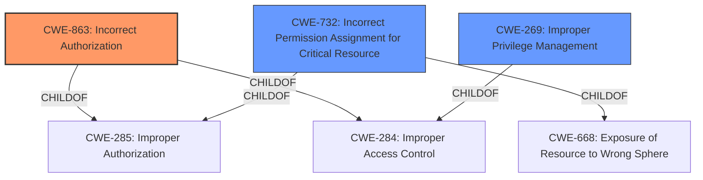

# Raw Analyzer Response for CVE-2022-26415

# Summary
| CWE ID | CWE Name | Confidence | CWE Abstraction Level | CWE Vulnerability Mapping Label | CWE-Vulnerability Mapping Notes |
|---|---|---|---|---|---|
| CWE-863 | Incorrect Authorization | 0.8 | Class | Primary | Allowed-with-Review |
| CWE-269 | Improper Privilege Management | 0.6 | Class | Secondary | Discouraged |
| CWE-732 | Incorrect Permission Assignment for Critical Resource | 0.5 | Class | Secondary | Allowed-with-Review |

## Evidence and Confidence

*   **Confidence Score:** 0.7
*   **Evidence Strength:** MEDIUM

## Relationship Analysis
The primary relationship influencing the CWE selection is the hierarchical relationship. CWE-863 (Incorrect Authorization) is a class-level CWE. The vulnerability involves an authenticated administrator user bypassing appliance mode restrictions, which suggests an authorization issue. CWE-269 (Improper Privilege Management) is a parent of CWE-863 and represents a broader category. CWE-732 (Incorrect Permission Assignment for Critical Resource) is a child of CWE-285 and CWE-668, representing a resource access issue, but it is not the primary issue.

## Vulnerability Chain
The vulnerability chain starts with an authenticated user assigned the Administrator role. The **weakness** lies in the **improper** handling of authorization within the Appliance mode restrictions, allowing the user to **bypass** these restrictions via an undisclosed iControl REST endpoint. This leads to the **impact** of unauthorized access or actions within the system.

## Summary of Analysis
Initially, the vulnerability description points towards an authorization **bypass** due to an undisclosed iControl REST endpoint. The description includes "an authenticated user assigned the Administrator role may be able to **bypass** Appliance mode restrictions". This suggests that the authorization mechanism in Appliance mode is **incorrect**, allowing administrators to perform actions they should not be able to perform.

The Retriever results listed CWE-863 (Incorrect Authorization) as a strong candidate. CWE-269 (Improper Privilege Management) and CWE-732 (Incorrect Permission Assignment for Critical Resource) were also considered due to their relevance to access control and privilege management.

The final decision to select CWE-863 as the primary CWE is based on the fact that the authenticated administrator is able to **bypass** intended restrictions. This is a clear indication of **incorrect** authorization. CWE-269 and CWE-732 are related but less specific, as they address privilege management and permission assignment, respectively.

CWE-863 is selected because it directly addresses the **incorrect** authorization check that allows the **bypass** of Appliance mode restrictions. While CWE-269 and CWE-732 could be contributing factors, they don't fully capture the core issue of **incorrect** authorization leading to the **bypass**. The evidence from the vulnerability description clearly supports this classification.

Relevant CWE Information:

# Enhanced Context (25 CWEs)
The following CWEs were identified as potentially relevant to this vulnerability:

## CWE-74: Improper Neutralization of Special Elements in Output Used by a Downstream Component ('Injection')
**Abstraction Level**: Class
**Similarity Score**: 0.77
**Source**: dense

**Description**:
The product constructs all or part of a command, data structure, or record using externally-influenced input from an upstream component, but it does not neutralize or incorrectly neutralizes special elements that could modify how it is parsed or interpreted when it is sent to a downstream component.

**Mapping Guidance**:
- Usage: Discouraged
- Rationale: CWE-74 is high-level and often misused when lower-level weaknesses are more appropriate.

*Rejected:* This CWE is for injection vulnerabilities, where special elements aren't neutralized. This vulnerability is about an authorization **bypass**, not injection.

## CWE-405: Asymmetric Resource Consumption (Amplification)
**Abstraction Level**: Class
**Similarity Score**: 0.77
**Source**: dense

**Description**:
The product does not properly control situations in which an adversary can cause the product to consume or produce excessive resources without requiring the adversary to invest equivalent work or otherwise prove authorization, i.e., the adversary's influence is "asymmetric."

**Mapping Guidance**:
- Usage: Allowed-with-Review
- Rationale: This CWE entry is a Class and might have Base-level children that would be more appropriate

*Rejected:* This CWE is about resource consumption, which isn't the core issue. The vulnerability is about an authorization **bypass**.

## CWE-799: Improper Control of Interaction Frequency
**Abstraction Level**: Class
**Similarity Score**: 0.77
**Source**: dense

**Description**:
The product does not properly limit the number or frequency of interactions that it has with an actor, such as the number of incoming requests.

**Mapping Guidance**:
- Usage: Allowed-with-Review
- Rationale: This CWE entry is a Class and might have Base-level children that would be more appropriate

*Rejected:* This CWE is related to interaction frequency, which is not the primary **weakness**. The issue is an authorization **bypass**.

## CWE-668: Exposure of Resource to Wrong Sphere
**Abstraction Level**: Class
**Similarity Score**: 0.76
**Source**: dense

**Description**:
The product exposes a resource to the wrong control sphere, providing unintended actors with inappropriate access to the resource.

**Mapping Guidance**:
- Usage: Discouraged
- Rationale: CWE-668 is high-level and is often misused as a catch-all when lower-level CWE IDs might be applicable. It is sometimes used for low-information vulnerability reports [REF-1287]. It is a level-1 Class (i.e., a child of a Pillar). It is not useful for trend analysis.

*Rejected:* This CWE is too broad. The vulnerability is more specifically about **incorrect** authorization, not just general resource exposure.

## CWE-807: Reliance on Untrusted Inputs in a Security Decision
**Abstraction Level**: Base
**Similarity Score**: 0.76
**Source**: dense

**Description**:
The product uses a protection mechanism that relies on the existence or values of an input, but the input can be modified by an untrusted actor in a way that bypasses the protection mechanism.

**Mapping Guidance**:
- Usage: Allowed
- Rationale: This CWE entry is at the Base level of abstraction, which is a preferred level of abstraction for mapping to the root causes of vulnerabilities.

*Rejected:* This CWE involves reliance on untrusted inputs, which isn't the case here. The vulnerability involves an authenticated administrator user **bypassing** restrictions.

## CWE-918: Server-Side Request Forgery (SSRF)
**Abstraction Level**: Base
**Similarity Score**: 0.76
**Source**: dense

**Description**:
The web server receives a URL or similar request from an upstream component and retrieves the contents of this URL, but it does not sufficiently ensure that the request is being sent to the expected destination.

**Mapping Guidance**:
- Usage: Allowed
- Rationale: This CWE entry is at the Base level of abstraction, which is a preferred level of abstraction for mapping to the root causes of vulnerabilities.

*Rejected:* This CWE is about Server-Side Request Forgery, which is unrelated to the authorization **bypass** described.

## CWE-41: Improper Resolution of Path Equivalence
**Abstraction Level**: Base
**Similarity Score**: 0.75
**Source**: dense

**Description**:
The product is vulnerable to file system contents disclosure through path equivalence. Path equivalence involves the use of special characters in file and directory names. The associated manipulations are intended to generate multiple names for the same object.

**Mapping Guidance**:
- Usage: Allowed
- Rationale: This CWE entry is at the Base level of abstraction, which is a preferred level of abstraction for mapping to the root causes of vulnerabilities.

*Rejected:* This CWE is about path equivalence issues, which is not relevant to the **incorrect** authorization.

## CWE-113: Improper Neutralization of CRLF Sequences in