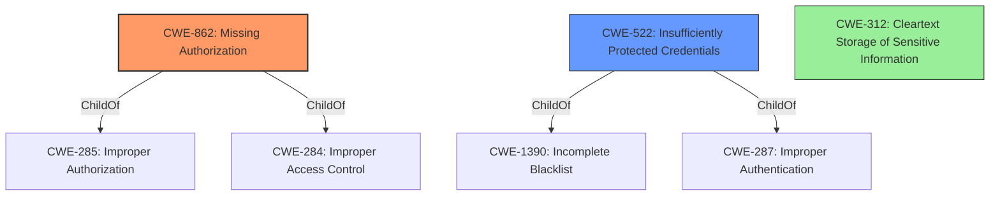

# Raw Analyzer Response for CVE-2022-26423

# Summary
| CWE ID  | CWE Name                                                        | Confidence | CWE Abstraction Level | CWE Vulnerability Mapping Label | CWE-Vulnerability Mapping Notes |
| :-------- | :-------------------------------------------------------------- | :--------- | :-------------------- | :------------------------------ | :------------------------------ |
| CWE-862   | Missing Authorization                                           | 0.95       | Class                 | Primary                         | Allowed-with-Review           |
| CWE-522   | Insufficiently Protected Credentials                          | 0.75       | Class                 | Secondary                       | Allowed-with-Review           |
| CWE-312   | Cleartext Storage of Sensitive Information                    | 0.60      | Base                  | Secondary                       | Allowed                         |

## Evidence and Confidence

*   **Confidence Score:** 0.85
*   **Evidence Strength:** HIGH

## Relationship Analysis
The primary CWE is CWE-862 [Missing Authorization], which is a Class-level CWE. The vulnerability stems from a **lack of authorization** checks, allowing unauthorized access to hashed user credentials. CWE-862 is a parent of CWE-285 [Improper Authorization] and CWE-284 [Improper Access Control].

CWE-522 [Insufficiently Protected Credentials] is a related Class-level CWE because the exposure of hashed credentials suggests they were not adequately protected. It is a child of CWE-1390 [Incomplete Blacklist] and CWE-287 [Improper Authentication].

CWE-312 [Cleartext Storage of Sensitive Information] is a Base-level CWE, considered due to the potential for the hashed credentials to be exposed without sufficient protection, which could be interpreted as a form of cleartext storage from an attacker's perspective.

## Vulnerability Chain
The vulnerability chain starts with the **missing authorization** check (CWE-862), which leads to the exposure of **hashed user credentials**. This exposure can be viewed as **insufficient protection of credentials** (CWE-522) and potentially **cleartext storage** from an attacker's viewpoint (CWE-312).

## Summary of Analysis
The initial assessment, based on the **Vulnerability Description Key Phrases** and **CVE Reference Links Content Summary**, points towards CWE-862 [Missing Authorization] as the primary weakness. The **root cause** is the **lack of authorization**, allowing an unauthenticated attacker to access sensitive information.

The retriever results also support CWE-862 [Missing Authorization]. The evidence from the **CVE Reference Links Content Summary** confirms the **missing authorization** as the root cause: "The vulnerability is due to **Missing Authorization (CWE-862)** in the Aethon TUG Home Base Server."

CWE-522 [Insufficiently Protected Credentials] is considered as a secondary weakness, as the exposed hashed credentials indicate a failure in protecting this sensitive information.

CWE-312 [Cleartext Storage of Sensitive Information] is a tertiary candidate, as the **impact** is similar to the effect of storing credentials in cleartext from an attacker's perspective, even though the credentials are, in fact, hashed.

The selection of CWE-862 [Missing Authorization] is at the optimal level of specificity, as it directly addresses the **root cause** of the vulnerability.

Relevant CWE Information:
# Enhanced Context (25 CWEs)
The following CWEs were identified as potentially relevant to this vulnerability:

## CWE-538: Insertion of Sensitive Information into Externally-Accessible File or Directory
**Abstraction Level**: Base
**Similarity Score**: 0.80
**Source**: dense

**Description**:
The product places sensitive information into files or directories that are accessible to actors who are allowed to have access to the files, but not to the sensitive information.

**Mapping Guidance**:
- Usage: Allowed
- Rationale: This CWE entry is at the Base level of abstraction, which is a preferred level of abstraction for mapping to the root causes of vulnerabilities.

## CWE-552: Files or Directories Accessible to External Parties
**Abstraction Level**: Base
**Similarity Score**: 0.78
**Source**: dense

**Description**:
The product makes files or directories accessible to unauthorized actors, even though they should not be.

**Mapping Guidance**:
- Usage: Allowed
- Rationale: This CWE entry is at the Base level of abstraction, which is a preferred level of abstraction for mapping to the root causes of vulnerabilities.

## CWE-73: External Control of File Name or Path
**Abstraction Level**: Base
**Similarity Score**: 0.77
**Source**: dense

**Description**:
The product allows user input to control or influence paths or file names that are used in filesystem operations.

**Mapping Guidance**:
- Usage: Allowed
- Rationale: This CWE entry is at the Base level of abstraction, which is a preferred level of abstraction for mapping to the root causes of vulnerabilities.

## CWE-41: Improper Resolution of Path Equivalence
**Abstraction Level**: Base
**Similarity Score**: 0.77
**Source**: dense

**Description**:
The product is vulnerable to file system contents disclosure through path equivalence. Path equivalence involves the use of special characters in file and directory names. The associated manipulations are intended to generate multiple names for the same object.

**Mapping Guidance**:
- Usage: Allowed
- Rationale: This CWE entry is at the Base level of abstraction, which is a preferred level of abstraction for mapping to the root causes of vulnerabilities.

## CWE-312: Cleartext Storage of Sensitive Information
**Abstraction Level**: Base
**Similarity Score**: 0.77
**Source**: dense

**Description**:
The product stores sensitive information in cleartext within a resource that might be accessible to another control sphere.

**Mapping Guidance**:
- Usage: Allowed
- Rationale: This CWE entry is at the Base level of abstraction, which is a preferred level of abstraction for mapping to the root causes of vulnerabilities.

## CWE-798: Use of Hard-coded Credentials
**Abstraction Level**: Base
**Similarity Score**: 0.76
**Source**: dense

**Description**:
The product contains hard-coded credentials, such as a password or cryptographic key.

**Mapping Guidance**:
- Usage: Allowed
- Rationale: This CWE entry is at the Base level of abstraction, which is a preferred level of abstraction for mapping to the root causes of vulnerabilities.

## CWE-1391: Use of Weak Credentials
**Abstraction Level**: Class
**Similarity Score**: 0.76
**Source**: dense

**Description**:
The product uses weak credentials (such as a default key or hard-coded password) that can be calculated, derived, reused, or guessed by an attacker.

**Mapping Guidance**:
- Usage: Allowed-with-Review
- Rationale: This CWE entry is a Class and might have Base-level children that would be more appropriate

## CWE-212: Improper Removal of Sensitive Information Before Storage or Transfer
**Abstraction Level**: Base
**Similarity Score**: 0.76
**Source**: dense

**Description**:
The product stores, transfers, or shares a resource that contains sensitive information, but it does not properly remove that information before the product makes the resource available to unauthorized actors.

**Mapping Guidance**:
- Usage: Allowed
- Rationale: This CWE entry is at the Base level of abstraction, which is a preferred level of abstraction for mapping to the root causes of vulnerabilities.

## CWE-23: Relative Path Traversal
**Abstraction Level**: Base
**Similarity Score**: 0.76
**Source**: dense

**Description**:
The product uses external input to construct a pathname that should be within a restricted directory, but it does not properly neutralize sequences such as ".." that can resolve to a location that is outside of that directory.

**Mapping Guidance**:
- Usage: Allowed
- Rationale: This CWE entry is at the Base level of abstraction, which is a preferred level of abstraction for mapping to the root causes of vulnerabilities.

## CWE-807: Reliance on Untrusted Inputs in a Security Decision
**