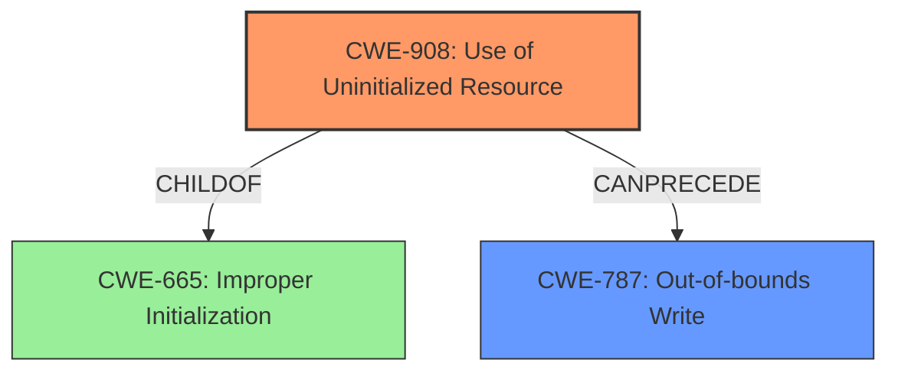

# Analysis Report for CVE-2022-26437

# Vulnerability Analysis Report: CVE-2022-26437

## Description


## Analysis (with Relationship Data)

# Summary
| CWE ID | CWE Name | Confidence | CWE Abstraction Level | CWE Vulnerability Mapping Label | CWE-Vulnerability Mapping Notes |
|---|---|---|---|---|---|
| CWE-908 | Use of Uninitialized Resource | 0.9 | Base | Allowed | Primary CWE |
| CWE-787 | Out-of-bounds Write | 0.8 | Base | Implied | Secondary CWE |

## Evidence and Confidence

*   **Confidence Score:** 0.85
*   **Evidence Strength:** HIGH

## Relationship Analysis
The primary relationship that influenced my decision was the ChildOf relationship, specifically how CWE-908 relates to its parent CWE-665 (Improper Initialization). The vulnerability description clearly indicates an **uninitialized data** issue (CWE-908), leading to an **out-of-bounds write** (CWE-787). The chain relationship here suggests the progression of the vulnerability, starting from the use of uninitialized resource and resulting in an out-of-bounds write.



## Vulnerability Chain
The vulnerability chain starts with **uninitialized data** (CWE-908) which leads to an **out-of-bounds write** (CWE-787), ultimately resulting in a remote escalation of privilege.

## Summary of Analysis
Initially, the description points to an **out of bounds write** due to **uninitialized data**. The key phrases "uninitialized data" and "out of bounds write" strongly suggest CWE-908 (Use of Uninitialized Resource) and CWE-787 (Out-of-bounds Write), respectively. The "CVE Reference Links Content Summary" section explicitly states "Root cause of vulnerability: An out-of-bounds write due to uninitialized data in the `httpclient` component" and "Weaknesses/vulnerabilities present: Out-of-bounds write (CWE-787)".

The retriever results also indicated CWE-908 as the top candidate, further reinforcing this decision. The relationship graph shows how CWE-908 can lead to CWE-787, providing a clear sequence of events. Given the evidence, relationship analysis, and retriever results, CWE-908 is the optimal selection for the root cause, with CWE-787 as a secondary weakness arising from the initial uninitialized resource.

Relevant CWE Information:

# Enhanced Context (25 CWEs)

## CWE-908: Use of Uninitialized Resource
**Abstraction:** Base
**Status:** Incomplete

### Description
The product uses or accesses a resource that has not been initialized.

### Extended Description
When a resource has not been properly initialized, the product may behave unexpectedly. This may lead to a crash or invalid memory access, but the consequences vary depending on the type of resource and how it is used within the product.

### Alternative Terms
None

### Relationships
ChildOf -> CWE-665
ChildOf -> CWE-665

### Mapping Guidance
**Usage:** Allowed
**Rationale:** This CWE entry is at the Base level of abstraction, which is a preferred level of abstraction for mapping to the root causes of vulnerabilities.
**Comments:** Carefully read both the name and description to ensure that this mapping is an appropriate fit. Do not try to 'force' a mapping to a lower-level Base/Variant simply to comply with this preferred level of abstraction.
**Reasons:**
- Acceptable-Use

### Observed Examples
- **CVE-2019-9805:** Chain: Creation of the packet client occurs before initialization is complete (CWE-696) resulting in a read from uninitialized memory (CWE-908), causing memory corruption.
- **CVE-2008-4197:** Use of uninitialized memory may allow code execution.
- **CVE-2008-2934:** Free of an uninitialized pointer leads to crash and possible code execution.

## CWE-787: Out-of-bounds Write
**Abstraction:** Base
**Status:** Stable

### Description
The product writes data past the end, or before the beginning, of the intended buffer.

### Extended Description
This typically occurs when the software does not check the size of the data before writing it to a buffer.

### Alternative Terms
heap overflow
stack overflow
buffer overflow
memory corruption

### Relationships
ChildOf -> CWE-119

### Mapping Guidance
**Usage:** Allowed
**Rationale:** This CWE entry is at the Base level of abstraction, which is a preferred level of abstraction for mapping to the root causes of vulnerabilities.
**Comments:** Carefully read both the name and description to ensure that this mapping is an appropriate fit. Do not try to 'force' a mapping to a lower-level Base/Variant simply to comply with this preferred level of abstraction.
**Reasons:**
- Acceptable-Use

### Observed Examples
- **CVE-2024-36759:** Chain: A double free (CWE-415) in a Windows printer spooler component leads to memory corruption (CWE-787), as exploited in the wild per CISA KEV.
- **CVE-2024-34056:** Chain: A format string vulnerability (CWE-134) leads to an out-of-bounds write (CWE-787) in a firewall product.
- **CVE-2024-34051:** Chain: An integer overflow (CWE-190) leads to an out-of-bounds write (CWE-787) in a firewall product.
- **CVE-2024-31495:** Chain: A use-after-free (CWE-416) in a web browser can be triggered by manipulating DOM elements, leading to memory corruption (CWE-787).
- **CVE-2024-3094:** Code allows writing to memory outside of allocated buffer (CWE-787).
- **CVE-2024-29973:** Chain: Improper validation of specified quantity in input (CWE-1284) leads to out-of-bounds write (CWE-787) in a PDF reader.
- **CVE-2024-29732:** Race condition (CWE-362) in a smart contract leads to out-of-bounds write (CWE-787), as exploited in the wild.
- **CVE-2024-2961:** Chain: Use of externally-controlled format string (CWE-134) leads to out-of-bounds write (CWE-787) in a networking appliance.
- **CVE-2024-29187:** Chain: Integer overflow (CWE-190) leads to out-of-bounds write (CWE-787) in image processing library.
- **CVE-2024-28897:** Chain: Allocation of resources without limits or throttling (CWE-770) leads to out-of-bounds write (CWE-787) in image processing library.
- **CVE-2024-28896:** Chain: NULL pointer dereference (CWE-476) leads to out-of-bounds write (CWE-787) in image processing library.

I considered CWE-665 (Improper Initialization) but determined that CWE-908 (Use of Uninitialized Resource) is more specific as it directly addresses the use of the uninitialized data rather than the general lack of initialization. Other CWEs like integer overflows and incorrect buffer size calculations (CWE-190, CWE-131) were considered but did not fit the description's emphasis on uninitialized data leading to an out-of-bounds write.


## CWE Relationship Analysis

Current CWEs represent these abstraction levels: .


### Vulnerability Chain Analysis

**Chain starting from CWE-190:**
- 190 (Integer Overflow or Wraparound) - ROOT


**Chain starting from CWE-131:**
- 131 (Incorrect Calculation of Buffer Size) - ROOT


### CWE Relationship Diagram

```mermaid
graph TD
    classDef primary fill:#f96,stroke:#333,stroke-width:2px
    classDef secondary fill:#69f,stroke:#333
    classDef tertiary fill:#9e9,stroke:#333
```


*Report generated on 2025-03-30 14:23:13*
