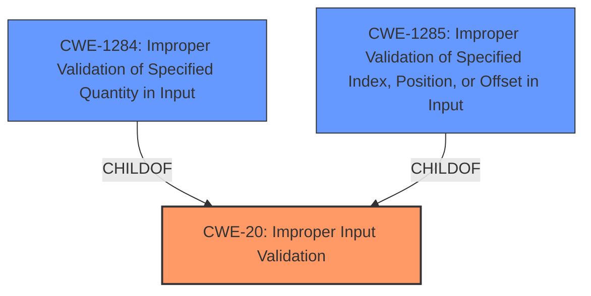

# Raw Analyzer Response for CVE-2022-26446

# Summary
| CWE ID | CWE Name | Confidence | CWE Abstraction Level | CWE Vulnerability Mapping Label | CWE-Vulnerability Mapping Notes |
|---|---|---|---|---|---|
| **CWE-20** | **Improper Input Validation** | 0.7 | Class | Primary | Discouraged |
| CWE-1284 | Improper Validation of Specified Quantity in Input | 0.6 | Base | Secondary | Allowed |
| CWE-1285 | Improper Validation of Specified Index, Position, or Offset in Input | 0.5 | Base | Secondary | Allowed |

## Evidence and Confidence

*   **Confidence Score:** 0.7
*   **Evidence Strength:** MEDIUM

## Relationship Analysis
The primary relationship considered was the parent-child relationship between CWE-20 and its children, specifically CWE-1284 and CWE-1285. While CWE-20 is a general class, the description points to a lack of validation, which could involve quantities, indexes, positions, or offsets. However, the description is not specific enough to pinpoint the exact type of input that is not being validated. The relationships between these CWEs helped narrow down the possible causes, but ultimately the lack of specific information led to choosing the more general CWE-20.

## Vulnerability Chain
The chain of events is as follows:
1.  **Root Cause:** **Improper Input Validation** (CWE-20) when concatenating improper SIB12 (CMAS message)
2.  **Impact:** System crash, leading to remote denial of service.

The chain starts with **improper input validation**, which allows the concatenation of a malformed SIB12 message. This ultimately leads to a system crash and denial of service.

## Summary of Analysis
The initial analysis identified **improper input validation** as the root cause of the vulnerability, which leads to a system crash. The provided evidence explicitly states that the vulnerability is due to **improper input validation** in the Modem 4G RRC when concatenating improper SIB12 (CMAS message).

The statement from the "CVE Reference Links Content Summary" section directly supports this:
"root_cause: **Improper input validation** in Modem 4G RRC."

The retriever results also point to CWE-20 as a likely candidate, along with its children such as CWE-1284 and CWE-1285, due to the general nature of the weakness.

While CWE-20 is discouraged due to its generality, the lack of specific information about *what* kind of input validation is missing makes it difficult to choose a more specific CWE. There is mention of "concatenating improper SIB12 (CMAS message)", suggesting that the length or format of SIB12 messages may not be properly validated.

Considering the mapping guidance, it is generally recommended to choose the most specific CWE. However, in this case, the evidence is not detailed enough to confirm that the quantity (CWE-1284) or index/offset (CWE-1285) is the specific problem. Therefore, while these are strong secondary candidates, the primary mapping remains CWE-20, due to the explicit mention of **improper input validation** in the vulnerability description.

Relevant CWE Information:

# Enhanced Context (25 CWEs)
The following CWEs were identified as potentially relevant to this vulnerability:

## CWE-662: Improper Synchronization
**Abstraction Level**: Class
**Similarity Score**: 0.78
**Source**: dense

**Description**:
The product utilizes multiple threads or processes to allow temporary access to a shared resource that can only be exclusive to one process at a time, but it does not properly synchronize these actions, which might cause simultaneous accesses of this resource by multiple threads or processes.

**Mapping Guidance**:
- Usage: Discouraged
- Rationale: This CWE entry is a level-1 Class (i.e., a child of a Pillar). It might have lower-level children that would be more appropriate

*Not Selected:* This CWE is not relevant because the vulnerability description makes no mention of threads, processes, or synchronization issues.

## CWE-366: Race Condition within a Thread
**Abstraction Level**: Base
**Similarity Score**: 0.77
**Source**: dense

**Description**:
If two threads of execution use a resource simultaneously, there exists the possibility that resources may be used while invalid, in turn making the state of execution undefined.

**Mapping Guidance**:
- Usage: Allowed
- Rationale: This CWE entry is at the Base level of abstraction, which is a preferred level of abstraction for mapping to the root causes of vulnerabilities.

*Not Selected:* This CWE is not relevant because the vulnerability description makes no mention of threads or race conditions.

## CWE-367: Time-of-check Time-of-use (TOCTOU) Race Condition
**Abstraction Level**: Base
**Similarity Score**: 0.77
**Source**: dense

**Description**:
The product checks the state of a resource before using that resource, but the resource's state can change between the check and the use in a way that invalidates the results of the check. This can cause the product to perform invalid actions when the resource is in an unexpected state.

**Mapping Guidance**:
- Usage: Allowed
- Rationale: This CWE entry is at the Base level of abstraction, which is a preferred level of abstraction for mapping to the root causes of vulnerabilities.

*Not Selected:* This CWE is not relevant because the vulnerability description makes no mention of checking the state of a resource or race conditions.

## CWE-667: Improper Locking
**Abstraction Level**: Class
**Similarity Score**: 0.77
**Source**: dense

**Description**:
The product does not properly acquire or release a lock on a resource, leading to unexpected resource state changes and behaviors.

**Mapping Guidance**:
- Usage: Allowed-with-Review
- Rationale: This CWE entry is a Class and might have Base-level children that would be more appropriate

*Not Selected:* This CWE is not relevant because the vulnerability description makes no mention of locking issues or resource access problems.

## CWE-362: Concurrent Execution using Shared Resource with Improper Synchronization ('Race Condition')
**Abstraction Level**: Class
**Similarity Score**: 0.76
**Source**: dense

**Description**:
The product contains a concurrent code sequence that requires temporary, exclusive access to a shared resource, but a timing window exists in which the shared resource can be modified by another code sequence operating concurrently.

**Mapping Guidance**:
- Usage: Allowed-with-Review
- Rationale: This CWE entry is a Class and might have Base-level children that would be more appropriate

*Not Selected:* This CWE is not relevant because the vulnerability description makes no mention of concurrent execution or synchronization problems.

## CWE-404: Improper Resource Shutdown or Release
**Abstraction Level**: Class
**Similarity Score**: 0.76
**Source**: dense

**Description**:
The product does not release or incorrectly releases a resource before it is made available for re-use.

**Mapping Guidance**:
- Usage: Allowed-with-Review
- Rationale: This CWE entry is a Class and might have Base-level children that would be more appropriate

*Not Selected:* This CWE is not relevant because the vulnerability description makes no mention of resource management or shutdown problems.

## CWE-1289: Improper Validation of Unsafe Equivalence in Input
**Abstraction Level**: Base
**Similarity Score**: 0.74
**Source**: dense

**Description**:
The product receives an input value that is used as a resource identifier or other type of reference, but it does not validate or incorrectly validates that the input is equivalent to a potentially-unsafe value.

**Mapping Guidance**:
- Usage: Allowed
- Rationale: This CWE entry is at the Base level of abstraction, which is a preferred level of abstraction for mapping to the root causes of vulnerabilities.

*Not Selected:* This CWE is not relevant because the vulnerability description does not indicate any issues regarding equivalence or resource identifiers.

## CWE-664: Improper Control of a Resource Through its Lifetime
**Abstraction Level**: Pillar
**Similarity Score**: 0.74
**Source**: dense

**Description**:
The product does not maintain or incorrectly maintains control over a resource throughout its lifetime of creation, use, and release.

**Mapping Guidance**:
- Usage: Discouraged
- Rationale: This CWE entry is high-level when lower-level children are available.

*Not Selected:* This CWE is too high-level. The vulnerability description