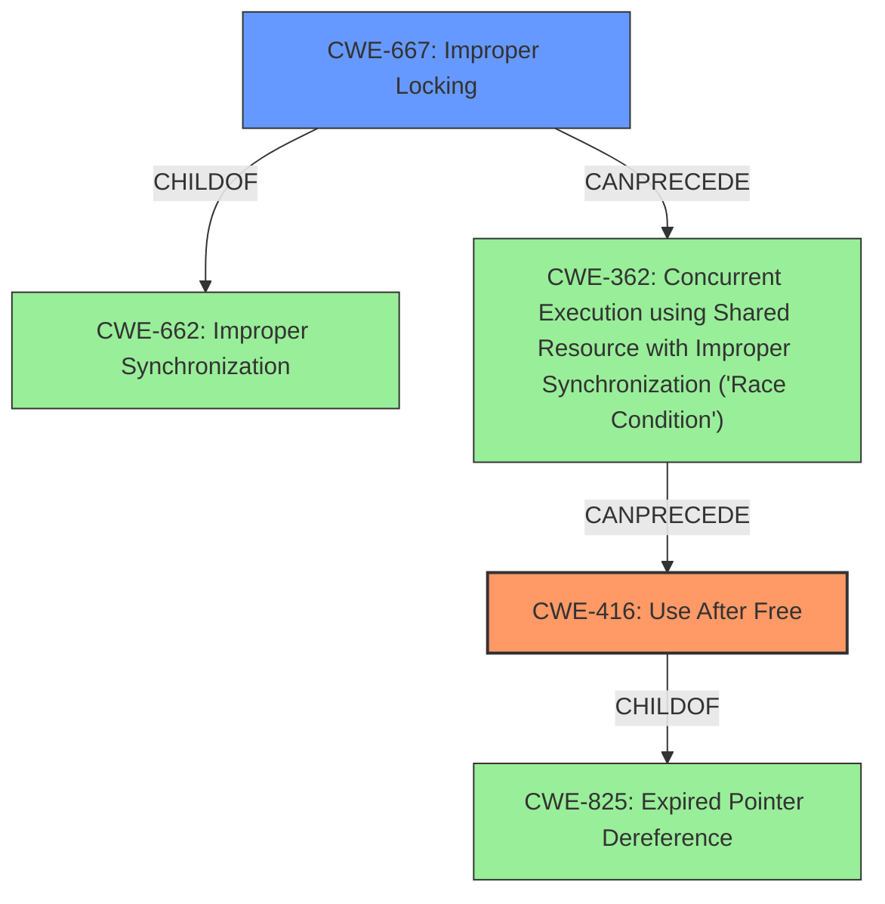

# Enhanced Analysis for CVE-2022-26473

# Summary
| CWE ID | CWE Name | Confidence | CWE Abstraction Level | CWE Vulnerability Mapping Label | CWE-Vulnerability Mapping Notes |
|---|---|---|---|---|---|
| CWE-416 | Use After Free | 1.0 | Variant | Allowed | Primary CWE |
| CWE-667 | Improper Locking | 0.7 | Class | Allowed-with-Review | Secondary Candidate |

## Evidence and Confidence

*   **Confidence Score:** 0.85
*   **Evidence Strength:** HIGH

## Relationship Analysis
The primary CWE is CWE-416, which is a Variant of CWE-825 (Expired Pointer Dereference). CWE-667 is a Class-level CWE, and a child of CWE-662 (Improper Synchronization), indicating a potential synchronization issue that leads to the vulnerability. The relationship analysis shows that improper locking can lead to race conditions which in turn can lead to use-after-free vulnerabilities.



## Vulnerability Chain
The vulnerability chain starts with **improper locking** (CWE-667), which leads to a race condition, eventually resulting in a **use after free** (CWE-416).
  - Initial Flaw: **Improper Locking**
  - Resulting Weakness: Race Condition
  - Final Impact: **Use After Free**

## Summary of Analysis
The initial assessment focused on identifying the root cause and the resulting weakness. The primary **rootcause** identified in the vulnerability description is "**use after free**". The "CVE Reference Links Content Summary" confirms "**Improper locking mechanisms** in vdec fmt".

The analysis considered the relationships between the CWEs, especially the chain relationships. The evidence supports CWE-416 as the primary CWE because the vulnerability description explicitly mentions "**use after free**". The retriever results also listed CWE-667 (Improper Locking) as a potential candidate, and the "CVE Reference Links Content Summary" confirms that **improper locking** is the root cause.

The selection of CWE-416 is at the optimal level of specificity because it directly describes the type of memory error that occurs.

Relevant CWE Information:

# Enhanced Context (25 CWEs)
The following CWEs were identified as potentially relevant to this vulnerability:

## CWE-667: Improper Locking
**Abstraction Level**: Class
**Similarity Score**: 0.79
**Source**: dense

**Description**:
The product does not properly acquire or release a lock on a resource, leading to unexpected resource state changes and behaviors.

**Mapping Guidance**:
- Usage: Allowed-with-Review
- Rationale: This CWE entry is a Class and might have Base-level children that would be more appropriate

## CWE-416: Use After Free
**Abstraction Level**: Variant
**Similarity Score**: 4.53
**Source**: graph

**Description**:
CWE-416: Use After Free

**Mapping Guidance**:
- Usage: Allowed
- Rationale: This CWE entry is at the Variant level of abstraction, which is a preferred level of abstraction for mapping to the root causes of vulnerabilities.

**CWE Selection Rationale:**

*   **CWE-416: Use After Free**
    *   **Match:** The vulnerability description explicitly states "**use after free** due to improper locking".
    *   **Abstraction:** Variant, which is a preferred level of abstraction.
    *   **Usage:** Allowed.
    *   **Relationship:** Child of CWE-825 (Expired Pointer Dereference).
    *   **Justification:** This is the most direct match to the described vulnerability.
    *   **Confidence:** 1.0

*   **CWE-667: Improper Locking**
    *   **Match:** The "CVE Reference Links Content Summary" mentions "**Improper locking mechanisms** in vdec fmt."
    *   **Abstraction:** Class.
    *   **Usage:** Allowed-with-Review.
    *   **Relationship:** Child of CWE-662 (Improper Synchronization).
    *   **Justification:** The vulnerability description also indicates that the **use after free** is "due to improper locking", suggesting a potential causal relationship where the improper locking leads to the memory corruption.
    *   **Confidence:** 0.7

**CWEs Considered but Not Used:**

*   **CWE-362: Concurrent Execution using Shared Resource with Improper Synchronization ('Race Condition')**: While improper locking often leads to race conditions, the primary issue is the **use after free**, not the race condition itself. Therefore, it is less directly applicable than CWE-416 and CWE-667.
*   **CWE-787: Out-of-bounds Write**: Although listed as the Primary CWE match for similar CVE Descriptions, the description does not directly indicate an out-of-bounds write. The root cause is a **use after free**, which might lead to an out-of-bounds write as a consequence, but the initial error is the memory corruption caused by using freed memory.
*   **CWE-662: Improper Synchronization**: This is a more general class of weakness than CWE-667. Since there is more evidence for the specific locking issue, CWE-667 is more appropriate.


## CWE Relationship Analysis

Current CWEs represent these abstraction levels: .


### Vulnerability Chain Analysis

**Chain starting from CWE-825:**
- 825 (Expired Pointer Dereference) - ROOT


**Chain starting from CWE-662:**
- 662 (Improper Synchronization) - ROOT


### CWE Relationship Diagram

```mermaid
graph TD
    classDef primary fill:#f96,stroke:#333,stroke-width:2px
    classDef secondary fill:#69f,stroke:#333
    classDef tertiary fill:#9e9,stroke:#333
```